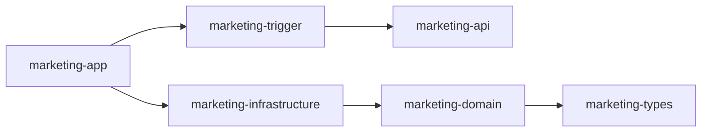
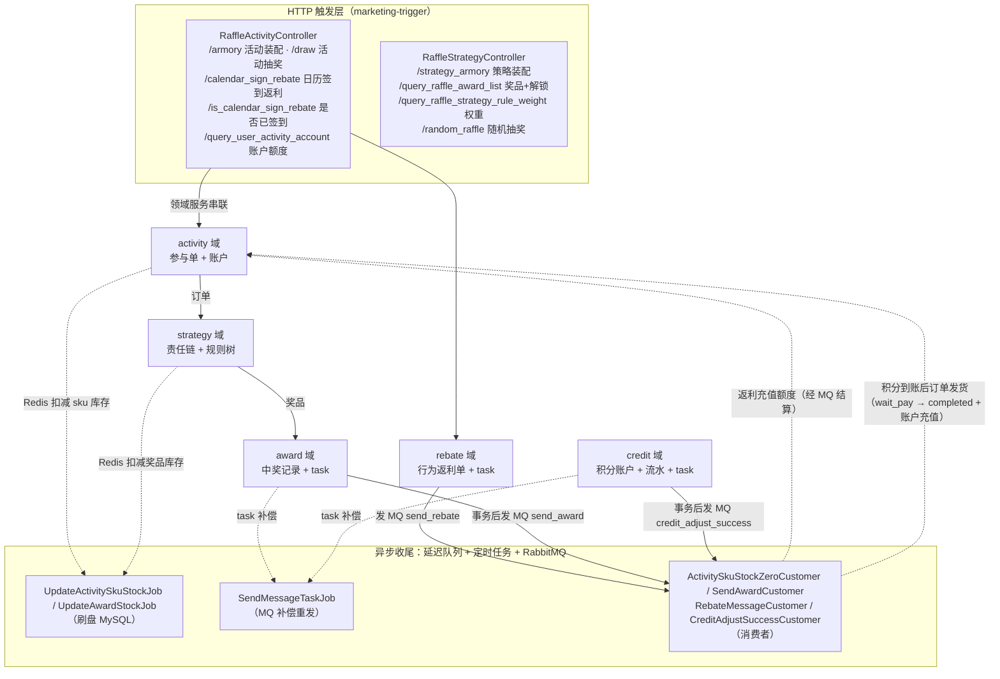

# 营销抽奖系统 · 概览与总体架构

> 拆分自《营销抽奖系统 详细设计文档》§一~§二，原文档现为索引页。
> 更新日期：2026-09-21（第 26/27 节：credit 域独立成限界上下文、Listener 计数、积分支付链路补充）｜ 配套文档：`docs/rule-chain.md`（责任链）、`docs/rule-tree-engine.md`（规则树引擎）

---
## 一、项目概览

本系统是一个基于 **DDD（领域驱动设计）分层架构** 的营销抽奖平台，核心能力是把「活动 — 策略 — 抽奖 — 规则 — 发奖 — 行为返利」整条链路串联起来：

- **活动域（activity）**：管理活动的有效期、状态、SKU 库存、用户参与额度（总/月/日三级账户），负责「一次抽奖资格」的发放与核销；
- **策略域（strategy）**：管理概率查找表装配、责任链（前置规则）、决策树（后置规则）、奖品库存扣减；
- **奖品域（award）**：负责中奖记录落库与异步发奖任务的投递；
- **积分域（credit，第 26 节独立）**：负责用户积分账户与流水的正逆向调额（`ICreditAdjustService`），调额成功后发 `credit_adjust_success` MQ 驱动订单发货（第 27 节）；
- **返利域（rebate）**：管理日常行为（签到等）的返利配置查询与返利订单入账，经 MQ 异步完成「返利 → 账户额度充值 / 积分入账」的结算闭环；
- **任务域（task）**：负责 MQ 消息的补偿重发，保证最终一致性。

**技术栈**：Java 1.8、Spring Boot 2.7.12、MyBatis、MySQL 8.0（db-router 分库分表：2 库 × 4 表）、Redis（Redisson 3.23.4）、RabbitMQ（spring-boot-starter-amqp）、Lombok、FastJSON、Guava。

**启动**：`com.charlie.Application`（marketing-app 模块），端口 `8091`，默认 profile `dev`。

---

## 二、总体架构

### 2.1 模块分层与依赖关系



| 模块 | 职责 |
|---|---|
| `marketing-types` | 常量（`Constants.RedisKey`）、异常码枚举（`ResponseCode`）、事件基类（`BaseEvent`）、业务异常（`AppException`） |
| `marketing-api` | 对外 HTTP 契约：`IRaffleActivityService`、`IRaffleStrategyService` 及 DTO/Response，不含业务 |
| `marketing-domain` | 六个限界上下文（strategy / activity / award / credit / rebate / task）的实体、值对象、聚合、领域服务、仓储接口 |
| `marketing-infrastructure` | 仓储实现（`StrategyRepository` / `ActivityRepository` / `AwardRepository` / `CreditRepository` / `BehaviorRebateRepository` / `TaskRepository`）、MyBatis DAO/PO、Redis 封装、RabbitMQ 发布器与拓扑配置 |
| `marketing-trigger` | HTTP 触发器（2 个 Controller）、定时任务（3 个 Job）、MQ 监听器（5 个 Listener） |
| `marketing-app` | 启动类、Redis/线程池/数据源路由配置、yml、mybatis mapper、logback |

**DDD 关键约束**：domain 不依赖 infrastructure。反向依赖通过「domain 定义仓储接口（如 `IActivityRepository`）+ infrastructure 提供 `@Repository` 实现」完成倒置。新增基础设施能力时，**先在 domain 定义接口，再在 infrastructure 实现**。

### 2.2 领域包内部约定（以 activity 为例）

```
domain/activity/
  ├─ event/          # 领域事件（ActivitySkuStockZeroMessageEvent）
  ├─ model/aggregate/  # 聚合根（CreateQuotaOrderAggregate、CreatePartakeOrderAggregate）
  ├─ model/entity/     # 实体（ActivityEntity、UserRaffleOrderEntity ...）
  ├─ model/valobj/     # 值对象（ActivityStateVO、OrderStateVO ...）
  ├─ repository/       # 仓储接口（IActivityRepository）
  └─ service/          # 领域服务（quota 额度、partake 参与、armory 装配）
```

### 2.3 系统全链路总览图



> 返利结算链路：`rebate 域` 落库返利订单 + task 后发 MQ 到 `send_rebate` 队列，`RebateMessageCustomer` 消费后把 sku 类型返利转成 `SkuRechargeEntity`，复用 activity 域的额度充值链路（见 4.13）给账户加次数；integral 类型返利转 `TradeEntity` 调 `creditAdjustService.createOrder` 积分入账（见 4.16）——返利不直接改账户，而是复用「充值单 + 账户聚合」既有事务。
>
> 发奖链路（第 25 节）：`award 域` 落库中奖记录 + task 后发 MQ 到 `send_award` 队列，`SendAwardCustomer` 消费后按 `award_key` 路由到 `IDistributeAward` 实现，当前已落地 `UserCreditRandomAward`（含黑名单积分），完成 `user_credit_account` 入账 + 中奖记录置 completed（见 4.15）。
>
> 积分支付兑换链路（第 27 节）：activity 域 `credit_pay_trade` 下单只落 `wait_pay` 订单不动账户 → credit 域调额成功发 `credit_adjust_success` MQ → `CreditAdjustSuccessCustomer` 消费后 `updateOrder` 把订单置 completed 并给活动三级账户充值（见 4.17）。

**整体流程图**：

```mermaid
flowchart TB
    %% ===== HTTP 触发层 =====
    subgraph Trigger["HTTP 触发层 (marketing-trigger)"]
        T1["POST /draw<br/>活动抽奖<br/>RaffleActivityController"]
        T2["POST /calendar_sign_rebate<br/>签到返利"]
        T3["GET /armory<br/>活动+策略装配"]
        T4["POST /query_raffle_award_list<br/>奖品列表+解锁"]
        T5["POST /query_raffle_strategy_rule_weight<br/>权重档位"]
        T6["POST /query_user_activity_account<br/>账户额度"]
    end

    %% ===== activity 域 =====
    subgraph Activity["activity 域"]
        A1["createOrder<br/>建参与单<br/>RaffleActivityPartakeService"]
        A2["createQuotaOrder<br/>活动充值下单<br/>RaffleActivityAccountQuotaService"]
        A3["queryActivityAccountEntity<br/>查询账户额度"]
        A4["三级账户<br/>total/day/month<br/>扣减+建账户"]
        A5["活动动作责任链<br/>base → sku_stock"]
        A6["subtractionActivitySkuStock<br/>Redis DECR + 分段锁"]
    end

    %% ===== strategy 域 =====
    subgraph Strategy["strategy 域"]
        S1["策略装配<br/>assembleLotteryStrategy"]
        S2["责任链<br/>raffleLogicChain<br/>黑名单+权重+默认"]
        S3["默认抽奖<br/>Redis Hash HGET"]
        S4["规则树<br/>raffleLogicTree<br/>rule_lock + rule_stock + rule_luck_award"]
        S5["subtractionAwardStock<br/>Redis DECR + 分段锁<br/>(rule_stock 节点内)"]
    end

    %% ===== award 域 =====
    subgraph Award["award 域"]
        W1["saveUserAwardRecord<br/>事务内: 记录+参与单 used+task<br/>事务后: publish send_award"]
        W2["SendAwardCustomer.listener<br/>MQ 消费"]
        W3["AwardService.distributeAward<br/>按 awardKey 路由"]
        W4["UserCreditRandomAward<br/>giveOutPrizes"]
        W5["AwardRepository<br/>saveGiveOutPrizesAggregate<br/>UPDATE 入账+completed"]
    end

    %% ===== rebate 域 =====
    subgraph Rebate["rebate 域"]
        R1["BehaviorRebateService<br/>createOrder 返利入账"]
        R2["RebateMessageCustomer.listener<br/>MQ 消费 → 复用 A2 / CD1"]
    end

    %% ===== credit 域 =====
    subgraph Credit["credit 域"]
        CD1["CreditAdjustService<br/>createOrder 积分调额<br/>TradeEntity 正/逆向"]
        CD2["CreditRepository<br/>saveUserCreditTradeOrder<br/>账户先查后写 + 流水 + task"]
        CD3["CreditAdjustSuccessCustomer<br/>MQ 消费 → updateOrder 发货"]
    end

    %% ===== MQ / Job =====
    subgraph Async["异步收尾 (Job / MQ)"]
        J1["UpdateActivitySkuStockJob<br/>5s 刷盘 SKU 库存"]
        J2["UpdateAwardStockJob<br/>5s 刷盘奖品库存"]
        J3["SendMessageTaskJob<br/>5s 扫描 task 补偿重发"]
        J4["ActivitySkuStockZeroCustomer<br/>清零收尾: DB 置 0 + 清队列"]
    end

    %% ===== Redis =====
    subgraph RedisCache["Redis"]
        Rds1["rate_range + rate_table<br/>概率查找表 (Hash)"]
        Rds2["strategy_award_count<br/>奖品库存 AtomicLong"]
        Rds3["activity_sku_stock_count<br/>SKU 库存 AtomicLong"]
        Rds4["activity / activity_count / strategy<br/>配置缓存 (String)"]
        Rds5["strategy_award_count_query_key<br/>奖品库存延迟队列"]
        Rds6["activity_sku_count_query_key<br/>SKU 库存延迟队列"]
    end

    %% ===== MySQL =====
    subgraph DB["MySQL (分库分表)"]
        Db1["marketing (db00)<br/>配置库<br/>strategy/award/sku/rule_tree/task"]
        Db2["marketing_01 / marketing_02 (db01/02)<br/>用户库<br/>按 userId 路由"]
    end

    %% ===== 主链路: draw =====
    T1 -->|"① 参数校验"| T1
    T1 -->|"② 建参与单"| A1
    A1 -->|"扣减 total/day/month"| A4
    A1 -->|"查活动/次数配置缓存"| Rds4
    A1 -->|"返回 UserRaffleOrder"| T1
    T1 -->|"③ performRaffle"| S2
    S2 -->|"接管(黑名单/权重)"| S2done["直接返回 RaffleAwardEntity<br/>跳过 S3/S4/S5"]
    S2 -->|"默认节点放行"| S3
    S3 -->|"HGET 命中 awardId"| S4
    S4 -->|"ALLOW"| S5
    S5 -->|"扣成功 TAKE_OVER 锁奖"| W1
    S5 -->|"扣失败 TAKE_OVER 空数据"| S4luck["→ rule_luck_award 兜底"]
    S4luck --> W1
    S2 -. 读概率表 .-> Rds1
    S3 -. HGET .-> Rds1
    S5 -. DECR .-> Rds2
    S5 -. 投延迟队列 .-> Rds5
    W1 -->|"事务: insert record+task<br/>update used"| Db2
    W1 -->|"事务提交后 publish"| Q1(("MQ<br/>send_award"))
    Q1 --> W2
    W2 --> W3
    W3 -->|"awardKey=user_credit_random"| W4
    W4 -->|"updateAwardConfig 兜底"| Db1
    W4 --> W5
    W5 -->|"UPDATE 入账<br/>(0行→INSERT)"| Db2
    W5 -->|"UPDATE completed"| Db2

    %% ===== 主链路: armory =====
    T3 -->|"活动装配"| A5armory["ActivityArmory<br/>cacheActivitySkuStockCount<br/>SETNX 防覆盖"]
    A5armory --> Rds3
    A5armory -. 读 .-> Db1
    A5armory --> Rds4
    T3 -->|"策略装配"| S1
    S1 --> Rds1
    S1 --> Rds2
    S1 -. 读奖品+策略+规则 .-> Db1

    %% ===== 主链路: 签到返利 =====
    T2 --> R1
    R1 -->|"事务: insert 返利单+task"| Db2
    R1 -. 查配置 .-> Db1
    R1 -->|"事务提交后 publish"| Q2(("MQ<br/>send_rebate"))
    Q2 --> R2
    R2 -->|"sku 类型 SkuRechargeEntity"| A2
    R2 -->|"integral 类型 TradeEntity"| CD1
    A2 --> A5
    A5 -->|"扣库存"| A6
    A6 --> Rds3
    A6 -. 投延迟队列 .-> Rds6
    A2 -->|"累加 total/day/month"| A4

    %% ===== 主链路: 积分支付兑换（第 27 节）=====
    A2pay["createOrder<br/>credit_pay_trade<br/>订单 wait_pay"] -->|"积分调额成功"| CD1
    CD1 --> CD2
    CD2 -->|"UPDATE/INSERT user_credit_account<br/>+ insert user_credit_order + task"| Db2
    CD2 -->|"事务提交后 publish"| Q4(("MQ<br/>credit_adjust_success"))
    Q4 --> CD3
    CD3 -->|"updateOrder:<br/>wait_pay → completed"| A4

    %% ===== 查询 =====
    T4 -->|"queryRaffleStrategyAwardList<br/>+ queryAwardRuleLockCount<br/>+ queryDayPartakeCount"| Db1
    T4 --> Db2
    T5 -->|"queryActivityAccountTotalUseCount<br/>+ queryAwardRuleWeightByActivityId"| Db1
    T5 --> Db2
    T6 --> A3
    A3 --> Db2

    %% ===== 异步收尾 =====
    Rds5 -. 3s 到期 .-> J2
    Rds6 -. 3s 到期 .-> J1
    A6 -. DECR→0 publish .-> Q3(("MQ<br/>activity_sku_stock_zero"))
    Q3 --> J4
    J4 -->|"DB 置 0"| Db1
    J4 -->|"清队列"| Rds6
    J1 -->|"UPDATE raffle_activity_sku"| Db1
    J2 -->|"UPDATE strategy_award"| Db1
    J3 -->|"读 state in (create,fail)"| Db1
    J3 -->|"重发 publish"| Q1
    J3 -->|"重发 publish"| Q2

    classDef trigger fill:#fff4e1,stroke:#d4a017,color:#5b3e00
    classDef activity fill:#e8f5ff,stroke:#1f6feb,color:#003366
    classDef strategy fill:#e6f7ec,stroke:#389e0d,color:#135200
    classDef award fill:#f9e6ff,stroke:#8533c1,color:#4a1972
    classDef rebate fill:#fff0f6,stroke:#c41d7f,color:#7a0e3d
    classDef credit fill:#e6fffb,stroke:#08979c,color:#00474f
    classDef async fill:#f0f0f0,stroke:#666,color:#333
    classDef redis fill:#ffebeb,stroke:#cf1322,color:#5c0000
    classDef db fill:#fafafa,stroke:#444,color:#222
    classDef q fill:#ffe7ba,stroke:#d46b08,color:#5c3300

    class T1,T2,T3,T4,T5,T6 trigger
    class A1,A2,A3,A4,A5,A6,A5armory,A2pay activity
    class S1,S2,S3,S4,S5,S2done,S4luck strategy
    class W1,W2,W3,W4,W5 award
    class R1,R2 rebate
    class CD1,CD2,CD3 credit
    class J1,J2,J3,J4 async
    class Rds1,Rds2,Rds3,Rds4,Rds5,Rds6 redis
    class Db1,Db2 db
    class Q1,Q2,Q3,Q4 q
```



**图例说明**：

- **实线箭头**：同步调用 / MQ 生产→消费；**虚线箭头**：异步事件 / Redis 读写 / 异步落库
- **颜色分组**：橙色=HTTP 触发层；蓝色=activity 域；绿色=strategy 域；紫色=award 域；青色=credit 域；粉色=rebate 域；灰色=异步 Job / MQ；红色=Redis 缓存；浅灰=MySQL；深橙圆角矩形=MQ 队列
- **四条主链路**：
  - **抽奖**（`/draw`）：`Controller.draw → createOrder（A1+A4） → performRaffle（S2→S3→S4→S5） → saveUserAwardRecord（W1） → MQ → SendAwardCustomer → distributeAward → UserCreditRandomAward → 入账 + completed`
    - S2 责任链：黑名单/权重接管直接返回，跳过 S3/S4/S5
    - S2 默认节点放行 → S3 Redis HGET → S4 规则树 → S5 Redis DECR 锁奖 → W1
  - **装配**（`/armory`）：活动装配（cacheActivitySkuStockCount SETNX 兜底 + 活动/次数缓存）+ 策略装配（rate_table + 奖品库存计数器）
  - **签到**（`/calendar_sign_rebate`）：rebate 入账（R1）→ MQ → 消费侧分流：sku 类型复用 activity createQuotaOrder（A2+A5+A6）累加账户；integral 类型进 credit 域调额（CD1+CD2）
  - **积分支付兑换**（第 27 节）：`createOrder(credit_pay_trade)` 落 `wait_pay` 订单（A2pay）→ credit 域调额（CD1+CD2，账户+流水+task 同事务）→ 事务后发 `credit_adjust_success` MQ → `CreditAdjustSuccessCustomer`（CD3）`updateOrder` 置 completed + 三账户充值
- **DB 路由**：W1/W4/CD2 写用户库按 userId 路由；J1/J2 改配置库（strategy_award / raffle_activity_sku 走 db00）；任务补偿 J3 读 task 表（不分库）；配置/规则树读取走 db00
- **库存路径**：Redis DECR 抗写 + 分段锁防超卖 → Redisson 延迟队列 3s 缓冲 → Job 5s/条 串行刷盘；清零时发 MQ → J4 DB 置 0 + 清队列残值

---
