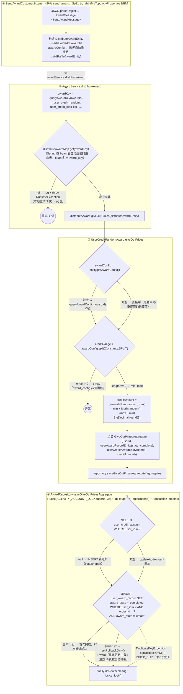
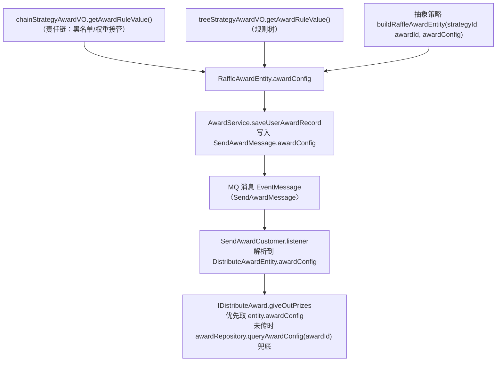
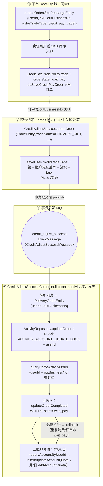

# 营销抽奖系统 · 核心流程设计

> 拆分自《营销抽奖系统 详细设计文档》§四（4.1~4.17），原文档现为索引页。
> 更新日期：2026-09-21（第 27 节：4.9 交易策略化改造、4.12 消费者表补充、新增 4.16 积分调额 / 4.17 积分支付兑换、4.15 开户方式校准）

---
## 四、核心流程设计（每个场景逐一列举）

### 4.1 活动装配流程（数据预热）

**入口**：`GET /api/v1/raffle/activity/armory?activityId=100301` → `RaffleActivityController.armory` → 串联两步装配。

```
① activityArmory.assembleActivitySkuByActivityId(activityId)      ← 活动装配
   ├─ 查该活动下全部 SKU（db00.raffle_activity_sku）
   ├─ 每个 SKU：
   │    ├─ cacheActivitySkuStockCount(sku, stockCountSurplus)
   │    │    → Redis SETNX activity_sku_stock_count_key_{sku}（key 已存在则跳过，防止覆盖扣减中的库存）
   │    └─ queryRaffleActivityCountByActivityCountId → 预热次数配置缓存
   └─ queryRaffleActivityByActivityId → 预热活动信息缓存

② strategyArmory.assembleLotteryStrategyByActivityId(activityId)  ← 策略装配
   ├─ repository.queryStrategyIdByActivityId(activityId)  → 100301 映射 100006
   └─ assembleLotteryStrategy(100006)（见 4.2）
```

**场景逐一列举**：

| 场景 | 输入举例 | 行为与结果 |
|---|---|---|
| A1 正常装配 | `activityId=100301` | SKU 9011 库存计数器、活动/次数缓存写入 Redis；策略 100006 概率表 + 奖品库存计数器写入。返回 `{"code":"0000","data":true}` |
| A2 策略含权重规则 | `strategyId=100001`（rule_models 含 `rule_weight`） | 默认表之外，再按 4000/5000/6000 三档各装配一张概率子表（key 带 `_档位` 后缀） |
| A3 重复装配（幂等） | 再次调用 armory | 活动信息/次数配置走缓存直接返回；**SKU 库存计数器因 key 已存在不覆盖**，避免清掉扣减中的实时值；概率表则重复写入（内容相同，无副作用） |
| A4 权重规则缺失 | 策略 rule_models 声明了 `rule_weight` 但 `strategy_rule` 表无对应行 | 抛 `AppException(ERR_BIZ_001)`「策略规则中 rule_weight 权重规则已适用但未配置」 |
| A5 未装配先抽奖 | 未调 armory 直接 draw | `getRateRange` 取不到值 → 抛出异常（错误码 `ERR_BIZ_002` 语义：抽奖策略配置未装配） |

### 4.2 策略装配——概率查找表算法（`StrategyArmoryDispatch`）

**目标**：把每个奖品的概率展开成 Redis Hash 查找表，抽奖时「一次随机数 + 一次 HGET」O(1) 命中。

**算法步骤**：

```
1. 查询策略下全部奖品（带缓存）
2. 逐个奖品把库存总量写入 Redis 计数器 strategy_award_count_key_{sid}_{aid}
3. minRate   = 所有奖品概率的最小值        ← 最小刻度
   totalRate = 所有奖品概率之和（约等于 1）
   rateRange = ⌈totalRate / minRate⌉      ← 查找表总容量（向上取整，不丢份额）
4. 每个奖品占位数 = ⌈rateRange × awardRate⌉，把 awardId 重复占位填入 List
5. Collections.shuffle 乱序（打散连续排布）
6. List → LinkedHashMap（索引 → 奖品ID）
7. 写 Redis：
   String: big_market_strategy_rate_range_key_{key} = rateRange
   Hash:   big_market_strategy_rate_table_key_{key}  (field=索引, value=奖品ID)
```

**举例一：策略 100001（标准概率表，精度无损）**

奖品配置：101(0.30) 102(0.20) 103(0.20) 104(0.10) 105(0.10) 106(0.05) 107(0.04) 108(0.0099) 109(0.0001)

```
totalRate = 1.0000
minRate   = 0.0001（奖品 109）
rateRange = ⌈1.0000 / 0.0001⌉ = 10000

占位计算：
  101 → ⌈10000×0.30⌉  = 3000 个
  102 → ⌈10000×0.20⌉  = 2000 个
  103 → ⌈10000×0.20⌉  = 2000 个
  104 → ⌈10000×0.10⌉  = 1000 个
  105 → ⌈10000×0.10⌉  = 1000 个
  106 → ⌈10000×0.05⌉  =  500 个
  107 → ⌈10000×0.04⌉  =  400 个
  108 → ⌈10000×0.0099⌉=   99 个
  109 → ⌈10000×0.0001⌉=    1 个
合计 10000 个槽位，shuffle 后写入 Hash。
抽奖时：random = SecureRandom.nextInt(10000)，HGET rate_table random → 奖品ID。
109 的中奖概率 = 1/10000 = 0.0001 ✓ 与配置严格一致。
```

**举例二：策略 100006（活动 100301 的策略，展示低精度失真）**

奖品配置：101(0.02)，102~108 各(0.03)，共 8 个奖品。

```
totalRate = 0.02 + 7×0.03 = 0.23
minRate   = 0.02
rateRange = ⌈0.23 / 0.02⌉ = ⌈11.5⌉ = 12

占位计算：
  101    → ⌈12×0.02⌉ = ⌈0.24⌉  = 1 个
  102~108 → ⌈12×0.03⌉ = ⌈0.36⌉ = 各 1 个（共 7 个）
合计 8 个槽位（不是 12！各奖品独立向上取整导致表长 < rateRange）。
实际中奖概率：每个奖品 1/8 = 0.125。
→ 教训：概率刻度不足时，各奖品概率被「拉平」。奖品概率的最小值决定了查找表精度，
  实际配置应保证 minRate 足够小（如 0.0001），让 rateRange 覆盖全部概率份额。
```

**举例三：权重子表装配（策略 100001，档位 `4000:102,103,104,105`）**

```
筛选子表奖品：102(0.20) 103(0.20) 104(0.10) 105(0.10)
totalRate = 0.60，minRate = 0.10
rateRange = ⌈0.60 / 0.10⌉ = 6
占位：102→2，103→2，104→1，105→1（共 6）
Redis key：big_market_strategy_rate_table_key_100001_4000:102,103,104,105
（key = strategyId + "_" + 整段档位字符串）
```

**装配触发方式汇总**：

| 方式 | 入口 | 说明 |
|---|---|---|
| 活动装配接口 | `GET /api/v1/raffle/activity/armory` | 活动 + 策略一次装配，**生产推荐入口** |
| 策略装配接口 | `GET /api/v1/raffle/strategy_armory?strategyId=100006` | 仅装配策略（策略维度的调试/运维入口） |

### 4.3 活动抽奖主流程（draw，第 20 节串联的核心）

**入口**：`POST /api/v1/raffle/activity/draw`，body `{"userId":"Charlie","activityId":100301}`。

`RaffleActivityController.draw` 串联 5 步（无独立 case 层时由接口实现层承担领域串联职责）：

```
① 参数校验：userId 非空 && activityId 非空，否则抛 ILLEGAL_PARAMETER
② raffleActivityPartakeService.createOrder(userId, activityId)   ← 活动域：换取「一次抽奖资格」
     返回 UserRaffleOrderEntity（含 orderId、strategyId、endDateTime=活动结束时间）
③ raffleStrategy.performRaffle(RaffleFactorEntity(userId, strategyId, endDateTime))  ← 策略域：算出奖品
     返回 RaffleAwardEntity（awardId / awardTitle / sort）
     endDateTime 随抽奖因子透传到规则树 rule_stock 节点，用作奖品库存分段锁的 TTL
     （TTL = 活动结束时间 - 当前时间 + 1 天，锁随活动自然过期，避免残留 key）
④ awardService.saveUserAwardRecord(UserAwardRecordEntity)        ← 奖品域：中奖记录 + 发奖任务
     （内部同事务写入 user_award_record + task，并把 user_raffle_order 置为 used；事务后发 MQ）
⑤ 组装 ActivityDrawResponseDTO（awardId / awardTitle / awardIndex）返回
```

**完整时序举例（userId=Charlie，activityId=100301，当天首次抽奖）**：

```
1. 参与域：查活动（open ✓、日期内 ✓）→ 查未使用参与单（无）→ 查总/月/日账户
   → 月/日账户不存在，从总账镜像初始化 → 总-1、月-1、日-1，插入参与单
   user_raffle_order：orderId=812345678901 state=create strategyId=100006
2. 策略域：责任链（100006 无 rule_models → 直接 default）→ 默认概率表随机命中 awardId=106
   → 规则树 tree_lock_1：rule_lock 查当天已抽 1 次 ≥ 阈值 1 → ALLOW
   → rule_stock：Redis DECR strategy_award_count_key_100006_106（成功）→ 锁奖返回 106
3. 奖品域：user_award_record 插入（orderId 幂等键）+ task 插入 + 参与单置 used（同一事务）
   → 事务提交后发 MQ 到 send_award 队列 → task 置 completed
4. 返回：{"code":"0000","info":"成功","data":{"awardId":106,"awardTitle":"3等奖","awardIndex":6}}
```

**主流程异常场景**（每个都会被 catch 转为对应错误码响应）：

| 场景 | 触发条件 | 结果 |
|---|---|---|
| C1 参数缺失 | `{"userId":"","activityId":100301}` | `0002 ILLEGAL_PARAMETER`，不进入领域层 |
| C2 活动未开启 | 活动 state=create/close | `ERR_BIZ_003 ACTIVITY_STATE_ERROR`，参与单不创建 |
| C3 不在活动期 | 当前时间 < begin 或 > end | `ERR_BIZ_004 ACTIVITY_DATE_ERROR` |
| C4 总额度不足 | 账户不存在或 totalCountSurplus ≤ 0 | `ERR_BIZ_006 ACCOUNT_QUOTA_ERROR` |
| C5 月额度不足 | monthCountSurplus ≤ 0 | `ERR_BIZ_007 ACCOUNT_MONTH_QUOTA_ERROR` |
| C6 日额度不足 | dayCountSurplus ≤ 0 | `ERR_BIZ_008 ACCOUNT_DAY_QUOTA_ERROR` |
| C7 重复核销 | 并发下参与单已被置 used | `ERR_BIZ_009 ACTIVITY_ORDER_ERROR`，事务回滚 |
| C8 唯一索引冲突 | orderId / 消息重复落库 | `0003 INDEX_DUP`，事务回滚 |
| C9 非预期异常 | 任何未捕获异常 | `0001 UN_ERROR` |

### 4.4 参与活动——创建参与订单（activity 域 partake）

**模板方法**：`AbstractRaffleActivityPartake.createOrder`（固定流程）+ `RaffleActivityPartakeService`（可变细节）。

```
1. 查活动（缓存）→ 校验 state=open、当前时间 ∈ [begin, end]
2. queryNoUsedRaffleOrder(userId, activityId)
   └─ 查 user_raffle_order 中 order_state='create' 的记录
      ├─ 命中 → 直接返回旧订单（幂等复用，不重复扣额度）
      └─ 未命中 → 继续
3. doFilterAccount：三级账户过滤 + 构建聚合对象
4. buildUserRaffleOrder：orderId=RandomStringUtils.randomNumeric(12)，state=create
5. saveCreatePartakeOrderAggregate（单事务）：
   ① update 总账户 totalCountSurplus-1（影响 0 行 → 回滚 + ACCOUNT_QUOTA_ERROR）
   ② 月账户：存在 → update monthCountSurplus-1（0 行 → 回滚）
              不存在 → insert 月账户(monthCountSurplus=镜像值-1) + 回写总账月镜像
   ③ 日账户：同 ②（day 维度）
   ④ insert user_raffle_order
   任一步失败整体回滚；DuplicateKeyException → INDEX_DUP
```

**场景逐一列举**：

| 场景 | 举例 | 行为 |
|---|---|---|
| P1 首次参与 | Charlie 首抽 100301 | 月/日账户不存在 → 以总账镜像 `monthCountSurplus/dayCountSurplus` 为基数**先建账户再扣 1**（insert 时直接写 `镜像值-1`），并回写总账镜像；总账 `totalCountSurplus-1` |
| P2 订单复用（幂等） | 抽奖流程在第 ③ 步断掉（网络中断），用户再次点击 draw | 第 2 步查到 `state=create` 的旧参与单，**直接返回旧单**，额度只扣了一次。后续抽奖继续用同一个 orderId |
| P3 跨日参与 | 昨天 totalSurplus 还剩 1，今天再抽 | 昨天的日账户已扣光，但今天是新的 `day` 键 → 查不到日账户 → 从总账日镜像重新初始化日账户，可继续抽（日额度按天重置的设计） |
| P4 总额度耗尽 | totalCountSurplus=0 | `ERR_BIZ_006`，update 影响 0 行 → 回滚 |
| P5 月额度耗尽 | 月账户 monthCountSurplus=0（总账还有） | 查询阶段即拦截 `ERR_BIZ_007`，无需回滚 |
| P6 日额度耗尽 | 日账户 dayCountSurplus=0 | 查询阶段拦截 `ERR_BIZ_008` |
| P7 并发重复提交 | 同一用户双击 draw | 两个线程都查不到未使用单 → 都走建单 → 一个成功，另一个因 `uq_order_id`/update 竞争失败回滚（幂等由唯一索引兜底） |

### 4.5 前置规则——责任链（决定「用哪种方式抽」）

**装配**：`DefaultChainFactory.openLogicChain(strategyId)` 按 `strategy.rule_models` 数组顺序拼接节点，末尾强制追加 `default` 兜底。节点返回 `StrategyAwardVO{awardId, logicModel}`，**接管**（直接返回）或**放行**（`next().logic(...)`）。

> 详细设计见 `docs/rule-chain.md`。注意：该文档写作时节点返回 `Integer awardId`，现演进为返回 `StrategyAwardVO`（携带 `logicModel`），供 `AbstractRaffleStrategy` 判断「非 default 接管则跳过规则树」。

**场景逐一列举（策略 100001，rule_models = `rule_blacklist,rule_weight`）**：

| 场景 | 输入 | 链路走向 | 结果 |
|---|---|---|---|
| D1 黑名单命中 | `userId=user001`，rule_value=`101:user001,user002,user003` | 黑名单节点拆 `:` 取 awardId=101、拆 `,` 得名单，命中 → 接管 | 返回 `{awardId:101, logicModel:rule_blacklist}`，**后续权重/默认/规则树全部跳过**，awardConfig 暂为 null（见已知问题 Q2） |
| D2 权重命中 | `userScore = queryActivityAccountTotalUseCount(userId, strategyId)`（用户在活动下的累计参与次数，等价积分） | 黑名单放行 → 权重节点解析档位 `{6000,5000,4000}` 降序，取用户积分够得着的最高档 | 走子表 `100001_档位:奖品列表` 随机抽（子表内奖品均分概率），返回 `{awardId, logicModel:rule_weight}`，跳过规则树 |
| D3 权重不命中 | `userScore=0`，所有档位都够不着 | 黑名单放行 → 权重放行 → 默认节点 | `getRandomAwardId(strategyId)` 走全量概率表（如返回 107），**logicModel=default，继续进入规则树** |
| D4 策略无规则 | strategy 100006（rule_models=NULL） | 工厂返回仅含 default 的链 | 直接默认抽奖 |

> 权重节点 D2 中 `userScore` 来源：`RuleWeightLogicChain` 通过 `IStrategyRepository.queryActivityAccountTotalUseCount(userId, strategyId)` 查询活动账户的 `totalCount - totalCountSurplus`（账户累加式积分），**已对接 DB**，无硬编码占位。

**与规则树的衔接**（`AbstractRaffleStrategy.performRaffle`）：

```java
// 责任链结果 logicModel != default（黑名单/权重接管）→ 直接构建奖品实体返回，不走规则树
if (!LogicModel.RULE_DEFAULT.getCode().equals(chainVO.getLogicModel())) {
    return buildRaffleAwardEntity(strategyId, chainVO.getAwardId(), null);
}
// 否则进入规则树（后置规则）
treeVO = raffleLogicTree(userId, strategyId, chainVO.getAwardId());
```

### 4.6 后置规则——决策树（对已抽出的奖品「二次决策」）

**装配**：`DefaultRaffleStrategy.raffleLogicTree` 按奖品查询 `strategy_award.rule_models`（即规则树 ID）→ `queryRuleTreeVOByTreeId` 组装 `RuleTreeVO`（带缓存）→ `DecisionTreeEngine.process` 从根节点迭代。

**引擎路由规则**（`DecisionTreeEngine`）：

- 每轮执行节点 `logic(userId, strategyId, awardId, ruleValue, endDateTime)`，返回 `TreeActionEntity{ruleLogicCheckType, strategyAwardVO}`；`endDateTime`（活动结束时间）由 `performRaffle` 透传，供 `rule_stock` 计算分段锁 TTL；
- `strategyAwardVO` **每轮覆盖**，返回值是「最后一个填充它的节点」结果；
- 下一节点由「当前节点决策 code（0000=ALLOW / 0001=TAKE_OVER）× 出边 `rule_limit_value`（EQUAL 匹配）」决定；无出边或无匹配出边 → 循环结束。

**关于"锁奖短路"的当前实现与注释差异**（`DecisionTreeEngine.process`，与 §八 Q1 联动）：

- 引擎类注释（L45-51）承诺「TAKE_OVER + awardData 非空立即 break」，但 `process` 方法体内并未显式短路，而是靠「无匹配出边自然终止」达成锁奖效果；
- 当前 `RuleStockLogicTreeNode` 仅返回 TAKE_OVER（成功带数据 / 失败不带数据），不会返回 ALLOW；SQL 中 `rule_stock → rule_luck_award` 的出边限定值是 **ALLOW**（`marketing.sql:184/186/191/197`），不会被 TAKE_OVER 匹配上；
- 三个效果叠加：① 库存扣减成功 → TAKE_OVER+awardData → 出边匹配失败 → 循环自然结束，**结果仍是锁奖**；② 库存不足 → TAKE_OVER 无 awardData → 出边仍是 ALLOW 匹配失败 → 循环结束 → **会返回上游的 null**，兜底节点不会被走到（与 Q1 描述一致）。

**三个节点**：

| 节点 | bean 名 | ruleValue | 行为 |
|---|---|---|---|
| 次数锁 | `rule_lock` | 阈值整数（如 `1`、`2`） | 查当天已抽次数 `queryTodayUserRaffleCount`；≥阈值 → ALLOW（继续库存扣减）；<阈值 → TAKE_OVER（无奖品数据，走兜底） |
| 库存扣减 | `rule_stock` | 无 | Redis DECR 奖品库存（`subtractionAwardStock(strategyId, awardId, endDateTime)`）；成功 → TAKE_OVER + 透传 awardId（锁奖）；不足 → TAKE_OVER 不带奖品数据 |
| 兜底奖励 | `rule_luck_award` | `奖品ID:规则值`（如 `101:1,100`） | 拆冒号取兜底奖品，覆盖上游 awardId → TAKE_OVER + 兜底奖品数据 |

**场景逐一列举（策略 100006）**：

**场景 E1：抽中 106（tree_lock_1，次数锁阈值 1），当天已抽 0 次**

```
第 1 轮 rule_lock：当天次数 0 < 1 → TAKE_OVER
  匹配出边 rule_lock --TAKE_OVER--> rule_luck_award
第 2 轮 rule_luck_award：ruleValue='101:1,100' → 兜底奖品 101「随机积分」
  返回 {awardId:101, awardRuleValue:'1,100'}
→ 用户第 1 次抽奖抽不到 3 等奖，拿兜底奖 101（随机 1~100 积分）。
```

**场景 E2：当天已抽 1 次，再次抽中 106（tree_lock_1），库存充足（surplus=28）**

```
第 1 轮 rule_lock：当天次数 1 ≥ 1 → ALLOW
  匹配出边 rule_lock --ALLOW--> rule_stock
第 2 轮 rule_stock：DECR strategy_award_count_key_100006_106 → 27（>0）
  抢分段锁 SETNX ..._106_27 成功 → 投延迟队列 → 返回 TAKE_OVER + {awardId:106}
  匹配 rule_stock 出边（仅配置了 ALLOW --> rule_luck_award）→ TAKE_OVER 无匹配 → 循环结束
→ 返回 106（锁奖效果达成：TAKE_OVER 且携带奖品数据时不会走到兜底节点）
```

**场景 E3：抽中 101（tree_luck_award 树，根节点即库存扣减），库存充足**

```
第 1 轮 rule_stock：DECR 成功 → TAKE_OVER + {awardId:101} → 无匹配出边 → 结束
→ 返回 101。tree_luck_award 的兜底节点仅在库存不足（TAKE_OVER 无数据，见已知问题 Q1）或
   ALLOW 时才会被走到。
```

**场景 E4：奖品未配置规则树**（`strategy_award.rule_models` 为空）

```
queryStrategyAwardRuleModelVO 返回 null → 直接透传责任链的 awardId，不进规则树。
```

**场景 E5：树 ID 配置了但 rule_tree 三张表缺配置**

```
queryRuleTreeVOByTreeId 返回 null → 抛 RuntimeException
「存在抽奖策略配置的规则模型 Key，未在库表 rule_tree、rule_tree_node、rule_tree_line 配置对应的规则树信息」
```

### 4.7 奖品库存扣减与异步落库（strategy 域）

**链路**：抽奖命中奖品 → 规则树 `rule_stock` 节点 Redis 原子扣减 → 扣减事件进延迟队列（3s）→ `UpdateAwardStockJob` 每 5 秒取 1 条刷回 MySQL。

**扣减实现**（`StrategyRepository.subtractionAwardStock`，第 24 节增加 `endDateTime` 参数）：

```
surplus = DECR strategy_award_count_key_{sid}_{aid}
├─ surplus < 0（库存已空仍被扣）→ SET key 0（回填防负数扩散）→ return false
└─ surplus ≥ 0 → SETNX key_surplus 分段锁
     ├─ endDateTime 非空 → TTL = 活动结束时间 - now + 1 天（与 SKU 库存分段锁策略对齐）
     ├─ 成功 → return true（本笔有效，投递延迟队列）
     └─ 失败 → return false（同一剩余值的锁已存在——防恢复库存/手动调整时超卖的兜底）
```

**场景逐一举例（奖品 100006/106 初始库存 28）**：

| 场景 | 过程 | 结果 |
|---|---|---|
| S1 正常扣减 | 第 5 笔抽奖：DECR 28→23...依次递减；SETNX `..._106_23` 成功 | 扣减成功锁奖；事件 `{strategyId:100006, awardId:106}` 投入 `strategy_award_count_query_key` 延迟队列 |
| S2 库存耗尽 | 最后一笔：DECR 0→-1 | 回填为 0，return false → 规则树 `rule_stock` 判定库存不足 → TAKE_OVER 无奖品数据（当前配置下走不到兜底，见已知问题 Q1） |
| S3 分段锁竞争 | 手工把 Redis 恢复到 23，再次扣减 DECR→23，但 `..._106_23` 已被锁 | return false → 视同库存不足（「所有可用库存 key 都被加锁」的防超卖兜底设计） |
| S4 异步刷盘 | 3s 后事件到达 BlockingQueue；Job 每 5s poll 一条 | `UPDATE strategy_award SET award_count_surplus = award_count_surplus - 1 WHERE strategy_id=? AND award_id=?`（每次只刷 1 条，削峰） |

**设计要点**：Redis 承担「即时防超卖」（毫秒级 DECR），MySQL 由 Job 异步串行刷盘（最终一致）。分段锁保证「同一剩余值只投一次延迟消息」，且手工恢复库存也无法超卖。

### 4.8 活动 SKU 库存扣减与异步落库（activity 域）

**链路**：额度充值下单时 action chain 扣 SKU 库存 → 扣减事件进延迟队列（3s）→ `UpdateActivitySkuStockJob` 每 5 秒刷 1 条 → **库存清零时发 MQ → `ActivitySkuStockZeroCustomer` 强一致收尾**。

**扣减实现**（`ActivityRepository.subtractionActivitySkuStock`，三分支）：

```
surplus = DECR activity_sku_stock_count_key_{sku}
├─ surplus == 0 → 发布 MQ（activity_sku_stock_zero 队列，data=sku）→ return false（告知上游本笔是最后一扣）
├─ surplus < 0  → SET key 0（超卖兜底回填）→ return false
└─ surplus > 0  → SETNX key_surplus 分段锁（TTL = 活动结束时间 - now + 1 天）
     ├─ 成功 → return true（上游投延迟队列）
     └─ 失败 → return false（上游抛 ACTIVITY_SKU_STOCK_ERROR）
```

**场景逐一举例（sku=9011，初始 Redis 库存 100）**：

| 场景 | 过程 | 结果 |
|---|---|---|
| G1 正常扣减 | 用户充值：DECR 100→99，SETNX `..._9011_99`（TTL 至活动结束次日）成功 | 延迟队列投 `{sku:9011, activityId:100301}`；3s 后 Job 每 5s 刷一条 `UPDATE raffle_activity_sku SET stock_count_surplus = surplus - 1` |
| G2 库存清零 | 第 100 笔：DECR 1→0 | 发 MQ `{"id":"...","data":9011}`；return false → `ActivitySkuStockActionChain` 抛 `ERR_BIZ_005`，该笔充值失败 |
| G3 超卖兜底 | 库存已 0 仍有请求：DECR 0→-1 | 回填 0，return false → 同 G2 拒绝 |
| G4 分段锁竞争 | 同一剩余值第二次出现（如手工恢复库存） | SETNX 失败 → return false → 拒绝本笔 |
| G5 清零收尾（MQ 消费） | `ActivitySkuStockZeroCustomer` 收到 data=9011 | ① `clearActivitySkuStock(9011)`：DB 库存**强制置 0**（终态覆写）；② `clearQueueValue()`：清空延迟队列残留事件，**防止 Job 在其后以 5s/条 的节奏把 DB 一路扣成负数** |
| G6 削峰效果 | T0 时刻 50 笔并发充值 | 瞬时 50 次 DECR 毫秒完成（防超卖 OK）；DB 写入被削平为 5s/条的串行节奏（50 笔 ≈ 250s 刷完）；若期间清零，剩余事件被 G5 直接清空 |

**两步顺序的设计**（清零收尾）：先 DB 置 0（幂等：SET 0 SET 0 仍是 0），后清队列（此时 Redis 已 0，上游 DECR 走分支②/③不再投递，不会误清新事件）。

### 4.9 活动额度充值下单（activity 域 quota，「买次数」）

**入口**：领域服务 `RaffleActivityAccountQuotaService.createOrder(SkuRechargeEntity{userId, sku, outBusinessNo, orderTradeType})`（测试 `RaffleActivityAccountQuotaServiceTest` 直接调用；生产可由支付回调/运营发放触发）。

**模板方法流程**（第 27 节起第 5 步改为**交易策略路由**）：

```
1. 参数校验（userId / sku / outBusinessNo 非空）
2. 查基础信息：sku → 活动 → 次数配置（11101：total=1/day=1/month=1）
   （ActivitySkuEntity 自第 27 节起携带 productAmount「商品金额【积分】」）
3. 活动动作责任链（DefaultActivityChainFactory，固定两节点）：
   activity_base_action（状态 open？日期内？sku 剩余库存>0？）
     └─ next ─► activity_sku_stock_action（Redis 扣 SKU 库存 + 投延迟队列，见 4.8）
4. buildOrderAggregate：生成 12 位数字 orderId
5. 交易策略路由（第 27 节新增，替代原固定 doSaveOrder）：
   ITradePolicy tradePolicy = tradePolicyGroup.get(skuRechargeEntity.getOrderTradeType().getCode())
   tradePolicy.trade(createOrderAggregate)
     ├─ rebate_no_pay_trade（默认值，返利无支付）：payAmount=0、state=completed
   │    └─ doSaveNoPayOrder：订单 + 三账户（总/月/日）同事务直接充值到账
   └─ credit_pay_trade（积分兑换，需支付）：state=wait_pay
        └─ doSaveCreditPayOrder：只写订单，不动账户（等支付成功 MQ 回调发货，见 4.17）
6. 返回单号
```

**交易策略一览**（`activity/service/quota/policy/`，`@Service("code")` 注册，Spring 按 bean 名组装 `Map<String, ITradePolicy>`）：

| 策略 bean 名 | `OrderTradeTypeVO` | 订单状态 | 支付金额 | 落库内容 | 典型来源 |
|---|---|---|---|---|---|
| `rebate_no_pay_trade` | `rebate_no_pay_trade`（**默认**，`SkuRechargeEntity` 字段默认值） | `completed` | `0` | 订单 + 总/月/日三账户累加（`ACTIVITY_ACCOUNT_LOCK` 分布式锁 + 编程式事务） | 签到等行为返利 sku 类型（`RebateMessageCustomer`） |
| `credit_pay_trade` | `credit_pay_trade` | `wait_pay` | 订单实体 `payAmount`（当前策略未赋值，落库为 NULL，见 §八 Q12） | 仅订单（无锁 + 编程式事务，`DuplicateKeyException → INDEX_DUP`） | 积分支付兑换商品（见 4.17） |

> **兼容性设计**：`SkuRechargeEntity.orderTradeType` 默认 `rebate_no_pay_trade`，老调用方（返利链路、历史测试）不传该字段时行为与第 26 节前完全一致；新调用方显式传 `credit_pay_trade` 走两段式支付。

**场景逐一列举**：

| 场景 | 举例 | 行为 |
|---|---|---|
| F1 首次充值 | `{userId:"Charlie", sku:9011, outBusinessNo:"20231109..."}`（默认策略） | 账户不存在 → insert `raffle_activity_account`（total/day/month 各 1/1/1）；订单落库；SKU 库存扣 1 |
| F2 追加充值 | 同一用户第二次充值（sku 库存仍有） | update 账户额度累加（1/1/1 → 2/2/2）；订单再落一条 |
| F3 活动校验失败 | 活动 state=close 或过期 | `ERR_BIZ_003` / `ERR_BIZ_004`，不进库存节点 |
| F4 SKU 库存不足 | Redis DECR 后 <0 | `ERR_BIZ_005 ACTIVITY_SKU_STOCK_ERROR`，订单不落库 |
| F5 重复 outBusinessNo | 同一业务单号重复回调 | `uq_order_id` 唯一索引 / `uq_out_business_no` 冲突 → 回滚 + `0003 INDEX_DUP`（幂等保护） |
| F6 积分支付下单 | `orderTradeType=credit_pay_trade` | 订单 `state=wait_pay` 落库，**账户不动**；返回 orderId，等待支付成功事件发货（4.17） |

**责任链与抽奖责任链的区别**：活动动作链是**固定顺序**（构造函数里拼好 `base → sku_stock`），节点通过**抛异常**中断（而非返回值接管）；抽奖责任链顺序由数据库 `rule_models` 驱动，可动态调整。

### 4.10 中奖记录写入与 MQ 发送（award 域）

**入口**：`AwardService.saveUserAwardRecord(userAwardRecordEntity)`，由 draw 主流程第 ④ 步调用。

**流程**：

```
1. 构建 MQ 消息体 SendAwardMessage{userId, orderId, awardId, awardTitle, awardConfig}，
   sendAwardMessageEvent.buildEventMessage(...) 生成 EventMessage（含 11 位随机 messageId）
2. 构建 TaskEntity{messageId, exchange, routingKey, queue, message, state=create}
3. 组装聚合 UserAwardRecordAggregate{userAwardRecord, task}
4. awardRepository.saveUserAwardRecord（dbRouter 按 userId 路由，编程式事务）：
   ① insert user_award_record（orderId 唯一索引 = 幂等键）
   ② insert task（state=create）
   ③ update user_raffle_order 置 order_state=used
      影响 0 行 → 回滚 + ACTIVITY_ORDER_ERROR（防止同一参与单重复核销中奖）
   DuplicateKeyException → 回滚 + INDEX_DUP
5. 事务提交后发送 MQ（EventPublisher，默认交换机 routingKey=send_award）
   ├─ 成功 → task.state=completed
   └─ 失败 → task.state=fail（不抛异常！等 SendMessageTaskJob 补偿）
```

**`awardConfig` 透传机制**（第 25 节新增，解决 Q2）：

- 抽象策略 `AbstractRaffleStrategy.buildRaffleAwardEntity` 把责任链/规则树节点的 `awardRuleValue` 写入 `RaffleAwardEntity.awardConfig`
  - 责任链非默认接管（黑名单/权重）→ `chainStrategyAwardVO.getAwardRuleValue()`
  - 规则树 → `treeStrategyAwardVO.getAwardRuleValue()`
- `AwardService.saveUserAwardRecord` 把 `RaffleAwardEntity.awardConfig` 透传到 `SendAwardMessage.awardConfig`，随消息下发到 `send_award` 队列
- `SendAwardCustomer.listener` 解析消息后写入 `DistributeAwardEntity.awardConfig`
- `IDistributeAward` 实现（如 `UserCreditRandomAward`）优先使用 `distributeAwardEntity.getAwardConfig()`，未传时再 `awardRepository.queryAwardConfig(awardId)` 兜底
- 这条链路让黑名单接管的奖品 101（`award_config="1,100"`）从责任链节点的 `awardRuleValue="1,100"` 一直透传到发奖侧，不再依赖 `award` 表兜底查询

**场景逐一列举**：

| 场景 | 举例 | 行为 |
|---|---|---|
| I1 正常 | draw 抽中 106 | 同事务三写（记录+任务+核销）→ MQ 发送成功 → task=completed → `SendAwardCustomer` 消费（**第 25 节**：`IDistributeAward` 按 `award_key` 路由 → `UserCreditRandomAward` 积分入账 → `user_award_record.award_state='completed'`，详见 4.15） |
| I2 MQ 发送失败 | 事务已提交但 RabbitMQ 不可用 | task=fail；抽奖结果不受影响（记录已落库）；5s 后 `SendMessageTaskJob` 扫到并补发（见 4.11） |
| I3 重复核销 | 并发/重放：参与单已是 used | 第 ③ 步 update 影响 0 行 → 全事务回滚 → `ERR_BIZ_009`，不会产生两条中奖记录 |
| I4 重复中奖记录 | 同 orderId 二次写入（如 I3 之外的极端重放） | `uq_order_id` 冲突 → 回滚 + `0003 INDEX_DUP` |

**设计要点**：**「事务内落库 + 事务外发消息 + 任务表补偿」** 是本系统保证「本地DB与MQ最终一致」的标准范式——MQ 发送永远不放在事务里（长事务/ MQ 抖动拖垮 DB），也绝不只发 MQ 不落库（消息丢失无从补偿）。

### 4.11 消息补偿定时任务（task 域）

**入口**：`SendMessageTaskJob.execute`，cron `0/5 * * * * ?`（每 5 秒）。

**流程**：

```
1. dbCount = dbRouter.dbCount()  // = 2
2. 逐库（dbIdx=1..2）提交线程池并行执行：
   ├─ dbRouter.setDBKey(dbIdx) + setTBKey(0)   // ThreadLocal 路由，线程内 SQL 全部路由到该库 task 表
   ├─ queryNoSendMessageTaskList()             // state in (create, fail)
   ├─ 每条任务再单独开线程：
   │    ├─ sendMessage(task)                   // 按 exchange/routingKey 重发
   │    ├─ 成功 → updateTaskSendMessageCompleted（幂等：下轮扫描不再查出）
   │    └─ 失败 → updateTaskSendMessageFail（下轮 5s 后继续重试）
   └─ finally dbRouter.clear()                 // 线程池复用线程，必须清 ThreadLocal 防串库
3. 顶层 try-catch 兜底：任何异常只记日志，保证 @Scheduled 调度不中断
```

**场景列举**：

| 场景 | 举例 | 行为 |
|---|---|---|
| T1 补偿成功 | I2 的 fail 任务，MQ 恢复后 | 重发成功 → completed，之后扫描不再命中 |
| T2 持续失败 | MQ 长时间宕机 | 每 5s 重试一轮，任务保持 fail，恢复后自动补上（至少一次投递 + 消费侧幂等） |
| T3 多库并行 | db01 有 80 条、db02 有 30 条 | 两个库的扫描并行执行；库内每条消息的发送也并行（线程池 20~50，拒绝策略 CallerRunsPolicy） |

### 4.12 MQ 消费者

| 消费者 | 队列 | 消息体 | 处理 | 失败策略 |
|---|---|---|---|---|
| `ActivitySkuStockZeroCustomer` | `activity_sku_stock_zero` | `EventMessage<Long>`（data=sku） | `clearActivitySkuStock`（DB 置 0）→ `clearQueueValue`（清延迟队列残留） | rethrow → 本地重试 3 次 → 死信（避免 Redis=0、DB=中间值的脏数据被静默吞掉） |
| `SendAwardCustomer`（**第 25 节完整闭环**） | `send_award` | `EventMessage<SendAwardMessage>` | parse 消息 → 构造 `DistributeAwardEntity{userId, orderId, awardId, awardConfig}` → `AwardService.distributeAward` → 按 `award_key` 路由 `IDistributeAward` 实现 → `UserCreditRandomAward` 等入账 + 中奖记录置 completed（详见 4.15） | rethrow → 重试 3 次 → 死信；消费侧幂等由 `WHERE award_state='create'` 条件 UPDATE 保证 |
| `RebateMessageCustomer` | `send_rebate`（已对齐 §八 Q8） | `EventMessage<RebateMessage>` | sku 类型返利 → `SkuRechargeEntity`（orderTradeType 默认 `rebate_no_pay_trade`）→ 额度充值结算（详见 4.13）；integral 类型返利 → `TradeEntity{tradeName=REBATE, tradeType=FORWARD}` → `creditAdjustService.createOrder` 积分入账（**第 26 节接入**，详见 4.16）；`INDEX_DUP` 视为重复消费，warn 后正常返回 | 其他异常 rethrow → 重试 3 次 → 死信 |
| `CreditAdjustSuccessCustomer`（第 27 节新增） | `credit_adjust_success` | `EventMessage<CreditAdjustSuccessMessage>`（userId / orderId / amount / outBusinessNo） | 积分调额/支付成功后发货：构造 `DeliveryOrderEntity{userId, outBusinessNo}` → `raffleActivityAccountQuotaService.updateOrder`（订单 `wait_pay → completed` + 三账户充值，详见 4.17） | rethrow → 重试 3 次 → 死信；`INDEX_DUP` warn 后返回（重复消费幂等） |

**消费侧幂等**：MQ 至少一次投递下可能重复消费。`clearActivitySkuStock` 天然幂等（SET 0）；`SendAwardCustomer` 通过 `user_award_record.award_state='create'` 的条件 UPDATE 形成幂等栅栏，重复消费时 UPDATE 影响 0 行 → rollback + warn，无副作用；`CreditAdjustSuccessCustomer` 通过 `raffle_activity_order.state='wait_pay'` 的条件 UPDATE 形成幂等栅栏（重复消费时影响 0 行 → rollback，积分不会二次到账）。

### 4.13 行为返利——入账与结算（rebate 域，第 22~23 节）

**入口**：`POST /api/v1/raffle/activity/calendar_sign_rebate`，参数 `userId`（form 表单）。

**入账流程**（`BehaviorRebateService.createOrder`，模板与 4.10 发奖范式完全一致）：

```
1. Controller 组装 BehaviorEntity：
     userId、behaviorTypeVO=SIGN、outBusinessNo=当天日期 yyyyMMdd（紧凑格式，如 20260911）
2. 查询返利配置 queryDailyBehaviorRebateConfig(SIGN)
     → db00.daily_behavior_rebate where state='open' and behavior_type='sign'
     → 种子数据返回两条：sku(9011)、integral(10)；无配置则直接返回空列表
3. 逐条配置构建聚合 BehaviorRebateAggregate{返利订单, task}：
     ├─ 返利订单：orderId=12位随机数、bizId = userId_rebateType_outBusinessNo
     │   （如 Charlie_sku_20260911，同一用户同一天同一返利类型 bizId 唯一）
     ├─ MQ 消息：SendRebateMessageEvent.RebateMessage{userId, rebateType, rebateDesc, rebateConfig, bizId}
     │   → buildEventMessage 生成 EventMessage（11 位随机 messageId）
     └─ task：exchange=''、routingKey=queue=send_rebate、state=create
4. saveUserRebateRecord（dbRouter 按 userId 路由，编程式事务）：
     逐条 insert user_behavior_rebate_order + insert task
     DuplicateKeyException（uq_order_id / uq_biz_id）→ 回滚 + INDEX_DUP
5. 事务提交后逐条发 MQ（EventPublisher → send_rebate 队列）：
     成功 → task=completed；失败 → task=fail，等 SendMessageTaskJob 补偿（见 4.11）
6. 返回全部 orderId 列表
```

**结算流程**（`RebateMessageCustomer.listener`，消费返利消息；第 26 节起 integral 分支接入 credit 域）：

```
1. 解析 EventMessage<RebateMessage>
2. 按 rebateType 分流：
   ├─ sku      → 组装 SkuRechargeEntity{userId, sku=Long.parseLong(rebateConfig), outBusinessNo=bizId}
   │             （orderTradeType 默认 rebate_no_pay_trade）
   │             → raffleActivityAccountQuotaService.createOrder
   │             → 完整复用 4.9 额度充值链路：活动动作责任链（校验+扣 SKU 库存）→ 充值单落库 → 账户额度累加
   │             → 消费重复时 uq_out_business_no（= bizId）冲突 → INDEX_DUP → catch 后 warn 返回（幂等）
   └─ integral → 组装 TradeEntity{userId, tradeName=REBATE, tradeType=FORWARD,
                                   amount=new BigDecimal(rebateConfig), outBusinessNo=bizId}
                → creditAdjustService.createOrder（积分入账，详见 4.16）
                → uq_out_business_no 冲突 → INDEX_DUP → warn 后返回（幂等）
```

**场景逐一列举（userId=Charlie，当天首次签到）**：

| 场景 | 举例 | 行为 |
|---|---|---|
| B1 正常签到 | `userId=Charlie`，当日首次调用 | 配置两条 → 两张返利单 + 两条 task 同事务落库 → 两条 MQ → sku 消息触发充值（账户 total/day/month 各 +1）、integral 消息经 `creditAdjustService.createOrder` 入账 10 积分（**第 26 节接入**） |
| B2 重复签到 | 同一天再次调用 | 第 2 条配置的 `uq_biz_id`（`Charlie_sku_20260911` 已存在）冲突 → 整个事务回滚 → `0003 INDEX_DUP`（**行为级幂等由 bizId 唯一索引保证**） |
| B3 无返利配置 | `daily_behavior_rebate` 无 open 状态的 sign 行 | 返回空列表，不落库不发 MQ，接口仍返回 `data:true` |
| B4 MQ 发送失败 | 事务提交后 RabbitMQ 不可用 | task=fail，返利单已落库；`SendMessageTaskJob` 补偿重发（同 4.11） |
| B5 消费侧重复消费 | 同一 messageId 被投递两次 | 第二次 `createOrder` 命中 `uq_out_business_no`（bizId）冲突 → INDEX_DUP → warn 后正常 ack |
| B6 跨天签到 | 次日再签 | outBusinessNo 变为新日期 → bizId 不同 → 正常再入账（每日返利的设计） |

**设计要点**：签到返利**不直接 update 账户表**，而是复用「充值单 + 账户聚合 + SKU 库存扣减」这条既有链路——返利单与充值单通过 `out_business_no = bizId` 关联，天然获得幂等、账户聚合事务与 SKU 库存防超卖三重保障。

### 4.14 签到状态查询与奖品解锁计算（第 21/24 节）

**是否已签到**（`POST /api/v1/raffle/activity/is_calendar_sign_rebate`，参数 `userId`）：

```
outBusinessNo = 当天 yyyyMMdd
→ queryOrderByOutBusinessNo(userId, outBusinessNo)（dbRouter 路由到用户库分表）
→ 结果非空 = 当天已签到（签到会为每条返利配置各落一张单，只要任一存在即视为已签）
```

**奖品列表解锁状态**（`POST /api/v1/raffle/query_raffle_award_list`，入参 `{userId, activityId}`，第 21 节迭代）：

```
1. queryRaffleStrategyAwardListByActivityId(activityId) → 策略奖品列表（含 rule_models=规则树ID）
2. 收集非空 rule_models 为 treeIds → queryAwardRuleLockCount(treeIds)
   → 查 rule_tree_node 中 rule_key='rule_lock' 的节点，得 Map<treeId, 解锁门槛次数>
3. queryRaffleActivityAccountDayPartakeCount(activityId, userId)
   → 日账户 day_count - day_count_surplus = 当日已参与次数（无日账户 = 0）
4. 逐奖品填充：
   awardRuleLockCount = 门槛（未配置规则树为 null）
   isAwardUnlock      = 无门槛 || 当日已抽次数 >= 门槛
   waitUnLockCount    = 无门槛 ? 0 : max(0, 门槛 - 当日已抽次数)
```

> 注意：解锁判断与规则树 `rule_lock` 节点同源（都基于 `queryTodayUserRaffleCount` / 日账户已参与次数），接口层用于前端「抽奖 N 次后解锁」角标展示，规则树用于抽奖时的实际拦截。

**权重规则查询**（`POST /api/v1/raffle/query_raffle_strategy_rule_weight`，入参 `{userId, activityId}`，第 24 节）：

```
1. queryRaffleActivityAccountPartakeCount(activityId, userId)
   → 总账户 total_count - total_count_surplus = 用户在该活动下的累计参与次数
2. queryAwardRuleWeightByActivityId(activityId)
   → 解析 strategy.rule_models + strategy_rule.rule_value（rule_weight）
   → 返回 List<RuleWeightVO{weight, List<Award{awardId, awardTitle}>}>
3. 逐档位返回：
   ruleWeightCount                 = 档位阈值（Long）
   userActivityAccountTotalUseCount = 用户总参与次数
   strategyAwards[]                = 该档位下可命中的奖品范围
```

> 该接口面向前端「权重档位 → 可抽奖范围」展示，配合 4.5 节 RuleWeightLogicChain 用同一档位规则在抽奖侧实际生效。

### 4.15 发奖服务实现（award 域，第 25 节）

**职责闭环**：从 `SendAwardCustomer.listener` 接收 `send_award` 队列消息后，按 `award.award_key` 路由到对应的 `IDistributeAward` 实现，完成实际发奖（当前已落地积分入账 `UserCreditRandomAward` / `UserCreditBlacklistAward`，未来扩展 OpenAI 次数/模型等）。

**整体流程（第 25 节落地，第 27 节校准开户方式）**：



**注册机制**（`@Component("award_key")` 约定）：

- 领域接口 `IDistributeAward`（`marketing-domain/.../award/service/distribute/IDistributeAward.java`）只有一个方法 `giveOutPrizes(DistributeAwardEntity)`
- 所有实现以 `@Component("award_key")` 注入 Spring 容器，**bean 名必须与 `award.award_key` 一致**——这是路由的唯一 key
- `AwardService` 构造函数注入 `Map<String, IDistributeAward> distributeAwardMap`，由 Spring 自动按 bean 名组装为路由表（`AbstractRaffleStrategy` 的责任链节点 `@Component("rule_xxx")` 注册同款机制）
- `distributeAward` 方法逻辑：

  ```java
  String awardKey = awardRepository.queryAwardKey(distributeAwardEntity.getAwardId());
  IDistributeAward distributeAward = distributeAwardMap.get(awardKey);
  if (null == distributeAward) {
      log.error("分发奖品，对应的服务不存在。awardKey:{}", awardKey);
      throw new RuntimeException("分发奖品，奖品" + awardKey + "对应的服务不存在");
  }
  distributeAward.giveOutPrizes(distributeAwardEntity);
  ```

**`award_config` 透传链路**（解决 Q2）：



- 黑名单奖品 100（`award_config="1"`）与默认奖品 101（`award_config="1,100"`）都通过这条链路把 `awardConfig` 一路传到发奖侧，不再依赖 `award` 表兜底查询
- `award_config` 的 `min,max` 解析规则见 `Constants.SPLIT = ","`（`marketing-types/.../common/Constants.java`）

**场景逐一列举（`UserCreditRandomAward`）**：

| 场景 | 举例 | 行为 |
|---|---|---|
| U1 首次入账 | `userId=Alice`, `awardConfig="1,100"`, 随机 = 42.3 | `ACTIVITY_ACCOUNT_LOCK + Alice` 加锁（3s）→ `SELECT user_credit_account WHERE user_id='Alice'` 返回 null → `INSERT` 新账户（total=available=42.3, status=`open`）；同时 `UPDATE user_award_record SET award_state='completed'` 影响 1 行 |
| U2 累加入账 | `userId=Charlie`, 已有账户余额 100 | 同一把锁内 `SELECT` 命中 → `updateAddAmount`（total/available 各 +42.3）；中奖记录置 completed |
| U3 重复消费 | 同一 messageId 被 RabbitMQ 投递两次（如任务补偿） | 第二次消费的 `UPDATE user_award_record ... WHERE award_state='create'` 影响 0 行（已 completed） → `status.setRollbackOnly()` + warn「重复更新拦截」；事务整体回滚避免「积分重复入账 + 中奖记录被覆盖」 |
| U4 awardKey 无实现 | `award_key="openai_use_count"` 但暂未注册实现 | `AwardService.distributeAward` 抛 `RuntimeException` → `SendAwardCustomer.listener` rethrow → 本地重试 3 次 → 死信；不会静默丢失 |
| U5 黑名单奖品 | `awardId=100`, `awardConfig="1"`（由责任链节点透传,不是从 `award` 表读） | 同 U1/U2 流程；`UserCreditRandomAward` 优先取 `entity.awardConfig="1"`，`min=max=1` → 强制发 1 积分 |

**关键设计决策**：

1. **「先查后写 + 分布式锁」开户（第 27 节由「先 UPDATE 后 INSERT 免查开户」改造而来）**：入账前先 `SELECT user_credit_account WHERE user_id=?`，null → INSERT、非空 → `updateAddAmount` 累加；外层加 `ACTIVITY_ACCOUNT_LOCK + userId` Redisson 锁（3 秒）串行化同一用户的开户/入账。相比旧实现（UPDATE 影响行数 0/1 区分开户）多一次查询，但消除了「两个并发首次入账都看到 0 行 → 双 INSERT」的窗口，是对 Q10（DDL 缺 `uq_user_id`）的应用层缓解——DDL 唯一索引仍未补，锁只是缩小了窗口；
2. **状态机推进方向**：`award_state` 只允许 `create → completed` 单向推进，反向操作直接 rollback，配合 `WHERE award_state='create'` 形成天然幂等栅栏——MQ 至少一次投递下的重复消费被自动拦截；
3. **bean 名 = award_key**：路由表按 bean 名自动组装，新增奖品类型只需新建 `XxxAward implements IDistributeAward` 并标注 `@Component("award_key")`，无需改服务层代码；
4. **`account_status` 预留 `close`**：当前仅 `open` 状态流转，`AccountStatusVO.close` 是预留状态，运行时暂无冻结流程切换路径；
5. **缺失唯一索引的并发风险（Q10）**：`user_credit_account` 当前 DDL 没有 `uq_user_id`。第 27 节已通过「Redisson 锁 + 先查后写」在应用层缓解，但锁过期/进程崩溃场景仍可能出现重复账户。彻底修复仍需 DDL 补 `UNIQUE KEY uq_user_id (user_id)`，INSERT 触发 `DuplicateKeyException` 后由调用方按业务规则合并或丢弃。

### 4.16 积分调额服务（credit 域，第 26 节）

**职责**：`ICreditAdjustService.createOrder(TradeEntity)` 是积分域的**统一正逆向调额入口**（`TradeTypeVO.FORWARD` 加积分 / `REVERSE` 扣积分），交易语义由 `TradeNameVO` 标注（`REBATE` 行为返利 / `CONVERT_SKU` 兑换抽奖）。发奖入账（4.15）与返利入账（4.13）后续都可收敛到该服务，当前由 `RebateMessageCustomer` 的 integral 分支调用。

**领域模型**：

| 角色 | 类 | 关键字段 |
|---|---|---|
| 入参实体 | `TradeEntity` | `userId / tradeName(TradeNameVO) / tradeType(TradeTypeVO) / amount(BigDecimal) / outBusinessNo` |
| 聚合根 | `TradeAggregate` | `userId + CreditAccountEntity + CreditOrderEntity + TaskEntity`（静态工厂 `createCreditAccountEntity` / `createCreditOrderEntity`） |
| 账户实体 | `CreditAccountEntity` | `userId / adjustAmount` |
| 流水实体 | `CreditOrderEntity` | `userId / orderId(12位随机) / tradeName / tradeType / tradeAmount / outBusinessNo` |
| 任务实体 | `TaskEntity`（credit 域版） | `userId / messageId / exchange / routingKey / queue / message(EventMessage<CreditAdjustSuccessMessage>) / state` |

**流程**（`CreditAdjustService.createOrder` → `CreditRepository.saveUserCreditTradeOrder`，与 4.10 发奖范式同构）：

```
1. CreditAdjustService 组装 TradeAggregate：
   ① CreditAccountEntity{userId, adjustAmount}
   ② CreditOrderEntity{userId, orderId=12位随机, tradeName, tradeType, tradeAmount, outBusinessNo}
   ③ MQ 消息 CreditAdjustSuccessMessage{userId, orderId, amount, outBusinessNo}
     → creditAdjustSuccessMessageEvent.buildEventMessage(...) 生成 EventMessage（11 位随机 messageId）
   ④ TaskEntity{userId, messageId, exchange="", routingKey=credit_adjust_success,
                queue=credit_adjust_success, message, state=create}
2. CreditRepository.saveUserCreditTradeOrder：
   ① RLock：USER_CREDIT_ACCOUNT_LOCK + userId + "_" + outBusinessNo（3 秒，按「用户+业务单」粒度）
   ② dbRouter.doRouter(userId)（分库路由，保证事务内同一物理库）
   ③ 编程式事务 transactionTemplate：
      ├─ queryUserCreditAccount(userId) → null ? insert : updateAddAmount（先查后写，同 4.15 决策1）
      ├─ insert user_credit_order（uq_order_id + uq_out_business_no 双重幂等）
      └─ insert task（state=create，携带 credit_adjust_success 消息）
      DuplicateKeyException / Exception → setRollbackOnly()（当前仅记日志，不对外抛 INDEX_DUP）
   ④ finally dbRouter.clear() + lock.unlock()
3. 事务提交后发送 MQ（EventPublisher，默认交换机 routingKey=credit_adjust_success）
   ├─ 成功 → taskDao.updateTaskSendMessageCompleted
   └─ 失败 → taskDao.updateTaskSendMessageFail（等 SendMessageTaskJob 补偿，见 4.11）
```

**消息契约**（`CreditAdjustSuccessMessageEvent.CreditAdjustSuccessMessage`）：`userId / orderId / amount / outBusinessNo`——「积分调整成功」事件，驱动 activity 域订单发货（见 4.17）。

**场景逐一列举**：

| 场景 | 举例 | 行为 |
|---|---|---|
| C1 首次调额 | `{userId:"Charlie", tradeName:REBATE, tradeType:FORWARD, amount:10.19, outBusinessNo:"100009909911"}` | 账户不存在 → insert `user_credit_account`；流水落库；task=create；事务后发 MQ → completed |
| C2 再次调额 | 同用户第二笔（outBusinessNo 不同） | `SELECT` 命中 → `updateAddAmount` 累加；再落一条流水 |
| C3 重复 outBusinessNo | 同一业务单号重复调用（如返利消息重放） | `uq_out_business_no` 冲突 → `DuplicateKeyException` → 事务回滚（当前仅日志，调用方无感知）；**不会重复入账** |
| C4 MQ 发送失败 | 事务已提交但 RabbitMQ 不可用 | task=fail；调额结果不受影响（流水已落库）；5s 后 `SendMessageTaskJob` 补发（见 4.11） |

### 4.17 积分支付兑换商品（activity × credit 跨域，第 27 节）

**业务场景**：用户消耗积分「购买」活动 SKU（抽奖次数）。积分是虚拟资产，无法走外部支付渠道，因此形成**「积分域扣减意向 → MQ 事件 → 活动域发货」**的两段式闭环：



**两段式设计要点**：

1. **下单不扣积分**：`CreditPayTradePolicy` 只把订单置 `wait_pay` 落库（`doSaveCreditPayOrder` 无锁、无账户操作），积分扣减由 credit 域独立完成——两个域各自守好自己的账户，跨域只通过 `outBusinessNo` 关联；
2. **积分调额成功才发货**：`credit_adjust_success` 消息是发货的唯一信号，`CreditAdjustSuccessCustomer` 收到后调 `updateOrder` 把 `wait_pay → completed` 并给活动三级账户充值；
3. **幂等三栅栏**：订单 `WHERE state='wait_pay'` 条件 UPDATE（影响 0 行回滚）、`uq_out_business_no` 业务单唯一、credit 域 `uq_out_business_no` 流水唯一——任一路径重复都落不到「二次充值」；
4. **异常传播**：`updateOrder` 抛 `INDEX_DUP` 时 listener warn 后返回（视为重复消费）；其它异常 rethrow → 本地重试 3 次 → 死信，等人工/补偿处理。

**场景逐一列举**：

| 场景 | 举例 | 行为 |
|---|---|---|
| P1 正常兑换 | 用户下单（wait_pay）→ 积分调额成功 → MQ 投递 | 订单置 completed；总/月/日账户按订单次数充值；用户获得抽奖次数 |
| P2 重复消费 | 同一 `credit_adjust_success` 消息被投递两次 | 第二次 `updateOrderCompleted` 影响 0 行（已 completed）→ rollback + warn；账户不重复充值 |
| P3 积分不足 | 积分调额前校验失败（credit 域未创建成功流水） | 不发 `credit_adjust_success`，订单停留在 `wait_pay`，无发货动作（超时关单由后续补充） |
| P4 消费失败重试 | listener 处理时 DB 抖动 | rethrow → 重试 3 次 → 死信；订单仍 wait_pay，可补偿重投 |
