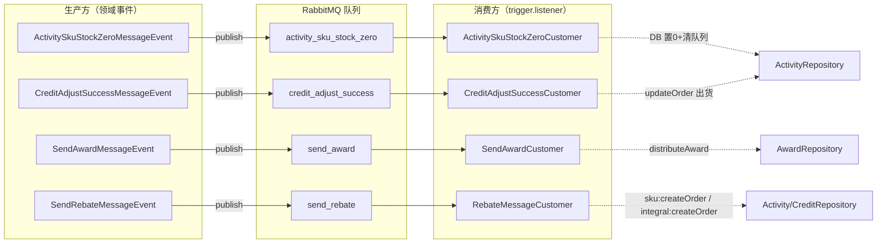

# 营销抽奖系统 · 文件索引与领域层详细设计

> 拆分自《营销抽奖系统 详细设计文档》§十~§十一，原文档现为索引页。
> 更新日期：2026-09-21（第 26/27 节：文件索引补 credit 域与交易策略相关文件、Listener 计数修正）

---
## 十、相关文件索引

| 主题 | 文件 |
|---|---|
| 抽奖主流程 | `marketing-domain/.../strategy/service/AbstractRaffleStrategy.java`、`raffle/DefaultRaffleStrategy.java` |
| 策略装配 | `marketing-domain/.../strategy/service/armory/StrategyArmoryDispatch.java` |
| 责任链 | `marketing-domain/.../strategy/service/rule/chain/`（配套 `docs/rule-chain.md`） |
| 决策树 | `marketing-domain/.../strategy/service/rule/tree/`（配套 `docs/rule-tree-engine.md`） |
| 参与下单 | `marketing-domain/.../activity/service/partake/AbstractRaffleActivityPartake.java`、`RaffleActivityPartakeService.java` |
| 额度下单 | `marketing-domain/.../activity/service/quota/`（含 `rule/impl/ActivityBaseActionChain`、`ActivitySkuStockActionChain`、`policy/ITradePolicy`、`policy/impl/CreditPayTradePolicy`、`policy/impl/RebateNoPayTradePolicy`——第 27 节交易策略化） |
| 积分调额（第 26 节） | `marketing-domain/.../credit/service/ICreditAdjustService.java`、`adjust/CreditAdjustService.java`、`credit/repository/ICreditRepository.java`、`infrastructure/.../repository/CreditRepository.java`、`credit/model/aggregate/TradeAggregate.java` |
| 积分支付发货（第 27 节） | `marketing-domain/.../activity/model/entity/DeliveryOrderEntity.java`、`credit/event/CreditAdjustSuccessMessageEvent.java`、`marketing-trigger/.../listener/CreditAdjustSuccessCustomer.java` |
| 活动装配 | `marketing-domain/.../activity/service/armory/ActivityArmory.java` |
| 中奖记录 | `marketing-domain/.../award/service/AwardService.java`、`infrastructure/.../repository/AwardRepository.java` |
| 发奖分发（第 25 节） | `marketing-domain/.../award/service/distribute/IDistributeAward.java`、`impl/UserCreditRandomAward.java`、`award/model/aggregate/GiveOutPrizesAggregate.java`、`award/model/entity/DistributeAwardEntity.java`、`award/model/entity/UserCreditAwardEntity.java`、`award/model/valobj/AccountStatusVO.java` |
| 发奖消费（第 25 节） | `marketing-trigger/.../listener/SendAwardCustomer.java` |
| 仓储实现 | `infrastructure/.../repository/StrategyRepository.java`、`ActivityRepository.java`、`AwardRepository.java`、`CreditRepository.java`、`BehaviorRebateRepository.java`、`TaskRepository.java` |
| 触发层 | `marketing-trigger/.../http/`（2 Controller）、`job/`（3 Job）、`listener/`（5 Listener） |
| MQ 基础设施 | `infrastructure/.../mq/EventPublisher.java`、`RabbitMqConfig.java`、`RabbitMqTopologyProperties.java` |
| SQL | `docs/dev-ops/mysql/sql/marketing.sql`（db00）、`marketing_01.sql` / `marketing_02.sql`（用户库） |
| 配置 | `marketing-app/src/main/resources/application-dev.yml` |

---

## 十一、领域层详细设计（静态结构）

> 本章为**新增**（2026-09-20，第 27 节），补齐 §一~§十 未覆盖的「领域模型静态结构」：每个限界上下文的 Aggregate / Entity / ValObj / Repository 接口 / 领域服务实现 / Event 字段表与方法签名清单。与运行时流程（§四）形成「静态 + 动态」互补。

### 11.x 子文档索引（按限界上下文拆分）

> **拆分原因**：原 §11.1~§11.6 在同一文档中累计 578 行，导致主文档膨胀到 2382 行不便阅读。已于 2026-09-20 按限界上下文拆分为 6 个独立子文档，§11.7 跨域协作（横跨多域）保留在主文档。
>
> **运行时流程**：仍以本主文档 §四 为准；本索引只解决「领域静态结构」的体量问题。

| 域 | 子文档 | 原章节 | 主题摘要 |
|---|---|---|---|
| strategy 域 | [domain-strategy.md](../domain-strategy.md) | §11.1 | 装配算法、抽奖模板、责任链/决策树、规则工厂 |
| activity 域 | [domain-activity.md](../domain-activity.md) | §11.2 | 抽奖主流程、TradePolicy 策略、SKU 库存、责任链 |
| award 域 | [domain-award.md](../domain-award.md) | §11.3 | 中奖记录、发奖策略、awardConfig 透传链路 |
| credit 域 | [domain-credit.md](../domain-credit.md) | §11.4 | 积分账户/流水、调额服务、与 activity 域协作 |
| rebate 域 | [domain-rebate.md](../domain-rebate.md) | §11.5 | 行为返利聚合、跨域消费路由（SKU/INTEGRAL） |
| task 域 | [domain-task.md](../domain-task.md) | §11.6 | MQ 任务表统一发送器、扫描补发 Job |

每个子文档均包含：包结构 / Aggregate + Entity + ValObj / Repository 接口 / 领域服务 / Event / 扩展指南 / 相关文件索引。

---

### 11.7 跨域协作与事件拓扑

#### 11.7.1 RabbitMQ 拓扑

所有事件**走默认交换机**（`exchange=""`，`routingKey = 队列名`），简单拓扑：

#### 11.7.2 跨域调用关系矩阵

| 方向 | 关系 | 体现 |
|---|---|---|
| **activity → strategy** | 活动引用策略 | `ActivityEntity.strategyId` / `UserRaffleOrderEntity.strategyId` |
| **activity → activity 自身账户** | 账户额度引用活动 | `ActivityAccountEntity.activityId` |
| **award → strategy** | 中奖记录含策略+奖品 | `UserAwardRecordEntity.strategyId + awardId` |
| **credit → credit 自身** | 积分账户按 userId 分库 | `CreditOrderEntity.userId` |
| **rebate → activity** | SKU 类型返利给活动账户充次数 | `RebateTypeVO.SKU` → 消费侧调 `IRaffleActivityAccountQuotaService.createOrder(orderTradeType=rebate_no_pay_trade)` |
| **rebate → credit** | INTEGRAL 类型返利给用户加积分 | `RebateTypeVO.INTEGRAL` → 消费侧调 `ICreditAdjustService.createOrder(TradeEntity)` |
| **task → award / credit / rebate** | 统一 MQ 任务表发送器 | 各域 `TaskEntity` 字段一致 |
| **activity → credit（隐式）** | `CreditPayTradePolicy` 走「下单 + 支付回调」两段式 | `wait_pay` 单 + 回调 `updateOrder` 触发 credit 域扣减 |

> **领域层内部不直接互调 service 接口**——跨域编排由 `marketing-trigger` 层完成，通过 MQ 事件解耦。

#### 11.7.3 关键模式清单

| 模式 | 出现位置 | 机制 |
|---|---|---|
| **聚合根 + 单事务** | `CreateQuotaOrderAggregate` / `CreatePartakeOrderAggregate` / `UserAwardRecordAggregate` / `BehaviorRebateAggregate` / `TradeAggregate` | 一个聚合一个事务，事务边界即聚合边界 |
| **模板方法** | `AbstractRaffleStrategy` / `AbstractRaffleActivityAccountQuota` / `AbstractRaffleActivityPartake` | 抽象类固定流程骨架，子类实现可变步骤 |
| **策略模式（路由）** | `ITradePolicy` / `IDistributeAward` / `ILogicChain` / `ILogicTreeNode` | `@Component("code")` 注入 `Map<String, X>`，按 bean 名路由 |
| **责任链（前置）** | `DefaultChainFactory`（strategy）/ `DefaultActivityChainFactory`（activity） | 前者按 `rule_models` 数组动态拼装，后者构造函数写死两步 |
| **决策树（后置）** | `DecisionTreeEngine`（strategy） | 节点 + 连线数据结构，按 `ruleLimitValue` 跳转 |
| **MQ 任务表补偿** | award / credit / rebate 域 + task 域 | 业务订单 + task 同事务，Job 扫描补发 |
| **幂等三件套** | `outBusinessNo` 字段 / `bizId` 拼接键 / 状态机 `WHERE state='create'` | 业务层 / DB 层 / 状态机层 |
| **Cache-Aside** | strategy / activity 仓储 | 查时先 Redis miss 回填 DB，写时只写 DB（装配数据除外） |
| **Redis 抗写 + DB 异步刷盘** | 奖品库存 / SKU 库存 | DECR + 分段锁 → 延迟队列 3s → Job 5s/条 串行刷盘 |
| **奖牌透传链路** | `awardConfig`（黑名单/权重） | 抽象策略 → `RaffleAwardEntity` → MQ → `IDistributeAward` |

