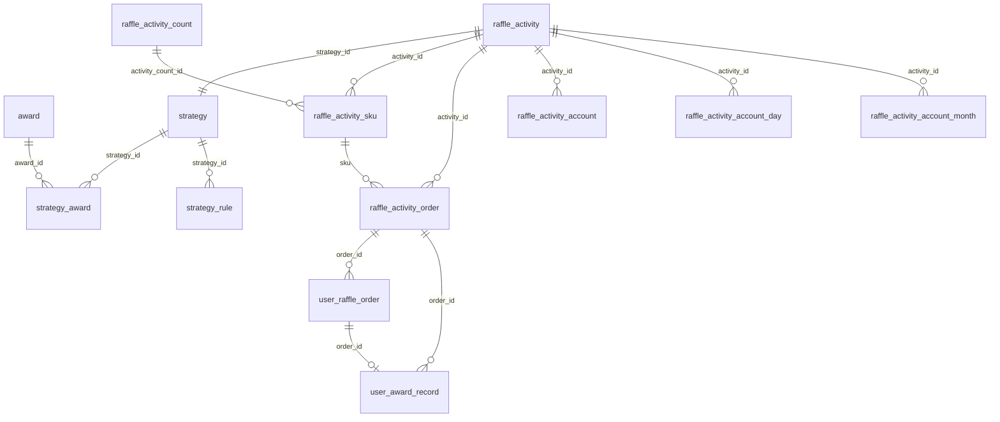
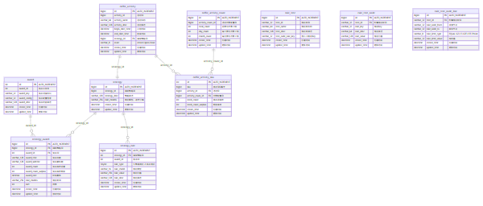
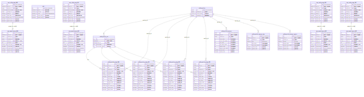
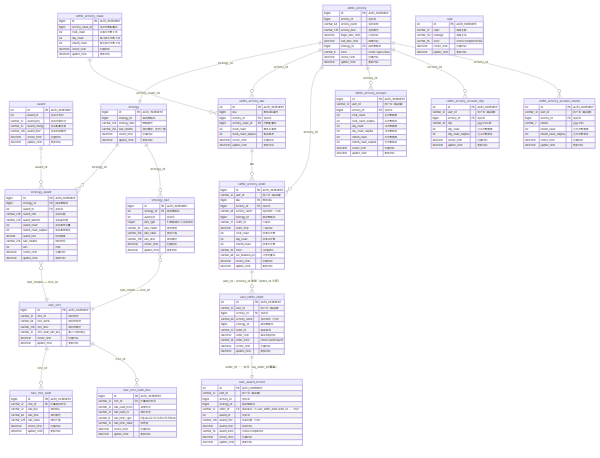

<style>
/* 全局字号与行高 */
body { font-size: 15px; line-height: 1.7; font-family: -apple-system, "PingFang SC", "Microsoft YaHei", "Segoe UI", sans-serif; }
h1 { font-size: 26px; }
h2 { font-size: 21px; }
h3 { font-size: 18px; }
h4 { font-size: 16px; }
p, li, td, th, code, pre, blockquote { font-size: 15px; }
code { font-size: 14px; padding: 1px 5px; }
pre { font-size: 13px; line-height: 1.6; padding: 12px; }
pre code { font-size: 13px; }
/* 表格放大 */
table { font-size: 14px; border-collapse: collapse; }
th, td { padding: 7px 12px; }
th { font-size: 15px; font-weight: 600; }
/* mermaid 图表区域 */
.mermaid, .mermaid svg { font-size: 15px !important; }
</style>

# 营销抽奖系统 — 数据库设计文档

## 1. 概述

- **数据库架构**：1 个公共库（`marketing`）+ 2 个分库（`marketing_01`、`marketing_02`）
- **字符集**：`utf8mb4`
- **存储引擎**：`InnoDB`
- **总表数**：10 张（公共库）+ 5 类 × 2 库（分库用户表，含分表展开共 18 张）

### 1.1 分库分表策略

```
marketing（公共库，不拆分）
  ├── award                    ← 奖品字典
  ├── strategy                 ← 抽奖策略
  ├── strategy_award           ← 策略奖品配置
  ├── strategy_rule            ← 策略规则
  ├── raffle_activity          ← 活动
  ├── raffle_activity_count    ← 活动次数配置
  ├── raffle_activity_sku      ← 活动SKU
  ├── rule_tree                ← 规则树
  ├── rule_tree_node           ← 规则树节点
  └── rule_tree_node_line      ← 规则树节点连线

marketing_01（分库 1，按 userId 哈希路由）          marketing_02（分库 2，按 userId 哈希路由）
  ├── raffle_activity_account           ← 不分表        ├── raffle_activity_account           ← 不分表
  ├── raffle_activity_account_day       ← 不分表        ├── raffle_activity_account_day       ← 不分表
  ├── raffle_activity_account_month     ← 不分表        ├── raffle_activity_account_month     ← 不分表
  ├── task                               ← 不分表        ├── task                               ← 不分表
  ├── raffle_activity_order_000         ← 分表 0        ├── raffle_activity_order_000         ← 分表 0
  ├── raffle_activity_order_001         ← 分表 1        ├── raffle_activity_order_001         ← 分表 1
  ├── raffle_activity_order_002         ← 分表 2        ├── raffle_activity_order_002         ← 分表 2
  ├── raffle_activity_order_003         ← 分表 3        ├── raffle_activity_order_003         ← 分表 3
  ├── user_raffle_order_000             ← 分表 0        ├── user_raffle_order_000             ← 分表 0
  ├── user_raffle_order_001             ← 分表 1        ├── user_raffle_order_001             ← 分表 1
  ├── user_raffle_order_002             ← 分表 2        ├── user_raffle_order_002             ← 分表 2
  ├── user_raffle_order_003             ← 分表 3        ├── user_raffle_order_003             ← 分表 3
  ├── user_award_record_000             ← 分表 0        ├── user_award_record_000             ← 分表 0
  ├── user_award_record_001             ← 分表 1        ├── user_award_record_001             ← 分表 1
  ├── user_award_record_002             ← 分表 2        ├── user_award_record_002             ← 分表 2
  └── user_award_record_003             ← 分表 3        └── user_award_record_003             ← 分表 3
```

- **路由键**：`userId`
- **分库数**：2（`marketing_01`、`marketing_02`）
- **分表数**：`raffle_activity_order` / `user_raffle_order` / `user_award_record` 每库 4 张（`_000` ~ `_003`），其余账户表与 `task` 表每库 1 张（不分表）
- **路由组件**：`cn.bugstack.middleware.db.router`（`@DBRouter` + `@DBRouterStrategy`）

---

## 2. ER 图（实体关系总览）

### 2.1 实体关系总览（Mermaid）



### 2.2 公共库 ER 图（marketing）

> 包含 10 张公共表（`award`、`strategy`、`strategy_award`、`strategy_rule`、`raffle_activity`、`raffle_activity_count`、`raffle_activity_sku`、`rule_tree`、`rule_tree_node`、`rule_tree_node_line`）及其字段、约束与外键关系。



### 2.3 分库分表 ER 图（marketing_01 / marketing_02）

> `raffle_activity_order` / `user_raffle_order` / `user_award_record` 按 `userId` 哈希分到 `marketing_01` / `marketing_02`，每个库内再分 4 张表（`_000` ~ `_003`）；`raffle_activity_account` / `raffle_activity_account_day` / `raffle_activity_account_month` / `task` 分库但不分表。



### 2.4 全量 ER 图（含全部表与字段）



> 上述 ER 图基于 `marketing.sql` + `marketing_01.sql` + `marketing_02.sql` 三份建表脚本生成，Mermaid 源文件位于同目录的 `er_diagram*.mmd`。

---

## 3. 核心业务域

| 业务域 | 核心表 | 说明 |
|---|---|---|
| **奖品中心** | `award` | 统一的奖品字典，定义奖品元信息 |
| **策略域** | `strategy`、`strategy_award`、`strategy_rule` | 抽奖策略 = 奖品池 + 概率 + 规则模型 |
| **活动域** | `raffle_activity`、`raffle_activity_count`、`raffle_activity_sku`、`raffle_activity_order`、`raffle_activity_account`、`raffle_activity_account_day`、`raffle_activity_account_month` | 活动 = 策略 + 参与次数限制 + 库存 + 用户订单 + 总/日/月账户 |
| **抽奖流水域** | `user_raffle_order`、`user_award_record` | 用户每次发起的抽奖单 + 中奖记录（与活动订单分离，便于异步发奖与状态追踪） |
| **任务补偿域** | `task` | MQ 消息落库表，用于跨库分布式事务的最终一致性补偿 |
| **规则树域** | `rule_tree`、`rule_tree_node`、`rule_tree_node_line` | 可编排的决策树，通过连线控制节点流转 |

---

## 4. 表结构详解

### 4.1 `award` — 奖品表（公共库 `marketing`）

**职责**：奖品字典表，定义系统中所有可发放的奖品元信息。

| 字段名 | 类型 | 约束 | 说明 |
|---|---|---|---|
| `id` | `int(11) unsigned` | PK, AUTO_INCREMENT | 自增主键 |
| `award_id` | `int(8)` | NOT NULL | 奖品业务ID |
| `award_key` | `varchar(32)` | NOT NULL | 奖品对接标识，每个值对应一种发奖策略 |
| `award_config` | `varchar(32)` | NOT NULL | 奖品配置信息（如积分范围、使用次数） |
| `award_desc` | `varchar(128)` | NOT NULL | 奖品内容描述 |
| `create_time` | `datetime` | NOT NULL, DEFAULT CURRENT_TIMESTAMP | 创建时间 |
| `update_time` | `datetime` | NOT NULL, ON UPDATE | 更新时间 |

**索引**：`PRIMARY KEY (id)`

**种子数据**：

| award_id | award_key | award_config | award_desc |
|---|---|---|---|
| 101 | `user_credit_random` | `1,100` | 用户积分（随机1~100分） |
| 102 | `openai_use_count` | `5` | OpenAI 增加5次使用 |
| 103 | `openai_use_count` | `10` | OpenAI 增加10次使用 |
| 104 | `openai_use_count` | `20` | OpenAI 增加20次使用 |
| 105 | `openai_model` | `gpt-4` | OpenAI 增加 gpt-4 模型 |
| 106 | `openai_model` | `dall-e-2` | OpenAI 增加 dall-e-2 模型 |
| 107 | `openai_model` | `dall-e-3` | OpenAI 增加 dall-e-3 模型 |
| 108 | `openai_use_count` | `100` | OpenAI 增加100次使用 |
| 109 | `openai_model` | `gpt-4,dall-e-2,dall-e-3` | OpenAI 解锁全部模型 |
| 100 | `user_credit_blacklist` | `1` | 黑名单积分兜底 |

---

### 4.2 `strategy` — 抽奖策略表（公共库 `marketing`）

**职责**：定义抽奖策略，关联一组奖品和规则模型。

| 字段名 | 类型 | 约束 | 说明 |
|---|---|---|---|
| `id` | `bigint(11) unsigned` | PK, AUTO_INCREMENT | 自增主键 |
| `strategy_id` | `bigint(8)` | NOT NULL | 抽奖策略ID |
| `strategy_desc` | `varchar(128)` | NOT NULL | 策略描述 |
| `rule_models` | `varchar(256)` | NULL | 规则模型，逗号分隔 |
| `create_time` | `datetime` | NOT NULL | 创建时间 |
| `update_time` | `datetime` | NOT NULL | 更新时间 |

**索引**：`PRIMARY KEY (id)`、`KEY idx_strategy_id (strategy_id)`

**种子数据**：

| strategy_id | strategy_desc | rule_models | 说明 |
|---|---|---|---|
| 100001 | 抽奖策略 | `rule_blacklist,rule_weight` | 含黑名单+权重 |
| 100002 | 抽奖策略-非完整1概率 | NULL | 概率合计 0.61 |
| 100003 | 抽奖策略-验证lock | `rule_blacklist` | 仅黑名单 |
| 100004 | 抽奖策略-随机抽奖 | NULL | 单奖品 100% |
| 100005 | 抽奖策略-测试概率计算 | NULL | 5 个奖品各 3%+0.1% |
| 100006 | 抽奖策略-规则树 | NULL | 走规则树验证 |

---

### 4.3 `strategy_award` — 策略奖品配置表（公共库 `marketing`）

**职责**：定义某个策略下的奖品池、概率、库存、关联规则树。

| 字段名 | 类型 | 约束 | 说明 |
|---|---|---|---|
| `id` | `bigint(11) unsigned` | PK, AUTO_INCREMENT | 自增主键 |
| `strategy_id` | `bigint(8)` | NOT NULL | 抽奖策略ID |
| `award_id` | `int(8)` | NOT NULL | 奖品ID，关联 `award.award_id` |
| `award_title` | `varchar(128)` | NOT NULL | 奖品标题 |
| `award_subtitle` | `varchar(128)` | NULL | 奖品副标题（如"抽奖1次后解锁"） |
| `award_count` | `int(8)` | NOT NULL, DEFAULT 0 | 奖品库存总量 |
| `award_count_surplus` | `int(8)` | NOT NULL, DEFAULT 0 | 奖品库存剩余 |
| `award_rate` | `decimal(6,4)` | NOT NULL | 中奖概率 |
| `rule_models` | `varchar(256)` | NULL | 该奖品关联的规则树ID |
| `sort` | `int(2)` | NOT NULL, DEFAULT 0 | 排序 |
| `create_time` | `datetime` | NOT NULL | 创建时间 |
| `update_time` | `datetime` | NOT NULL | 修改时间 |

**索引**：`PRIMARY KEY (id)`、`KEY idx_strategy_id_award_id (strategy_id, award_id)`

**种子数据 — 策略 100001（9 个奖品）**：

| award_id | award_title | award_rate | award_count | rule_models |
|---|---|---|---|---|
| 101 | 随机积分 | 0.3000 | 80000 | `tree_luck_award` |
| 102 | 5次使用 | 0.2000 | 10000 | `tree_luck_award` |
| 103 | 10次使用 | 0.2000 | 5000 | `tree_luck_award` |
| 104 | 20次使用 | 0.1000 | 4000 | `tree_luck_award` |
| 105 | 增加gpt-4对话模型 | 0.1000 | 600 | `tree_luck_award` |
| 106 | 增加dall-e-2画图模型 | 0.0500 | 200 | `tree_luck_award` |
| 107 | 增加dall-e-3画图模型 | 0.0400 | 200 | `tree_luck_award` |
| 108 | 增加100次使用 | 0.0099 | 199 | `tree_luck_award` |
| 109 | 解锁全部模型 | 0.0001 | 1 | `tree_luck_award` |

**种子数据 — 策略 100006（8 个奖品，使用规则树）**：

| award_id | award_title | award_rate | award_count | rule_models | 说明 |
|---|---|---|---|---|---|
| 101 | 随机积分 | 0.0200 | 100 | `tree_luck_award` | 兜底奖 |
| 102 | 7等奖 | 0.0300 | 100 | `tree_luck_award` | — |
| 103 | 6等奖 | 0.0300 | 100 | `tree_luck_award` | — |
| 104 | 5等奖 | 0.0300 | 100 | `tree_luck_award` | — |
| 105 | 4等奖 | 0.0300 | 100 | `tree_luck_award` | — |
| 106 | 3等奖 | 0.0300 | 100 | `tree_lock_1` | 抽1次后解锁 |
| 107 | 2等奖 | 0.0300 | 100 | `tree_lock_1` | 抽1次后解锁 |
| 108 | 1等奖 | 0.0300 | 100 | `tree_lock_2` | 抽2次后解锁 |

---

### 4.4 `strategy_rule` — 策略规则表（公共库 `marketing`）

**职责**：存储策略级别或奖品级别的规则配置。

| 字段名 | 类型 | 约束 | 说明 |
|---|---|---|---|
| `id` | `bigint(11) unsigned` | PK, AUTO_INCREMENT | 自增主键 |
| `strategy_id` | `int(8)` | NOT NULL | 抽奖策略ID |
| `award_id` | `int(8)` | NULL | 奖品ID（策略规则时为NULL） |
| `rule_type` | `tinyint(1)` | NOT NULL, DEFAULT 0 | 1=策略规则，2=奖品规则 |
| `rule_model` | `varchar(16)` | NOT NULL | 规则类型 |
| `rule_value` | `varchar(256)` | NOT NULL | 规则比值，格式因 rule_model 而异 |
| `rule_desc` | `varchar(128)` | NOT NULL | 规则描述 |
| `create_time` | `datetime` | NOT NULL | 创建时间 |
| `update_time` | `datetime` | NOT NULL | 更新时间 |

**索引**：`PRIMARY KEY (id)`、`KEY idx_strategy_id_award_id (strategy_id, award_id)`

**种子数据**：

**权重规则（`rule_weight`）**：
```
strategy_id=100001, award_id=NULL, rule_type=1
rule_value: "4000:102,103,104,105 5000:102,103,104,105,106,107 6000:102,103,104,105,106,107,108,109"
```
格式：`积分阈值:奖品ID列表`（空格分隔多个档位）
- 积分 ≥ 4000 → 只能在 {102,103,104,105} 中抽奖
- 积分 ≥ 5000 → 扩充到 {102,...,107}
- 积分 ≥ 6000 → 扩充到 {102,...,109}（必中奖范围）

**黑名单规则（`rule_blacklist`）**：
```
strategy_id=100001, award_id=NULL, rule_type=1
rule_value: "101:user001,user002,user003"
```
格式：`兜底奖品ID:用户ID列表`（逗号分隔）
- `user001`、`user002`、`user003` 被拉黑，直接返回奖品 101

---

### 4.5 `raffle_activity` — 抽奖活动表（公共库 `marketing`）

**职责**：定义一个营销活动，关联策略、设定活动时间窗口和状态。

| 字段名 | 类型 | 约束 | 说明 |
|---|---|---|---|
| `id` | `bigint(11) unsigned` | PK, AUTO_INCREMENT | 自增主键 |
| `activity_id` | `bigint(12)` | NOT NULL, UNIQUE | 活动ID |
| `activity_name` | `varchar(64)` | NOT NULL | 活动名称 |
| `activity_desc` | `varchar(128)` | NOT NULL | 活动描述 |
| `begin_date_time` | `datetime` | NOT NULL | 活动开始时间 |
| `end_date_time` | `datetime` | NOT NULL | 活动结束时间 |
| `strategy_id` | `bigint(8)` | NOT NULL | 关联的抽奖策略ID |
| `state` | `varchar(8)` | NOT NULL, DEFAULT 'create' | 活动状态：`create`/`open`/`close` |
| `create_time` | `datetime` | NOT NULL | 创建时间 |
| `update_time` | `datetime` | NOT NULL | 更新时间 |

**索引**：`PRIMARY KEY (id)`、`UNIQUE KEY uq_activity_id (activity_id)`、`KEY idx_begin_date_time (begin_date_time)`、`KEY idx_end_date_time (end_date_time)`

**种子数据**：

| activity_id | activity_name | strategy_id | begin_date_time | end_date_time | state |
|---|---|---|---|---|---|
| 100301 | 测试活动 | 100006 | 2024-03-09 10:15:10 | 2034-03-09 10:15:10 | create |

---

### 4.6 `raffle_activity_count` — 活动参与次数配置表（公共库 `marketing`）

**职责**：定义用户在某个活动中的参与次数限制（总次数、日次数、月次数）。

| 字段名 | 类型 | 约束 | 说明 |
|---|---|---|---|
| `id` | `bigint(11) unsigned` | PK, AUTO_INCREMENT | 自增主键 |
| `activity_count_id` | `bigint(12)` | NOT NULL, UNIQUE | 活动次数配置ID |
| `total_count` | `int(8)` | NOT NULL | 总参与次数上限 |
| `day_count` | `int(8)` | NOT NULL | 每日参与次数上限 |
| `month_count` | `int(8)` | NOT NULL | 每月参与次数上限 |
| `create_time` | `datetime` | NOT NULL | 创建时间 |
| `update_time` | `datetime` | NOT NULL | 更新时间 |

**索引**：`PRIMARY KEY (id)`、`UNIQUE KEY uq_activity_count_id (activity_count_id)`

**种子数据**：

| activity_count_id | total_count | day_count | month_count |
|---|---|---|---|
| 11101 | 1 | 1 | 1 |

---

### 4.7 `raffle_activity_sku` — 活动SKU表（公共库 `marketing`）

**职责**：将活动、次数配置、库存打包为一个 SKU 商品单元。

| 字段名 | 类型 | 约束 | 说明 |
|---|---|---|---|
| `id` | `int(11) unsigned` | PK, AUTO_INCREMENT | 自增主键 |
| `sku` | `bigint(12)` | NOT NULL, UNIQUE | 商品SKU编号 |
| `activity_id` | `bigint(12)` | NOT NULL | 活动ID |
| `activity_count_id` | `bigint(12)` | NOT NULL | 活动次数配置ID |
| `stock_count` | `int(11)` | NOT NULL | 商品总库存 |
| `stock_count_surplus` | `int(11)` | NOT NULL | 剩余库存 |
| `create_time` | `datetime` | NOT NULL | 创建时间 |
| `update_time` | `datetime` | NOT NULL | 更新时间 |

**索引**：`PRIMARY KEY (id)`、`UNIQUE KEY uq_sku (sku)`、`KEY idx_activity_id_activity_count_id (activity_id, activity_count_id)`

**种子数据**：

| sku | activity_id | activity_count_id | stock_count | stock_count_surplus |
|---|---|---|---|---|
| 9011 | 100301 | 11101 | 0 | 0 |

> `stock_count = 0` 表示无限库存。

---

### 4.8 `raffle_activity_order` — 活动订单表（分库分表 `marketing_01`/`marketing_02`）

**职责**：记录用户每次参与活动的订单流水（"获得抽奖资格"的订单）。按 `userId` 分库分表，通过 `@DBRouterStrategy(splitTable = true)` 路由。

> DDL 已落地于 `marketing_01.sql` / `marketing_02.sql`，每个库 4 张分表（`_000` ~ `_003`）。

| 字段名 | 类型 | 约束 | 说明 |
|---|---|---|---|
| `id` | `bigint(11) unsigned` | PK, AUTO_INCREMENT | 自增主键 |
| `user_id` | `varchar(32)` | NOT NULL | 用户ID（路由键） |
| `sku` | `bigint(12)` | NOT NULL | 商品SKU |
| `activity_id` | `bigint(12)` | NOT NULL | 活动ID |
| `activity_name` | `varchar(64)` | NOT NULL | 活动名称（冗余，避免JOIN） |
| `strategy_id` | `bigint(8)` | NOT NULL | 抽奖策略ID |
| `order_id` | `varchar(12)` | NOT NULL | 订单ID |
| `order_time` | `datetime` | NOT NULL | 下单时间 |
| `total_count` | `int(8)` | NOT NULL | 本次订单获得的总抽奖次数 |
| `day_count` | `int(8)` | NOT NULL | 本次订单获得的日抽奖次数 |
| `month_count` | `int(8)` | NOT NULL | 本次订单获得的月抽奖次数 |
| `state` | `varchar(16)` | NOT NULL, DEFAULT 'complete' | 订单状态：`complete`（已下单完成，可发起抽奖） |
| `out_business_no` | `varchar(64)` | NOT NULL | 业务防重ID，外部透传，确保幂等 |
| `create_time` | `datetime` | NOT NULL | 创建时间 |
| `update_time` | `datetime` | NOT NULL | 更新时间 |

**索引**：
- `PRIMARY KEY (id)`
- `UNIQUE KEY uq_order_id (order_id)`
- `KEY idx_user_id_activity_id (user_id, activity_id, state)`

**种子数据**（`marketing_01.raffle_activity_order_000`）：

| id | user_id | sku | activity_id | activity_name | strategy_id | order_id | state | out_business_no |
|---|---|---|---|---|---|---|---|---|
| 3 | `Charlie` | 9011 | 100301 | 测试活动 | 100006 | `383240888158` | `completed` | `700091009111` |

**设计要点**：
- `state` 枚举：`complete`（下单即完成，订单生效、可发起抽奖）；当前版本不再使用 `not_used`，下单成功即 `complete`
- `out_business_no` 是外部传入的业务防重ID，用于幂等控制——同一 `out_business_no` 只能创建一条订单
- 分库分表：`userId` → 哈希 → 分库（01/02）→ 分表（000~003）
- 每个库的 4 张分表结构完全一致
- 本表是"用户购买的资格订单"，具体的"用户发起的一次抽奖"记录在 `user_raffle_order`（见 4.13 节），"用户中奖"记录在 `user_award_record`（见 4.14 节）

---

### 4.9 `raffle_activity_account` — 活动账户表（分库 `marketing_01`/`marketing_02`）

**职责**：记录用户在某个活动上的总次数额度（总/日/月次数及各自剩余）。与 `raffle_activity_order` 配合，订单记录"获得次数"，账户记录"消耗次数"。按 `userId` 分库但不分表。

> DDL 已落地于 `marketing_01.sql` / `marketing_02.sql`，每个库 1 张表。

| 字段名 | 类型 | 约束 | 说明 |
|---|---|---|---|
| `id` | `bigint(11) unsigned` | PK, AUTO_INCREMENT | 自增主键 |
| `user_id` | `varchar(32)` | NOT NULL | 用户ID（路由键） |
| `activity_id` | `bigint(12)` | NOT NULL | 活动ID |
| `total_count` | `int(8)` | NOT NULL | 总次数额度 |
| `total_count_surplus` | `int(8)` | NOT NULL | 总次数剩余 |
| `day_count` | `int(8)` | NOT NULL | 日次数额度（每日最大可消耗） |
| `day_count_surplus` | `int(8)` | NOT NULL | 日次数剩余 |
| `month_count` | `int(8)` | NOT NULL | 月次数额度（每月最大可消耗） |
| `month_count_surplus` | `int(8)` | NOT NULL | 月次数剩余 |
| `create_time` | `datetime` | NOT NULL | 创建时间 |
| `update_time` | `datetime` | NOT NULL | 更新时间 |

**索引**：
- `PRIMARY KEY (id)`
- `UNIQUE KEY uq_user_id_activity_id (user_id, activity_id)`

**设计要点**：
- 一个用户在一个活动下只有一条账户记录（唯一约束）
- 每次抽奖时，扣减 `day_count_surplus`、`month_count_surplus`、`total_count_surplus`
- 日/月额度按自然周期刷新：每自然日/月通过 `raffle_activity_account_day` / `raffle_activity_account_month` 单独滚动，避免在本表做条件更新
- 本表为"总账户"，日维度滚动数据见 4.10 节，月维度滚动数据见 4.11 节
- 分库不分表：按 `userId` 路由到不同库，但每个库内只有一张表

---

### 4.10 `raffle_activity_account_day` — 日次数账户表（分库 `marketing_01`/`marketing_02`）

**职责**：按"用户 × 活动 × 日期"维度记录日次数额度与剩余，用于日次数的自然滚动（每天一条记录，过期即不再被命中）。与总账户（4.9 节）配合：日次数扣减/重置走本表，总次数仍走总账户。

> DDL 已落地于 `marketing_01.sql` / `marketing_02.sql`，每个库 1 张表（不分表）。

| 字段名 | 类型 | 约束 | 说明 |
|---|---|---|---|
| `id` | `int(11) unsigned` | PK, AUTO_INCREMENT | 自增主键 |
| `user_id` | `varchar(32)` | NOT NULL | 用户ID（路由键） |
| `activity_id` | `bigint(12)` | NOT NULL | 活动ID |
| `day` | `varchar(10)` | NOT NULL | 日期（格式 `yyyy-mm-dd`） |
| `day_count` | `int(8)` | NOT NULL | 当日次数额度（取自活动次数配置） |
| `day_count_surplus` | `int(8)` | NOT NULL | 当日次数剩余 |
| `create_time` | `datetime` | NOT NULL | 创建时间 |
| `update_time` | `datetime` | NOT NULL | 更新时间 |

**索引**：
- `PRIMARY KEY (id)`
- `UNIQUE KEY uq_user_id_activity_id_day (user_id, activity_id, day)`

**设计要点**：
- 唯一键 `(user_id, activity_id, day)` 保证同一用户同一活动同一天只有一条记录
- 首次抽奖或日切时写入一条新记录：`day_count = 总账户.day_count`，`day_count_surplus = day_count`
- 跨天后写入新 `day` 的记录即可实现"自然过期"，无需对老记录做条件更新
- 分库不分表：按 `userId` 路由到对应库

---

### 4.11 `raffle_activity_account_month` — 月次数账户表（分库 `marketing_01`/`marketing_02`）

**职责**：按"用户 × 活动 × 月份"维度记录月次数额度与剩余，用于月次数的自然滚动。机制与日账户（4.10）相同，只是维度粒度为月。

> DDL 已落地于 `marketing_01.sql` / `marketing_02.sql`，每个库 1 张表（不分表）。

| 字段名 | 类型 | 约束 | 说明 |
|---|---|---|---|
| `id` | `int(11) unsigned` | PK, AUTO_INCREMENT | 自增主键 |
| `user_id` | `varchar(32)` | NOT NULL | 用户ID（路由键） |
| `activity_id` | `bigint(12)` | NOT NULL | 活动ID |
| `month` | `varchar(7)` | NOT NULL | 月份（格式 `yyyy-mm`） |
| `month_count` | `int(8)` | NOT NULL | 当月次数额度（取自活动次数配置） |
| `month_count_surplus` | `int(8)` | NOT NULL | 当月次数剩余 |
| `create_time` | `datetime` | NOT NULL | 创建时间 |
| `update_time` | `datetime` | NOT NULL | 更新时间 |

**索引**：
- `PRIMARY KEY (id)`
- `UNIQUE KEY uq_user_id_activity_id_month (user_id, activity_id, month)`

**设计要点**：
- 唯一键 `(user_id, activity_id, month)` 保证同一用户同一活动同一月只有一条记录
- 首次抽奖或跨月时写入新记录：`month_count = 总账户.month_count`，`month_count_surplus = month_count`
- 跨月后写入新 `month` 的记录即可实现"自然过期"，无需对老记录做条件更新
- 分库不分表：按 `userId` 路由到对应库

---

### 4.12 `task` — MQ 任务表（分库 `marketing_01`/`marketing_02`）

**职责**：将待发送的 MQ 消息落库，作为"消息表 + 定时扫描"分布式事务最终一致性方案的本地存储。每条记录对应一条待发出的 MQ 消息，扫描器按状态推进（`create` → `completed`/`fail`）。

> DDL 已落地于 `marketing_01.sql` / `marketing_02.sql`，每个库 1 张表（不分表）。

| 字段名 | 类型 | 约束 | 说明 |
|---|---|---|---|
| `id` | `int(11) unsigned` | PK, AUTO_INCREMENT | 自增主键 |
| `topic` | `varchar(32)` | NOT NULL | 消息主题（MQ topic） |
| `message` | `varchar(512)` | NOT NULL | 消息主体（JSON 序列化） |
| `state` | `varchar(16)` | NOT NULL, DEFAULT 'create' | 任务状态：`create`（待发送）、`completed`（已成功）、`fail`（失败待重试） |
| `create_time` | `datetime` | NOT NULL | 创建时间 |
| `update_time` | `datetime` | NOT NULL | 更新时间 |

**索引**：`PRIMARY KEY (id)`（无唯一约束、无业务索引）

**设计要点**：
- 与本地业务事务一起 commit，借助 MQ 中间件的事务消息表思路实现"最终一致性"
- 定时任务按 `state='create'` 扫描，发送 MQ 后更新为 `completed`；失败则按重试策略更新为 `fail`
- 配合库存扣减等"先写本地、后发 MQ"的场景，避免消息丢失与业务回滚之间的不一致
- 分库不分表：按 `userId` 路由到对应库，扫描任务在两个库分别执行

---

### 4.13 `user_raffle_order` — 用户抽奖订单表（分库分表 `marketing_01`/`marketing_02`）

**职责**：记录用户"发起一次抽奖"的流水，与"下单购买资格"的 `raffle_activity_order` 分离。一次用户购买资格（活动订单）可以发起多次抽奖（用户抽奖单），每张抽奖单对应一次完整的"扣次数 → 抽签 → 中奖记录"流程。

> DDL 已落地于 `marketing_01.sql` / `marketing_02.sql`，每个库 4 张分表（`_000` ~ `_003`）。

| 字段名 | 类型 | 约束 | 说明 |
|---|---|---|---|
| `id` | `int(11) unsigned` | PK, AUTO_INCREMENT | 自增主键 |
| `user_id` | `varchar(32)` | NOT NULL | 用户ID（路由键） |
| `activity_id` | `bigint(12)` | NOT NULL | 活动ID |
| `activity_name` | `varchar(64)` | NOT NULL | 活动名称（冗余，避免JOIN） |
| `strategy_id` | `bigint(8)` | NOT NULL | 抽奖策略ID |
| `order_id` | `varchar(12)` | NOT NULL, UNIQUE | 抽奖单ID（全局幂等） |
| `order_time` | `datetime` | NOT NULL | 抽奖发起时间 |
| `order_state` | `varchar(16)` | NOT NULL, DEFAULT 'create' | 抽奖单状态：`create`（已创建）、`used`（已使用）、`cancel`（已作废） |
| `create_time` | `datetime` | NOT NULL | 创建时间 |
| `update_time` | `datetime` | NOT NULL | 更新时间 |

**索引**：
- `PRIMARY KEY (id)`
- `UNIQUE KEY uq_order_id (order_id)`
- `KEY idx_user_id_activity_id (user_id, activity_id)`

**设计要点**：
- `order_id` 唯一约束保证同一抽奖请求只能创建一条抽奖单，避免重复扣次数/重复发奖
- `order_state` 流转：`create`（建单）→ `used`（抽奖完成，对应 `user_award_record` 已写入）；异常情况下可置为 `cancel`（作废、回滚次数）
- 与 `raffle_activity_order` 的关系：本表 `order_id` 与活动订单 `order_id` 字段含义不同——活动订单记"购买资格"，本表记"发起抽奖"；两者通过 `user_id + activity_id` 关联而非 `order_id`
- 与 `user_award_record` 的关系：每次抽奖完成时同步写一张 `user_award_record`，中奖结果记录在 `award_id / award_title / award_state`
- 分库分表：`userId` → 哈希 → 分库（01/02）→ 分表（000~003）

---

### 4.14 `user_award_record` — 用户中奖记录表（分库分表 `marketing_01`/`marketing_02`）

**职责**：记录每一次成功抽奖的中奖结果。与 `user_raffle_order` 一一对应，作为发奖阶段的入口。

> DDL 已落地于 `marketing_01.sql` / `marketing_02.sql`，每个库 4 张分表（`_000` ~ `_003`）。

| 字段名 | 类型 | 约束 | 说明 |
|---|---|---|---|
| `id` | `int(11) unsigned` | PK, AUTO_INCREMENT | 自增主键 |
| `user_id` | `varchar(32)` | NOT NULL | 用户ID（路由键） |
| `activity_id` | `bigint(12)` | NOT NULL | 活动ID |
| `strategy_id` | `bigint(8)` | NOT NULL | 抽奖策略ID |
| `order_id` | `varchar(12)` | NOT NULL, UNIQUE | 抽奖订单ID（与 `user_raffle_order.order_id` 一一对应，作为幂等键） |
| `award_id` | `int(11)` | NOT NULL | 奖品ID（关联 `award.award_id`） |
| `award_title` | `varchar(128)` | NOT NULL | 奖品标题（冗余，避免JOIN） |
| `award_time` | `datetime` | NOT NULL | 中奖时间 |
| `award_state` | `varchar(16)` | NOT NULL, DEFAULT 'create' | 奖品状态：`create`（待发奖）、`completed`（发奖完成） |
| `create_time` | `datetime` | NOT NULL | 创建时间 |
| `update_time` | `datetime` | NOT NULL | 更新时间 |

**索引**：
- `PRIMARY KEY (id)`
- `UNIQUE KEY uq_order_id (order_id)` —— 与 `user_raffle_order.order_id` 一一对应
- `KEY idx_user_id (user_id)` —— 用户维度查中奖记录
- `KEY idx_activity_id (activity_id)` —— 活动维度查中奖
- `KEY idx_award_id (strategy_id)` —— 索引名沿用 `idx_award_id`，实际指向 `strategy_id` 字段（按策略维度查中奖）

**设计要点**：
- `order_id` 唯一约束保证一次抽奖只产生一条中奖记录，幂等
- `award_state` 流转：`create`（写入中奖记录后初始）→ `completed`（MQ 消费、发奖成功后更新）；异常情况下可结合 `task` 表做补偿
- `award_title` 从 `strategy_award` 拷贝冗余，避免中奖详情展示 JOIN
- 分库分表：`userId` → 哈希 → 分库（01/02）→ 分表（000~003）

---

### 4.15 `rule_tree` — 规则树表（公共库 `marketing`）

**职责**：定义一棵规则决策树，由若干节点和连线组成，通过入口规则节点开始执行。

| 字段名 | 类型 | 约束 | 说明 |
|---|---|---|---|
| `id` | `bigint(11) unsigned` | PK, AUTO_INCREMENT | 自增主键 |
| `tree_id` | `varchar(32)` | NOT NULL, UNIQUE | 规则树ID |
| `tree_name` | `varchar(64)` | NOT NULL | 规则树名称 |
| `tree_desc` | `varchar(128)` | NULL | 规则树描述 |
| `tree_node_rule_key` | `varchar(32)` | NOT NULL | 根入口规则节点Key |
| `create_time` | `datetime` | NOT NULL | 创建时间 |
| `update_time` | `datetime` | NOT NULL | 更新时间 |

**索引**：`PRIMARY KEY (id)`、`UNIQUE KEY uq_tree_id (tree_id)`

**种子数据**：

| tree_id | tree_name | tree_desc | tree_node_rule_key |
|---|---|---|---|
| `tree_lock_1` | 规则树 | 规则树 | `rule_lock` |
| `tree_luck_award` | 规则树-兜底奖励 | 规则树-兜底奖励 | `rule_stock` |
| `tree_lock_2` | 规则树 | 规则树 | `rule_lock` |

---

### 4.16 `rule_tree_node` — 规则树节点表（公共库 `marketing`）

**职责**：定义规则树中的每个决策节点。

| 字段名 | 类型 | 约束 | 说明 |
|---|---|---|---|
| `id` | `bigint(11) unsigned` | PK, AUTO_INCREMENT | 自增主键 |
| `tree_id` | `varchar(32)` | NOT NULL | 所属规则树ID |
| `rule_key` | `varchar(32)` | NOT NULL | 规则Key（如 `rule_lock`、`rule_stock`） |
| `rule_desc` | `varchar(64)` | NOT NULL | 规则描述 |
| `rule_value` | `varchar(128)` | NULL | 规则比值 |
| `create_time` | `datetime` | NOT NULL | 创建时间 |
| `update_time` | `datetime` | NOT NULL | 更新时间 |

**种子数据（`tree_lock_1`）**：

| rule_key | rule_desc | rule_value | 说明 |
|---|---|---|---|
| `rule_lock` | 限定用户已完成N次抽奖后解锁 | `1` | 抽满1次后解锁 |
| `rule_stock` | 库存扣减规则 | NULL | 扣减库存，成功则继续 |
| `rule_luck_award` | 兜底奖品随机积分 | `101:1,100` | 发奖品101，积分1~100 |

---

### 4.17 `rule_tree_node_line` — 规则树节点连线表（公共库 `marketing`）

**职责**：定义规则树节点之间的流转路径和条件。

| 字段名 | 类型 | 约束 | 说明 |
|---|---|---|---|
| `id` | `bigint(11) unsigned` | PK, AUTO_INCREMENT | 自增主键 |
| `tree_id` | `varchar(32)` | NOT NULL | 所属规则树ID |
| `rule_node_from` | `varchar(32)` | NOT NULL | 来源节点 |
| `rule_node_to` | `varchar(32)` | NOT NULL | 目标节点 |
| `rule_limit_type` | `varchar(8)` | NOT NULL | 限定类型：EQUAL / GT / LT / GTE / LTE / ENUM |
| `rule_limit_value` | `varchar(32)` | NOT NULL | 限定值（如 `ALLOW`、`TAKE_OVER`） |
| `create_time` | `datetime` | NOT NULL | 创建时间 |
| `update_time` | `datetime` | NOT NULL | 更新时间 |

**种子数据（`tree_lock_1`）**：

| from | to | limit_type | limit_value | 含义 |
|---|---|---|---|---|
| `rule_lock` | `rule_stock` | EQUAL | ALLOW | 锁定通过 → 库存扣减 |
| `rule_lock` | `rule_luck_award` | EQUAL | TAKE_OVER | 锁定接管 → 兜底发奖 |
| `rule_stock` | `rule_luck_award` | EQUAL | ALLOW | 库存扣减完成 → 发奖 |

---

## 5. 表关系总结

```
award (奖品字典)
  │ award_id
  ▼
strategy_award (策略-奖品) ──── strategy (策略)
  │ rule_models                 │ rule_models
  ▼                             ▼
rule_tree ◄── strategy_rule (策略规则)
  ├── rule_tree_node
  └── rule_tree_node_line

raffle_activity (活动) ──── raffle_activity_sku (SKU)
  │ strategy_id              │ activity_count_id
  │                          ▼
  │                   raffle_activity_count (次数配置)
  │
  ├── raffle_activity_order (活动订单-获得资格)  ── 按 userId 分库分表
  │     │
  │     ▼
  ├── user_raffle_order (用户抽奖单-发起抽奖)     ── 按 userId 分库分表
  │     │
  │     ▼
  ├── user_award_record (用户中奖记录)           ── 按 userId 分库分表
  │
  ├── raffle_activity_account (账户-总)          ── 按 userId 分库
  ├── raffle_activity_account_day (账户-日)      ── 按 userId 分库
  ├── raffle_activity_account_month (账户-月)    ── 按 userId 分库
  │
  └── task (MQ 任务补偿)                        ── 按 userId 分库
```

---

## 6. 完整数据流转示例

### 6.1 场景一：用户下单 → 获得抽奖资格

```
用户 Charlie 通过 SKU 9011 参与活动 100301

输入：ActivityShopCartEntity { userId = "Charlie", sku = 9011 }

┌─────────────────────────────────────────────────────────────────┐
│ 1. SKU 查询（公共库 marketing）                                   │
│    SELECT * FROM raffle_activity_sku WHERE sku = 9011            │
│    → { sku: 9011, activityId: 100301, activityCountId: 11101 }  │
│                                                                  │
│ 2. 活动查询（Redis 缓存优先）                                      │
│    Redis GET big_market_activity_key_100301 → miss               │
│    SELECT * FROM raffle_activity WHERE activity_id = 100301      │
│    → { activityName: "测试活动", strategyId: 100006 }            │
│    → 回写 Redis                                                  │
│                                                                  │
│ 3. 次数配置查询（Redis 缓存优先）                                  │
│    Redis GET big_market_activity_count_key_11101 → miss          │
│    SELECT * FROM raffle_activity_count                           │
│           WHERE activity_count_id = 11101                        │
│    → { totalCount: 1, dayCount: 1, monthCount: 1 }              │
│    → 回写 Redis                                                  │
│                                                                  │
│ 4. 生成订单（路由到分库分表）                                      │
│    userId="Charlie" → 哈希 → marketing_01.raffle_activity_order_002│
│                                                                  │
│    INSERT INTO raffle_activity_order_002 (                       │
│      user_id, sku, activity_id, activity_name, strategy_id,      │
│      order_id, order_time, total_count, day_count, month_count,  │
│      state, out_business_no                                      │
│    ) VALUES (                                                    │
│      'Charlie', 9011, 100301, '测试活动', 100006,                │
│      '202408160001', NOW(), 1, 1, 1, 'complete', ''              │
│    )                                                             │
│                                                                  │
│ 5. 初始化账户（路由到同一分库）                                    │
│    INSERT INTO raffle_activity_account (                         │
│      user_id, activity_id,                                       │
│      total_count, total_count_surplus,                           │
│      day_count, day_count_surplus,                               │
│      month_count, month_count_surplus                            │
│    ) VALUES (                                                    │
│      'Charlie', 100301, 1, 1, 1, 1, 1, 1                        │
│    )                                                             │
│    ON DUPLICATE KEY UPDATE ...（存在则更新）                      │
│                                                                  │
│ 6. 初始化日账户（按当前日期）                                      │
│    INSERT INTO raffle_activity_account_day (                     │
│      user_id, activity_id, day, day_count, day_count_surplus     │
│    ) VALUES (                                                    │
│      'Charlie', 100301, CURDATE(), 1, 1                          │
│    )                                                             │
│    ON DUPLICATE KEY UPDATE ...                                  │
│                                                                  │
│ 7. 初始化月账户（按当前月份）                                      │
│    INSERT INTO raffle_activity_account_month (                   │
│      user_id, activity_id, month, month_count, month_count_surplus│
│    ) VALUES (                                                    │
│      'Charlie', 100301, DATE_FORMAT(NOW(),'%Y-%m'), 1, 1        │
│    )                                                             │
│    ON DUPLICATE KEY UPDATE ...                                  │
└─────────────────────────────────────────────────────────────────┘

结果：
  raffle_activity_order_002:    { userId="Charlie", state="complete", total_count=1 }
  raffle_activity_account:      { userId="Charlie", total_count_surplus=1, day_count_surplus=1 }
  raffle_activity_account_day:  { userId="Charlie", day='2026-08-24', day_count_surplus=1 }
  raffle_activity_account_month:{ userId="Charlie", month='2026-08', month_count_surplus=1 }
```

### 6.2 场景二：黑名单用户抽奖（策略 100001）

```
用户 user001 请求抽奖，strategyId = 100001

┌─────────────────────────────────────────────────────────────────┐
│ 1. 策略装配（首次，写入 Redis）                                    │
│    SELECT * FROM strategy_award WHERE strategy_id = 100001       │
│    → 9 个奖品                                                    │
│    最小概率 = 0.0001，rateRange = 10000                          │
│    → 按概率占比填充 10000 个槽位，shuffle 乱序                    │
│    → HSET big_market_strategy_rate_table_key_100001              │
│    → SET  big_market_strategy_rate_range_key_100001 = 10000      │
│                                                                  │
│ 2. 抽奖前规则过滤                                                 │
│    strategy.rule_models = "rule_blacklist,rule_weight"           │
│                                                                  │
│    ┌─ rule_blacklist 过滤器 ─────────────────────────────────┐   │
│    │ SELECT * FROM strategy_rule                              │   │
│    │   WHERE strategy_id=100001 AND rule_model='rule_blacklist'│   │
│    │ → rule_value = "101:user001,user002,user003"             │   │
│    │                                                          │   │
│    │ 解析：split(":") → ["101", "user001,user002,user003"]    │   │
│    │ user001 在 splitRuleValue[1] 中 → 命中黑名单！           │   │
│    │ 返回 TAKE_OVER，awardId = 101（积分兜底）                 │   │
│    └──────────────────────────────────────────────────────────┘   │
│    → 短路返回，不再执行 rule_weight 过滤器                        │
│                                                                  │
│ 3. 结果：awardId = 101                                           │
│    award(award_key=user_credit_blacklist, award_config=1)        │
│    → 用户获得 1 积分（黑名单兜底）                                 │
│                                                                  │
│ 4. 扣减账户次数                                                   │
│    UPDATE raffle_activity_account                                │
│    SET total_count_surplus = total_count_surplus - 1,            │
│        day_count_surplus = day_count_surplus - 1,                │
│        month_count_surplus = month_count_surplus - 1             │
│    WHERE user_id = 'user001' AND activity_id = 100301            │
│      AND day_count_surplus > 0 AND total_count_surplus > 0       │
└─────────────────────────────────────────────────────────────────┘
```

### 6.3 场景三：正常用户权重抽奖（策略 100001）

```
用户 Charlie，积分 4500，请求抽奖 strategyId = 100001

┌─────────────────────────────────────────────────────────────────┐
│ 1. 抽奖前规则过滤                                                 │
│                                                                  │
│    ┌─ rule_blacklist 过滤器 ─────────────────────────────────┐   │
│    │ Charlie 不在黑名单中 → ALLOW（放行）                      │   │
│    └──────────────────────────────────────────────────────────┘   │
│    │                                                             │
│    ▼                                                             │
│    ┌─ rule_weight 过滤器 ────────────────────────────────────┐   │
│    │ SELECT * FROM strategy_rule                              │   │
│    │   WHERE strategy_id=100001 AND rule_model='rule_weight'  │   │
│    │ → rule_value = "4000:102,103,104,105                     │   │
│    │                 5000:102,103,104,105,106,107             │   │
│    │                 6000:102,103,104,105,106,107,108,109"    │   │
│    │                                                          │   │
│    │ 用户积分 4500 → 匹配 4000 档                              │   │
│    │ 可用奖品 = {102, 103, 104, 105}                          │   │
│    │ 返回 TAKE_OVER，携带 ruleWeightValueKey = "4000"         │   │
│    └──────────────────────────────────────────────────────────┘   │
│    → 规则接管，走权重子表抽奖                                      │
│                                                                  │
│ 2. 权重子表抽奖                                                   │
│    Redis key = "big_market_strategy_rate_table_key_100001_4000"  │
│    HGET ... <random_index>                                       │
│    → 仅在 {102, 103, 104, 105} 中随机命中                        │
│    → 假设命中 awardId = 103                                      │
│                                                                  │
│ 3. 奖品规则树验证（awardId=103 挂载 tree_luck_award）              │
│    ┌─ tree_luck_award ───────────────────────────────────────┐   │
│    │ rule_stock → 扣减库存 (award_count_surplus: 4998→4997)   │   │
│    │   → ALLOW                                                │   │
│    │ rule_luck_award → 发奖（保持原 awardId=103）              │   │
│    └──────────────────────────────────────────────────────────┘   │
│                                                                  │
│ 4. 结果：awardId = 103                                           │
│    award(award_key=openai_use_count, award_config=10)            │
│    → 用户获得 OpenAI 10 次使用                                    │
└─────────────────────────────────────────────────────────────────┘
```

### 6.4 场景四：规则树锁定解锁（策略 100006）

```
用户 Charlie 第 1 次抽奖（strategyId = 100006）

1. 策略装配（首次）：
   SELECT * FROM strategy_award WHERE strategy_id = 100006
   → 8 个奖品，概率各 3%（合计 0.24，非完整概率）
   → 最小概率 = 0.03，rateRange = 8 个槽位
   → 每个奖品占 1 个槽位，shuffle → Redis

2. 默认抽奖：
   SecureRandom.nextInt(8) → 索引 3
   HGET → awardId = 106（3等奖，dall-e-2）

3. 规则树验证（awardId=106 挂载 tree_lock_1）：
   ┌──────────────────────────────────────────────────┐
   │ 入口：rule_lock（rule_value = "1"）               │
   │                                                    │
   │ 查询用户已抽奖次数：                                 │
   │   SELECT COUNT(*) FROM raffle_activity_order_xxx   │
   │   WHERE user_id = 'Charlie' AND state = 'complete' │
   │   → 次数 = 0                                       │
   │                                                    │
   │ 0 < 1 → TAKE_OVER                                  │
   │ 按连线：rule_lock → rule_luck_award (TAKE_OVER)    │
   │                                                    │
   │ rule_luck_award（rule_value = "101:1,100"）：       │
   │   解析：发奖品 101，积分 1~100                       │
   │   → 随机生成 42 分                                  │
   │   → 最终 awardId = 101                             │
   └──────────────────────────────────────────────────┘
   → 结果：awardId = 101（随机积分 42 分）


用户 Charlie 第 2 次抽奖（已抽过 1 次）

1. 默认抽奖 → 命中 awardId = 106

2. 规则树验证（tree_lock_1）：
   ┌──────────────────────────────────────────────────┐
   │ 入口：rule_lock                                   │
   │ 已抽奖次数 = 1 ≥ 1 → ALLOW                        │
   │                                                    │
   │ 按连线：rule_lock → rule_stock (ALLOW)             │
   │                                                    │
   │ rule_stock：                                       │
   │   UPDATE strategy_award                            │
   │   SET award_count_surplus = award_count_surplus - 1│
   │   WHERE strategy_id=100006 AND award_id=106        │
   │     AND award_count_surplus > 0                    │
   │   → 200 → 199（扣减成功）→ ALLOW                   │
   │                                                    │
   │ 按连线：rule_stock → rule_luck_award (ALLOW)       │
   │   → 最终 awardId = 106（保持原奖品）               │
   └──────────────────────────────────────────────────┘
   → 结果：awardId = 106（dall-e-2 画图模型）
```

### 6.5 场景五：用户发起抽奖 → 写入抽奖单 → 中奖记录 → MQ 发奖

```
用户 Charlie 对活动 100301 发起一次抽奖，已具备抽奖资格（活动订单已下单）

┌─────────────────────────────────────────────────────────────────┐
│ 1. 校验账户余额（总/日/月三个维度）                                 │
│    SELECT * FROM raffle_activity_account                         │
│      WHERE user_id='Charlie' AND activity_id=100301              │
│    → total_count_surplus=1, day_count_surplus=1,                │
│      month_count_surplus=1                                       │
│    SELECT * FROM raffle_activity_account_day                     │
│      WHERE user_id='Charlie' AND activity_id=100301              │
│        AND day=CURDATE()                                         │
│    → day_count_surplus=1                                         │
│    SELECT * FROM raffle_activity_account_month                   │
│      WHERE user_id='Charlie' AND activity_id=100301              │
│        AND month=DATE_FORMAT(NOW(),'%Y-%m')                      │
│    → month_count_surplus=1                                       │
│    任一 surplus ≤ 0 则拒绝                                       │
│                                                                  │
│ 2. 写入用户抽奖单（路由到分库分表）                                 │
│    userId="Charlie" → marketing_01.user_raffle_order_002         │
│    INSERT INTO user_raffle_order_002 (                           │
│      user_id, activity_id, activity_name, strategy_id,           │
│      order_id, order_time, order_state                           │
│    ) VALUES (                                                    │
│      'Charlie', 100301, '测试活动', 100006,                      │
│      '202608240001', NOW(), 'create'                             │
│    )                                                             │
│    → uq_order_id 保证幂等                                        │
│                                                                  │
│ 3. 执行抽奖（同场景二/三/四的策略装配 + 规则过滤 + 命中）           │
│    → 最终得到 awardId（例如 106）                                │
│                                                                  │
│ 4. 写入中奖记录（与抽奖单 order_id 一一对应）                      │
│    INSERT INTO user_award_record_002 (                           │
│      user_id, activity_id, strategy_id, order_id,                │
│      award_id, award_title, award_time, award_state              │
│    ) VALUES (                                                    │
│      'Charlie', 100301, 100006, '202608240001',                  │
│      106, '增加dall-e-2画图模型', NOW(), 'create'                │
│    )                                                             │
│    → uq_order_id 保证一次抽奖只产生一条中奖记录                   │
│                                                                  │
│ 5. 落库 MQ 任务（与上述业务同事务）                                │
│    INSERT INTO task (topic, message, state) VALUES (             │
│      'award_send',                                               │
│      '{"userId":"Charlie","orderId":"202608240001",              │
│        "awardId":106,"awardKey":"openai_model"}',                │
│      'create'                                                    │
│    )                                                             │
│                                                                  │
│ 6. 扣减账户次数（总/日/月三表并行扣减）                            │
│    UPDATE raffle_activity_account                                │
│      SET total_count_surplus=total_count_surplus-1,              │
│          day_count_surplus=day_count_surplus-1,                  │
│          month_count_surplus=month_count_surplus-1               │
│      WHERE user_id='Charlie' AND activity_id=100301              │
│        AND total_count_surplus>0 AND day_count_surplus>0         │
│        AND month_count_surplus>0                                 │
│    UPDATE raffle_activity_account_day                            │
│      SET day_count_surplus=day_count_surplus-1                   │
│      WHERE user_id='Charlie' AND activity_id=100301              │
│        AND day=CURDATE() AND day_count_surplus>0                 │
│    UPDATE raffle_activity_account_month                          │
│      SET month_count_surplus=month_count_surplus-1               │
│      WHERE user_id='Charlie' AND activity_id=100301              │
│        AND month=DATE_FORMAT(NOW(),'%Y-%m')                      │
│        AND month_count_surplus>0                                 │
│                                                                  │
│ 7. 更新抽奖单状态                                                 │
│    UPDATE user_raffle_order_002                                  │
│      SET order_state='used'                                      │
│      WHERE order_id='202608240001'                               │
│                                                                  │
│ 8. MQ 异步发奖（任务调度器扫描 task.state='create'）               │
│    SELECT * FROM task WHERE state='create'                       │
│    → 发送到 MQ topic 'award_send'                                │
│    → 消费者按 award_key 路由发奖（openai_model → 开通 dall-e-2）│
│    UPDATE user_award_record_002                                  │
│      SET award_state='completed'                                 │
│      WHERE order_id='202608240001'                               │
│    UPDATE task SET state='completed' WHERE id=<task_id>          │
└─────────────────────────────────────────────────────────────────┘

结果：
  user_raffle_order_002: { order_id='202608240001', order_state='used' }
  user_award_record_002: { order_id='202608240001', award_id=106, award_state='completed' }
  raffle_activity_account:       surplus 全减 1
  raffle_activity_account_day:   day_count_surplus=0（今日额度耗尽）
  raffle_activity_account_month: month_count_surplus=0
  task: { state='completed' }
```

### 6.6 数据流转关键点总结

| 阶段 | 输入 | 涉及表 | 输出 |
|---|---|---|---|
| **下单** | `userId` + `sku` | `raffle_activity_sku` → `raffle_activity` → `raffle_activity_count` | `raffle_activity_order`（活动订单）+ `raffle_activity_account`（总账户）+ `raffle_activity_account_day`（日账户）+ `raffle_activity_account_month`（月账户） |
| **抽奖资格校验** | `userId` + `activityId` | `raffle_activity_account*` | surplus>0 校验（总/日/月任一为 0 即拒绝） |
| **建抽奖单** | `userId` + `activityId` + `orderId` | `user_raffle_order` | order_state=create，幂等键 uq_order_id |
| **策略装配** | `strategy_id` | `strategy` → `strategy_award` | Redis Hash 概率查找表 |
| **策略规则过滤** | `strategy_id` + `userId` | `strategy_rule`（rule_model 匹配） | ALLOW（放行）或 TAKE_OVER（接管） |
| **默认抽奖** | `strategy_id` | Redis 概率表 HGET | 命中 `award_id` |
| **规则树验证** | `award_id` + `userId` | `rule_tree` → `rule_tree_node` → `rule_tree_node_line` | 最终 `award_id`（可能被兜底替换） |
| **写中奖记录** | `order_id` + `award_id` | `user_award_record`（uq_order_id 幂等） | award_state=create |
| **落 MQ 任务** | 业务事务 | `task` | state=create，与业务同事务提交 |
| **扣减账户次数** | `userId` + `activityId` | `raffle_activity_account` + `raffle_activity_account_day` + `raffle_activity_account_month`（并发 UPDATE） | surplus -1 |
| **更新抽奖单状态** | `order_id` | `user_raffle_order`（UPDATE order_state='used'） | 已使用标记 |
| **异步发奖** | `task.state='create'` 扫描 + MQ | `task` → MQ → `award`（award_key 路由）→ `user_award_record.award_state='completed'` | 实际发放奖品 |

### 6.7 运营配置数据 vs 流程生成数据

数据库中的字段按数据来源可分为三类:① **运营配置**(由运营/管理员在后台预先写入,运行时基本只读);② **流程生成**(由系统在运行时根据业务逻辑写入);③ **混合**(初始值由运营配置,运行中由流程持续修改)。明确这一边界,有助于理解哪些数据受运营变更影响、哪些受运行时逻辑驱动。

#### 6.7.1 数据来源总表

| 表 | 数据来源类型 | 字段 |
|---|---|---|
| `award` | **运营配置** | 全部业务字段(`award_id`、`award_key`、`award_config`、`award_desc`) |
| `strategy` | **运营配置** | 全部业务字段(`strategy_id`、`strategy_desc`、`rule_models`) |
| `strategy_award` | **混合** | 业务字段运营配置(`strategy_id`、`award_id`、`award_title`、`award_subtitle`、`award_rate`、`sort`、`rule_models`、`award_count`);`award_count_surplus` 由流程扣减 |
| `strategy_rule` | **运营配置** | 全部业务字段(`strategy_id`、`award_id`、`rule_type`、`rule_model`、`rule_value`、`rule_desc`) |
| `raffle_activity` | **运营配置** | 全部业务字段(`activity_id`、`activity_name`、`activity_desc`、`begin_date_time`、`end_date_time`、`strategy_id`、`state`) |
| `raffle_activity_count` | **运营配置** | 全部业务字段(`activity_count_id`、`total_count`、`day_count`、`month_count`) |
| `raffle_activity_sku` | **混合** | 业务字段运营配置(`sku`、`activity_id`、`activity_count_id`、`stock_count`);`stock_count_surplus` 由流程扣减 |
| `rule_tree` | **运营配置** | 全部业务字段(`tree_id`、`tree_name`、`tree_desc`、`tree_node_rule_key`) |
| `rule_tree_node` | **运营配置** | 全部业务字段(`tree_id`、`rule_key`、`rule_desc`、`rule_value`) |
| `rule_tree_node_line` | **运营配置** | 全部业务字段(`tree_id`、`rule_node_from`、`rule_node_to`、`rule_limit_type`、`rule_limit_value`) |
| `raffle_activity_order` | **流程生成** | 全部字段(`user_id`、`sku`、`activity_id`、`activity_name`、`strategy_id`、`order_id`、`order_time`、`total_count`、`day_count`、`month_count`、`state`、`out_business_no`)。其中 `activity_name`、`strategy_id` 是从配置表冗余拷贝 |
| `raffle_activity_account` | **混合** | 路由键运营写入(`user_id`、`activity_id`);`total_count`/`day_count`/`month_count` 取自 `raffle_activity_count` 的额度配置(首次落库时由流程写入);`total_count_surplus`/`day_count_surplus`/`month_count_surplus` 由流程扣减 |
| `raffle_activity_account_day` | **流程生成** | 全部字段均为流程生成(`user_id`、`activity_id`、`day`、`day_count`、`day_count_surplus`);`day` 取当前日期,`day_count` 取自总账户 `raffle_activity_account.day_count` |
| `raffle_activity_account_month` | **流程生成** | 全部字段均为流程生成(`user_id`、`activity_id`、`month`、`month_count`、`month_count_surplus`);`month` 取当前月份,`month_count` 取自总账户 `raffle_activity_account.month_count` |
| `task` | **流程生成** | 全部字段均为流程生成(`topic`、`message`、`state`);`topic` 与 `message` 由业务模块拼装,`state` 由调度器推进 |
| `user_raffle_order` | **流程生成** | 全部字段均为流程生成(`user_id`、`activity_id`、`activity_name`、`strategy_id`、`order_id`、`order_time`、`order_state`);`activity_name` 与 `strategy_id` 从配置表冗余 |
| `user_award_record` | **混合** | 路由与奖品关联(`user_id`、`activity_id`、`strategy_id`、`order_id`、`award_id`);`award_title` 从 `strategy_award`/`award` 冗余拷贝;`award_state` 由流程(发奖消费者)推进 |

> **公共字段说明**:`create_time`、`update_time` 在所有表中均由数据库/系统自动维护,不计入业务字段分类。

#### 6.7.2 数据流转场景中的字段来源标注

把 6.1 ~ 6.5 五个场景中,涉及的每一个字段的来源都明确标注,便于一眼区分"运营做了什么"和"系统做了什么"。

**场景一:下单建账户(6.1)**

| 字段 | 来源 | 出处 |
|---|---|---|
| sku | 运营配置 | raffle_activity_sku 运营预创建 |
| activity_id | 运营配置 | raffle_activity_sku 关联 |
| 次数额度 total_count day_count month_count | 运营配置 | raffle_activity_count 配置 |
| activity_name | 运营配置 | raffle_activity 配置 |
| strategy_id | 运营配置 | raffle_activity 配置 |
| 订单 order_id | 流程生成 | 系统生成 雪花或序列 |
| 订单 order_time | 流程生成 | 系统当前时间 |
| 订单 out_business_no | 外部透传 | 调用方传入,系统落库 |
| 订单 state | 流程生成 | 下单即 complete |
| 总账户额度 total_count day_count month_count | 流程生成 | 从 raffle_activity_count 拷贝,首次落库时写入 |
| 总账户剩余 *_surplus | 流程生成 | 初始化为额度值 |
| 日账户 day | 流程生成 | CURDATE() |
| 日账户 day_count day_count_surplus | 流程生成 | 取自总账户 day_count,首次落库时写入 |
| 月账户 month | 流程生成 | DATE_FORMAT(NOW(),'%Y-%m') |
| 月账户 month_count month_count_surplus | 流程生成 | 取自总账户 month_count,首次落库时写入 |

**场景二:黑名单抽奖(6.2)**

| 字段 | 来源 | 出处 |
|---|---|---|
| 策略 100001 的 rule_models | 运营配置 | strategy 表 |
| 黑名单 rule_value 示例 101 加 user001 user002 user003 | 运营配置 | strategy_rule |
| 兜底奖品 101 的 award_key 与 award_config | 运营配置 | award |
| Redis 概率表与范围键 | 流程生成 | 装配阶段写入 |
| 抽奖结果 awardId 等于 101 | 流程生成 | 规则接管返回值 |
| 账户 surplus 系列扣减 | 流程生成 | raffle_activity_account / raffle_activity_account_day / raffle_activity_account_month UPDATE |

**场景三:权重抽奖(6.3)**

| 字段 | 来源 | 出处 |
|---|---|---|
| 权重 rule_value 档位 4000 5000 6000 | 运营配置 | strategy_rule |
| 奖品池 102 至 109 的 award_rate 与 award_count | 运营配置 | strategy_award |
| 奖品挂载的 tree_luck_award 规则树 | 运营配置 | strategy_award 的 rule_models |
| Redis 权重子表键 含 4000 后缀 | 流程生成 | 装配阶段按档位生成 |
| rule_luck_award 节点及连线 | 运营配置 | rule_tree_node 与 rule_tree_node_line |
| rule_stock 节点扣减 award_count_surplus | 流程生成 | strategy_award UPDATE |
| 抽奖结果 awardId 等于 103 | 流程生成 | 子表 HGET 命中 |

**场景四:规则树锁定解锁(6.4)**

| 字段 | 来源 | 出处 |
|---|---|---|
| 策略 100006 的 8 个奖品配置 | 运营配置 | strategy_award |
| tree_lock_1 与 tree_lock_2 整棵树 | 运营配置 | rule_tree 加上节点与连线 |
| rule_lock 节点的 rule_value 值为 1 或 2 | 运营配置 | rule_tree_node |
| 用户已抽奖次数 实时统计 | 流程生成 | SELECT COUNT FROM user_raffle_order_xxx |
| 兜底奖 rule_luck_award 的 rule_value | 运营配置 | rule_tree_node |
| rule_stock 扣减 award_count_surplus | 流程生成 | strategy_award UPDATE |
| 最终 awardId | 流程生成 | 规则树决策结果 |

**场景五:用户发起抽奖 → 中奖记录 → MQ 发奖(6.5)**

| 字段 | 来源 | 出处 |
|---|---|---|
| 抽奖单 order_id | 流程生成 | 系统生成雪花/序列,作为 uq_order_id 幂等键 |
| 抽奖单 order_time | 流程生成 | 系统当前时间 |
| 抽奖单 order_state | 流程生成 | create → used 由系统流转 |
| 抽奖单 activity_name strategy_id | 运营配置 | 从 raffle_activity / strategy 冗余 |
| 中奖记录 award_id | 流程生成 | 抽奖命中结果 |
| 中奖记录 award_title | 运营配置 | 从 strategy_award 冗余拷贝(策略 100006 走规则树时也可能来自兜底奖品) |
| 中奖记录 award_time | 流程生成 | 系统当前时间 |
| 中奖记录 award_state | 流程生成 | create → completed 由 MQ 消费者推进 |
| task topic message | 流程生成 | 业务模块拼装,同事务提交 |
| task state | 流程生成 | create → completed/fail 由调度器推进 |
| 三账户 surplus 扣减 | 流程生成 | raffle_activity_account / account_day / account_month 并发 UPDATE |

#### 6.7.3 数据来源边界带来的设计约束

| 约束 | 说明 |
|---|---|
| 配置变更需同步装配 | 运营修改 `strategy_award` 概率/库存、`strategy_rule` 规则值、`raffle_activity_count` 次数额度后,需触发对应缓存的重新装配或失效,否则运行时仍使用旧配置 |
| 订单字段不可变 | `raffle_activity_order`、`user_raffle_order`、`user_award_record` 全部字段均为流程生成,流水性质,设计上不允许运营修改;`activity_name`、`strategy_id` 是冗余字段,即使运营改了 `raffle_activity`/`strategy`,历史订单保持原值不变 |
| 账户额度只能由次数配置驱动 | `raffle_activity_account.*_count` 仅在账户首建或跨周期重置时取自 `raffle_activity_count`,运营直接改 `*_count` 而不同步重置 `*_count_surplus` 会导致额度不一致 |
| 日/月账户必须按周期滚动 | `raffle_activity_account_day.day` 与 `raffle_activity_account_month.month` 均为流程生成的自然日期,新一天/新一月需落新行而不是修改老行;依赖唯一键保证不重复写入 |
| 库存字段双重来源 | `strategy_award.award_count_surplus` 和 `raffle_activity_sku.stock_count_surplus` 都是运营配置初始值 + 流程扣减的混合字段;两个库存独立计数,SKU 库存扣减在订单阶段,奖品库存扣减在抽奖阶段 |
| 规则树完全由运营编排 | 节点(`rule_tree_node`)、连线(`rule_tree_node_line`)、入口(`rule_tree.tree_node_rule_key`)均运营配置;运行时流程只按连线遍历、不修改任何规则树数据 |
| task 表是 MQ 的本地备份 | `task` 表与业务事务同 commit,即使 MQ 暂时不可用也能保证消息不丢;调度器扫描 `state='create'` 推进,需保证消息至少一次投递(消费端按 `user_award_record.order_id` 幂等) |
| 中奖记录不可回滚修改 | `user_award_record` 一旦写入,只有 `award_state` 可推进,其他字段(尤其 `award_id`/`award_title`)不可变;若需要补发,新增一条补偿记录而非修改原记录 |

---

## 7. 规则树决策流程

### 7.1 `tree_lock_1`（奖品 106/107 使用）

```
用户抽奖请求
  │
  ▼
rule_lock（锁定检查）
  │ 已抽奖次数 ≥ rule_value(1) ？
  ├─── 是(ALLOW) ──► rule_stock（库存扣减）
  │                      │
  │                      └── 扣减成功(ALLOW) ──► rule_luck_award（发奖）
  │
  └─── 否(TAKE_OVER) ──► rule_luck_award（兜底发奖，奖品101）
```

### 7.2 `tree_luck_award`（策略 100001 所有奖品使用）

```
用户抽奖请求
  │
  ▼
rule_stock（库存扣减）
  │
  └── 扣减成功(ALLOW) ──► rule_luck_award（发奖，保持原奖品）
```

### 7.3 规则树对比

| 规则树 | rule_lock 的 rule_value | 效果 |
|---|---|---|
| `tree_lock_1` | `1` | 抽满 1 次后解锁，奖品 106/107 挂此树 |
| `tree_lock_2` | `2` | 抽满 2 次后解锁，奖品 108 挂此树 |

---

## 8. 关键设计决策

| 决策点 | 方案 | 原因 |
|---|---|---|
| 概率存储 | `decimal(6,4)`，不强制总和为1 | 支持非完整概率，运行时以最小刻度归一化 |
| 规则树 vs 硬编码 | 规则树（节点+连线表） | 决策逻辑可编排，新增规则无需改代码 |
| rule_models 冗余 | 策略和奖品表均存 `rule_models` | 减少 JOIN，抽奖时一次查出所有规则 |
| SKU 独立表 | 活动与次数配置解耦 | 同一活动可卖不同次数档位，同一次数配置可复用 |
| Redis 概率查找表 | Hash 结构，O(1) 查询 | 高并发抽奖场景，避免实时计算概率 |
| 订单+账户双表 | 订单记"获得"，账户记"消耗" | 职责分离：订单不可变（流水），账户可变（余额） |
| 分库分表 | `raffle_activity_order` / `user_raffle_order` / `user_award_record` 按 userId 分库分表；账户表与 `task` 表分库不分表 | 用户数据水平扩展，流水表数据量大需分表，账户表数据量小只分库 |
| 公共库独立 | 活动/策略/奖品/规则树等配置表不拆分 | 配置数据量小、读多写少，集中管理避免跨库查询 |
| 业务防重 | `out_business_no` 外部防重ID | 外部系统透传，确保同一业务请求只创建一条订单 |
| 活动缓存 | `raffle_activity` 和 `raffle_activity_count` 查后写 Redis | 活动信息读多写少，缓存减少 DB 压力 |
| 账户拆分总/日/月三表 | `raffle_activity_account` + `raffle_activity_account_day` + `raffle_activity_account_month` | 日/月账户按自然周期滚动写入新行,避免在主表上做跨天/跨月条件更新,降低并发冲突 |
| 抽奖单与活动订单分离 | `raffle_activity_order`（购买资格） vs `user_raffle_order`（发起抽奖） | 一次购买可以对应多次抽奖,职责清晰,便于统计"购买"与"实际抽奖"的转化 |
| 中奖记录与发奖分离 | `user_award_record` + `task` 表 + MQ | 写中奖记录与落 MQ 任务同事务,异步消费 task 表保证最终一致性,避免单条中奖链路阻塞下单 |
| uq_order_id 全局幂等 | `user_raffle_order.order_id` 与 `user_award_record.order_id` 均加唯一约束 | 一次抽奖请求只能产生一条抽奖单、一条中奖记录,避免重复扣次数/重复发奖 |
| `user_award_record.idx_award_id` 索引名沿用 | 索引名 `idx_award_id` 但实际列指向 `strategy_id` | 历史迁移兼容,文档标注清楚即可;后续如重构建议改名 `idx_strategy_id` |