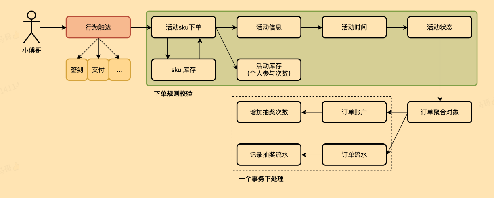

# 营销抽奖系统 — 数据库设计文档

## 1. 概述

- **数据库名称**：`marketing`
- **字符集**：`utf8mb4`
- **存储引擎**：`InnoDB`
- **总表数**：10 张（含 ER 图中新增的 `raffle_activity_order` 表）

---

## 2. ER 图（实体关系总览）



## 3. 核心业务域

系统围绕 **策略 → 活动 → 规则树 → 奖品** 四大核心域展开，分为三组：

| 业务域 | 核心表 | 说明 |
|---|---|---|
| **奖品中心** | `award` | 统一的奖品字典，定义奖品元信息 |
| **策略域** | `strategy`、`strategy_award`、`strategy_rule` | 抽奖策略 = 奖品池 + 概率 + 规则模型 |
| **活动域** | `raffle_activity`、`raffle_activity_count`、`raffle_activity_sku`、`raffle_activity_order` | 活动 = 策略 + 参与次数限制 + 库存 + 用户订单 |
| **规则树域** | `rule_tree`、`rule_tree_node`、`rule_tree_node_line` | 可编排的决策树，通过连线控制节点流转 |

---

## 4. 表结构详解

### 4.1 `award` — 奖品表

**职责**：奖品字典表，定义系统中所有可发放的奖品元信息。各策略通过 `award_id` 引用此表。

| 字段名 | 类型 | 约束 | 说明 |
|---|---|---|---|
| `id` | `int(11) unsigned` | PK, AUTO_INCREMENT | 自增主键 |
| `award_id` | `int(8)` | NOT NULL | 奖品业务ID，内部流转使用 |
| `award_key` | `varchar(32)` | NOT NULL | 奖品对接标识，每个值对应一种发奖策略 |
| `award_config` | `varchar(32)` | NOT NULL | 奖品配置信息（如积分范围、使用次数） |
| `award_desc` | `varchar(128)` | NOT NULL | 奖品内容描述 |
| `create_time` | `datetime` | NOT NULL, DEFAULT CURRENT_TIMESTAMP | 创建时间 |
| `update_time` | `datetime` | NOT NULL, ON UPDATE | 更新时间 |

**索引**：
- `PRIMARY KEY (id)`

**种子数据示例**：

| award_id | award_key | award_config | award_desc |
|---|---|---|---|
| 101 | `user_credit_random` | `1,100` | 用户积分（随机1~100分） |
| 102 | `openai_use_count` | `5` | OpenAI 增加5次使用 |
| 105 | `openai_model` | `gpt-4` | OpenAI 增加 gpt-4 模型 |
| 100 | `user_credit_blacklist` | `1` | 黑名单积分兜底 |

**设计要点**：
- `award_key` 是发奖策略的路由标识，系统根据此值选择合适的发奖逻辑
- `award_config` 的语义由 `award_key` 决定：`user_credit_random` 下为 `最小值,最大值`，`openai_use_count` 下为次数数字

---

### 4.2 `strategy` — 抽奖策略表

**职责**：定义抽奖策略，一个策略关联一组奖品（`strategy_award`）和规则模型（`rule_models`）。

| 字段名 | 类型 | 约束 | 说明 |
|---|---|---|---|
| `id` | `bigint(11) unsigned` | PK, AUTO_INCREMENT | 自增主键 |
| `strategy_id` | `bigint(8)` | NOT NULL | 抽奖策略ID |
| `strategy_desc` | `varchar(128)` | NOT NULL | 策略描述 |
| `rule_models` | `varchar(256)` | NULL | 规则模型，逗号分隔，如 `rule_blacklist,rule_weight` |
| `create_time` | `datetime` | NOT NULL | 创建时间 |
| `update_time` | `datetime` | NOT NULL | 更新时间 |

**索引**：
- `PRIMARY KEY (id)`
- `KEY idx_strategy_id (strategy_id)`

**种子数据示例**：

| strategy_id | strategy_desc | rule_models |
|---|---|---|
| 100001 | 抽奖策略 | `rule_blacklist,rule_weight` |
| 100003 | 抽奖策略-验证lock | `rule_blacklist` |
| 100006 | 抽奖策略-规则树 | NULL |

**设计要点**：
- `rule_models` 采用逗号分隔存储多个规则模型，运行时由 `DefaultLogicFactory` 解析并匹配合适的过滤器链
- 策略 100001 同时挂载了黑名单和权重规则，抽奖时先执行黑名单过滤，再走权重分档

---

### 4.3 `strategy_award` — 策略奖品配置表

**职责**：定义某个策略下有哪些奖品，以及每个奖品的概率、库存、关联的规则树。

| 字段名 | 类型 | 约束 | 说明 |
|---|---|---|---|
| `id` | `bigint(11) unsigned` | PK, AUTO_INCREMENT | 自增主键 |
| `strategy_id` | `bigint(8)` | NOT NULL | 抽奖策略ID |
| `award_id` | `int(8)` | NOT NULL | 奖品ID，关联 `award.award_id` |
| `award_title` | `varchar(128)` | NOT NULL | 奖品标题 |
| `award_subtitle` | `varchar(128)` | NULL | 奖品副标题（如"抽奖1次后解锁"） |
| `award_count` | `int(8)` | NOT NULL, DEFAULT 0 | 奖品库存总量 |
| `award_count_surplus` | `int(8)` | NOT NULL, DEFAULT 0 | 奖品库存剩余 |
| `award_rate` | `decimal(6,4)` | NOT NULL | 中奖概率（如 0.3000 = 30%） |
| `rule_models` | `varchar(256)` | NULL | 该奖品关联的规则树ID |
| `sort` | `int(2)` | NOT NULL, DEFAULT 0 | 排序 |
| `create_time` | `datetime` | NOT NULL | 创建时间 |
| `update_time` | `datetime` | NOT NULL | 修改时间 |

**索引**：
- `PRIMARY KEY (id)`
- `KEY idx_strategy_id_award_id (strategy_id, award_id)`

**种子数据示例（策略 100001）**：

| award_id | award_title | award_rate | award_count | award_count_surplus | rule_models |
|---|---|---|---|---|---|
| 101 | 随机积分 | 0.3000 (30%) | 80000 | 79998 | `tree_luck_award` |
| 102 | 5次使用 | 0.2000 (20%) | 10000 | 9999 | `tree_luck_award` |
| 103 | 10次使用 | 0.2000 (20%) | 5000 | 4998 | `tree_luck_award` |
| 104 | 20次使用 | 0.1000 (10%) | 4000 | 3999 | `tree_luck_award` |
| 105 | 增加gpt-4对话模型 | 0.1000 (10%) | 600 | 600 | `tree_luck_award` |
| 106 | 增加dall-e-2画图模型 | 0.0500 (5%) | 200 | 200 | `tree_luck_award` |
| 107 | 增加dall-e-3画图模型 | 0.0400 (4%) | 200 | 200 | `tree_luck_award` |
| 108 | 增加100次使用 | 0.0099 (0.99%) | 199 | 199 | `tree_luck_award` |
| 109 | 解锁全部模型 | 0.0001 (0.01%) | 1 | 1 | `tree_luck_award` |

**设计要点**：
- 概率总和不一定为 1.0，系统以最小概率为刻度做归一化。例如策略 100001 概率合计 = 1.0（100%），策略 100002 合计 = 0.61（非完整概率）
- `rule_models` 存储规则树ID（如 `tree_lock_1`），表示该奖品需要经过对应规则树验证后才能发放
- 库存扣减发生在规则过滤通过之后，`award_count_surplus` 通过 Redis 原子操作保证并发安全

---

### 4.4 `strategy_rule` — 策略规则表

**职责**：存储策略级别或奖品级别的规则配置，规则的值格式因规则类型而异。

| 字段名 | 类型 | 约束 | 说明 |
|---|---|---|---|
| `id` | `bigint(11) unsigned` | PK, AUTO_INCREMENT | 自增主键 |
| `strategy_id` | `int(8)` | NOT NULL | 抽奖策略ID |
| `award_id` | `int(8)` | NULL | 奖品ID（策略规则时为NULL） |
| `rule_type` | `tinyint(1)` | NOT NULL, DEFAULT 0 | 1=策略规则，2=奖品规则 |
| `rule_model` | `varchar(16)` | NOT NULL | 规则类型：`rule_weight`、`rule_blacklist` 等 |
| `rule_value` | `varchar(256)` | NOT NULL | 规则比值，格式因 rule_model 而异 |
| `rule_desc` | `varchar(128)` | NOT NULL | 规则描述 |
| `create_time` | `datetime` | NOT NULL | 创建时间 |
| `update_time` | `datetime` | NOT NULL | 更新时间 |

**索引**：
- `PRIMARY KEY (id)`
- `KEY idx_strategy_id_award_id (strategy_id, award_id)`

**种子数据及格式解析**：

**示例 1 — 权重规则（`rule_weight`）**：
```
rule_value: "4000:102,103,104,105 5000:102,103,104,105,106,107 6000:102,103,104,105,106,107,108,109"
```
格式：`积分阈值:奖品ID列表`（空格分隔多个档位）
- 用户积分 ≥ 4000 时，只能在 102~105 中抽奖
- 用户积分 ≥ 5000 时，扩充到 102~107
- 用户积分 ≥ 6000 时，扩充到 102~109（必中奖范围）

**示例 2 — 黑名单规则（`rule_blacklist`）**：
```
rule_value: "101:user001,user002,user003"
```
格式：`兜底奖品ID:用户ID列表`（逗号分隔）
- `user001`、`user002`、`user003` 被拉黑，直接返回奖品 101（积分兜底）

---

### 4.5 `raffle_activity` — 抽奖活动表

**职责**：定义一个营销活动，关联策略、设定活动时间窗口和状态。

| 字段名 | 类型 | 约束 | 说明 |
|---|---|---|---|
| `id` | `bigint(11) unsigned` | PK, AUTO_INCREMENT | 自增主键 |
| `activity_id` | `bigint(12)` | NOT NULL, UNIQUE | 活动ID |
| `activity_name` | `varchar(64)` | NOT NULL | 活动名称 |
| `activity_desc` | `varchar(128)` | NOT NULL | 活动描述 |
| `begin_date_time` | `datetime` | NOT NULL | 活动开始时间 |
| `end_date_time` | `datetime` | NOT NULL | 活动结束时间 |
| `strategy_id` | `bigint(8)` | NOT NULL | 关联的抽奖策略ID |
| `state` | `varchar(8)` | NOT NULL, DEFAULT 'create' | 活动状态 |
| `create_time` | `datetime` | NOT NULL | 创建时间 |
| `update_time` | `datetime` | NOT NULL | 更新时间 |

**索引**：
- `PRIMARY KEY (id)`
- `UNIQUE KEY uq_activity_id (activity_id)`
- `KEY idx_begin_date_time (begin_date_time)`
- `KEY idx_end_date_time (end_date_time)`

**种子数据**：

| activity_id | activity_name | strategy_id | begin_date_time | end_date_time | state |
|---|---|---|---|---|---|
| 100301 | 测试活动 | 100006 | 2024-03-09 10:15:10 | 2034-03-09 10:15:10 | create |

**设计要点**：
- 一个活动绑定一个策略（`strategy_id`），但一个策略可被多个活动复用
- `state` 字段当前值为 `create`，后续可扩展为 `online`、`offline`、`finished` 等状态流转
- 活动时间范围长达 10 年（种子数据），实际业务中应控制合理范围

---

### 4.6 `raffle_activity_count` — 活动参与次数配置表

**职责**：定义用户在某个活动中的参与次数限制（总次数、日次数、月次数）。

| 字段名 | 类型 | 约束 | 说明 |
|---|---|---|---|
| `id` | `bigint(11) unsigned` | PK, AUTO_INCREMENT | 自增主键 |
| `activity_count_id` | `bigint(12)` | NOT NULL, UNIQUE | 活动次数配置ID |
| `total_count` | `int(8)` | NOT NULL | 总参与次数上限 |
| `day_count` | `int(8)` | NOT NULL | 每日参与次数上限 |
| `month_count` | `int(8)` | NOT NULL | 每月参与次数上限 |
| `create_time` | `datetime` | NOT NULL | 创建时间 |
| `update_time` | `datetime` | NOT NULL | 更新时间 |

**索引**：
- `PRIMARY KEY (id)`
- `UNIQUE KEY uq_activity_count_id (activity_count_id)`

**种子数据**：

| activity_count_id | total_count | day_count | month_count |
|---|---|---|---|
| 11101 | 1 | 1 | 1 |

**设计要点**：
- 通过 `raffle_activity_sku` 表间接关联活动，实现次数配置的复用
- 当前种子数据限制极严格（总/日/月各1次），实际场景按活动需求配置

---

### 4.7 `raffle_activity_sku` — 活动SKU表

**职责**：将活动、次数配置、库存打包为一个 SKU 商品单元。

| 字段名 | 类型 | 约束 | 说明 |
|---|---|---|---|
| `id` | `int(11) unsigned` | PK, AUTO_INCREMENT | 自增主键 |
| `sku` | `bigint(12)` | NOT NULL, UNIQUE | 商品SKU编号 |
| `activity_id` | `bigint(12)` | NOT NULL | 活动ID |
| `activity_count_id` | `bigint(12)` | NOT NULL | 活动次数配置ID |
| `stock_count` | `int(11)` | NOT NULL | 商品总库存 |
| `stock_count_surplus` | `int(11)` | NOT NULL | 剩余库存 |
| `create_time` | `datetime` | NOT NULL | 创建时间 |
| `update_time` | `datetime` | NOT NULL | 更新时间 |

**索引**：
- `PRIMARY KEY (id)`
- `UNIQUE KEY uq_sku (sku)`
- `KEY idx_activity_id_activity_count_id (activity_id, activity_count_id)`

**种子数据**：

| sku | activity_id | activity_count_id | stock_count | stock_count_surplus |
|---|---|---|---|---|
| 9011 | 100301 | 11101 | 0 | 0 |

**设计要点**：
- **SKU 是活动与次数配置的组合**：同一活动可以有多个 SKU（不同次数档位），同一次数配置可被多个 SKU 引用
- `stock_count` 控制活动总参与名额，与 `strategy_award` 的奖品库存是两层限流
- 种子数据中 `stock_count = 0` 表示无限库存

---

### 4.8 `raffle_activity_order` — 活动订单表（ER 图中新增）

**职责**：记录用户参与活动的订单流水，跟踪抽奖次数消耗和中奖结果。

> 此表来自 ER 图设计，当前 SQL 文件中尚未落地 DDL。以下结构根据 ER 图提取：

| 字段名 | 类型 | 约束 | 说明 |
|---|---|---|---|
| `id` | `bigint(11) unsigned` | PK | 自增主键 |
| `user_id` | `varchar(32)` | NOT NULL | 用户ID |
| `activity_id` | `bigint(12)` | NOT NULL | 活动ID |
| `order_id` | `bigint(12)` | NOT NULL | 订单ID |
| `award_id` | `int(8)` | NOT NULL | 中奖奖品ID |
| `strategy_id` | `bigint(8)` | NOT NULL | 使用的策略ID |
| `state` | `varchar(8)` | NOT NULL | 订单状态（如 `wait_send`、`completed`） |
| `create_time` | `datetime` | NOT NULL | 创建时间 |
| `update_time` | `datetime` | NOT NULL | 更新时间 |

**设计要点**：
- 每条订单记录一次完整的抽奖结果：谁、在哪个活动、用哪个策略、抽中了什么奖品
- `state` 字段跟踪发奖链路：`wait_send` → 发奖服务处理 → `completed`
- 与 `raffle_activity_count` 配合，可统计用户已消耗的总/日/月次数

---

### 4.9 `rule_tree` — 规则树表

**职责**：定义一棵规则决策树，由若干节点和连线组成，通过入口规则节点开始执行。

| 字段名 | 类型 | 约束 | 说明 |
|---|---|---|---|
| `id` | `bigint(11) unsigned` | PK, AUTO_INCREMENT | 自增主键 |
| `tree_id` | `varchar(32)` | NOT NULL, UNIQUE | 规则树ID |
| `tree_name` | `varchar(64)` | NOT NULL | 规则树名称 |
| `tree_desc` | `varchar(128)` | NULL | 规则树描述 |
| `tree_node_rule_key` | `varchar(32)` | NOT NULL | 根入口规则节点Key |
| `create_time` | `datetime` | NOT NULL | 创建时间 |
| `update_time` | `datetime` | NOT NULL | 更新时间 |

**索引**：
- `PRIMARY KEY (id)`
- `UNIQUE KEY uq_tree_id (tree_id)`

**种子数据**：

| tree_id | tree_name | tree_desc | tree_node_rule_key |
|---|---|---|---|
| `tree_lock_1` | 规则树 | 规则树 | `rule_lock` |
| `tree_luck_award` | 规则树-兜底奖励 | 规则树-兜底奖励 | `rule_stock` |
| `tree_lock_2` | 规则树 | 规则树 | `rule_lock` |

---

### 4.10 `rule_tree_node` — 规则树节点表

**职责**：定义规则树中的每个决策节点。

| 字段名 | 类型 | 约束 | 说明 |
|---|---|---|---|
| `id` | `bigint(11) unsigned` | PK, AUTO_INCREMENT | 自增主键 |
| `tree_id` | `varchar(32)` | NOT NULL | 所属规则树ID |
| `rule_key` | `varchar(32)` | NOT NULL | 规则Key（如 `rule_lock`、`rule_stock`） |
| `rule_desc` | `varchar(64)` | NOT NULL | 规则描述 |
| `rule_value` | `varchar(128)` | NULL | 规则比值（如锁定次数阈值、兜底奖品范围） |
| `create_time` | `datetime` | NOT NULL | 创建时间 |
| `update_time` | `datetime` | NOT NULL | 更新时间 |

**种子数据（`tree_lock_1` 的节点）**：

| rule_key | rule_desc | rule_value | 说明 |
|---|---|---|---|
| `rule_lock` | 限定用户已完成N次抽奖后解锁 | `1` | 用户抽满1次后解锁下一级奖品 |
| `rule_stock` | 库存扣减规则 | NULL | 扣减库存，成功则继续 |
| `rule_luck_award` | 兜底奖品随机积分 | `101:1,100` | 库存不足时，发奖品101，积分范围1~100 |

---

### 4.11 `rule_tree_node_line` — 规则树节点连线表

**职责**：定义规则树节点之间的流转路径和条件。

| 字段名 | 类型 | 约束 | 说明 |
|---|---|---|---|
| `id` | `bigint(11) unsigned` | PK, AUTO_INCREMENT | 自增主键 |
| `tree_id` | `varchar(32)` | NOT NULL | 所属规则树ID |
| `rule_node_from` | `varchar(32)` | NOT NULL | 来源节点 |
| `rule_node_to` | `varchar(32)` | NOT NULL | 目标节点 |
| `rule_limit_type` | `varchar(8)` | NOT NULL | 限定类型：EQUAL / GT / LT / GTE / LTE / ENUM |
| `rule_limit_value` | `varchar(32)` | NOT NULL | 限定值（如 `ALLOW`、`TAKE_OVER`） |
| `create_time` | `datetime` | NOT NULL | 创建时间 |
| `update_time` | `datetime` | NOT NULL | 更新时间 |

**种子数据**：

| tree_id | from | to | limit_type | limit_value | 含义 |
|---|---|---|---|---|---|
| `tree_lock_1` | `rule_lock` | `rule_stock` | EQUAL | ALLOW | 锁定规则通过 → 进入库存扣减 |
| `tree_lock_1` | `rule_lock` | `rule_luck_award` | EQUAL | TAKE_OVER | 锁定规则接管 → 直接发兜底奖 |
| `tree_lock_1` | `rule_stock` | `rule_luck_award` | EQUAL | ALLOW | 库存扣减完成 → 发兜底奖 |

---

## 5. 规则树决策流程示例

以 `tree_lock_1`（策略 100006）为例，完整抽奖决策如下：

```
用户抽奖请求
  │
  ▼
rule_lock（锁定检查）
  │ 用户抽奖次数 ≥ 1？
  ├─── 是(ALLOW) ──► rule_stock（库存扣减）
  │                      │
  │                      └── 扣减成功(ALLOW) ──► rule_luck_award（发奖）
  │
  └─── 否(TAKE_OVER) ──► rule_luck_award（兜底发奖）
```

**`tree_lock_1` 与 `tree_lock_2` 的区别**：
- `tree_lock_1` 的 `rule_lock` 节点 `rule_value = '1'`（抽1次解锁）
- `tree_lock_2` 的 `rule_lock` 节点 `rule_value = '2'`（抽2次解锁）
- 策略 100006 中，奖品 106/107 挂 `tree_lock_1`（1次后解锁），奖品 108 挂 `tree_lock_2`（2次后解锁）

---

## 6. 表关系总结

```
award (奖品字典)
  │
  │ award_id
  ▼
strategy_award (策略-奖品配置) ────── strategy (策略)
  │ rule_models                       │ rule_models
  │                                   │
  ▼                                   ▼
rule_tree (规则树) ◄──────── strategy_rule (策略规则)
  │
  ├── rule_tree_node (决策节点)
  │
  └── rule_tree_node_line (节点连线)

raffle_activity (活动) ────── raffle_activity_sku (活动SKU)
                                │
                                └── raffle_activity_count (次数配置)

raffle_activity_order (活动订单) ── 关联活动、用户、中奖结果
```

---

## 7. 关键设计决策

| 决策点 | 方案 | 原因 |
|---|---|---|
| 概率存储 | `decimal(6,4)`，不强制总和为1 | 支持非完整概率，运行时以最小刻度归一化 |
| 规则树 vs 硬编码 | 规则树（节点+连线表） | 决策逻辑可编排，新增规则无需改代码 |
| rule_models 冗余 | 策略和奖品表均存 `rule_models` | 减少 JOIN，抽奖时一次查出所有规则 |
| SKU 独立表 | 活动与次数配置解耦 | 同一活动可卖不同次数档位，同一次数配置可复用 |
| Redis 概率查找表 | Hash 结构，O(1) 查询 | 高并发抽奖场景，避免实时计算概率 |