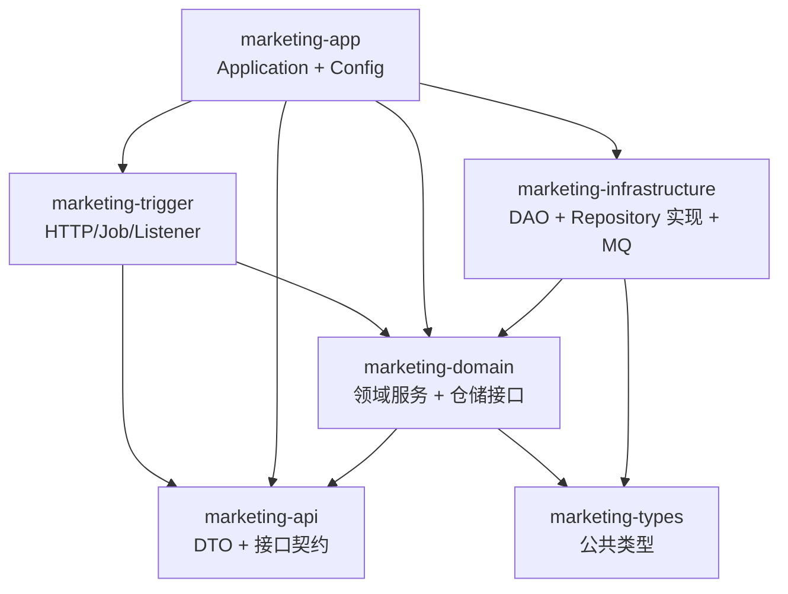
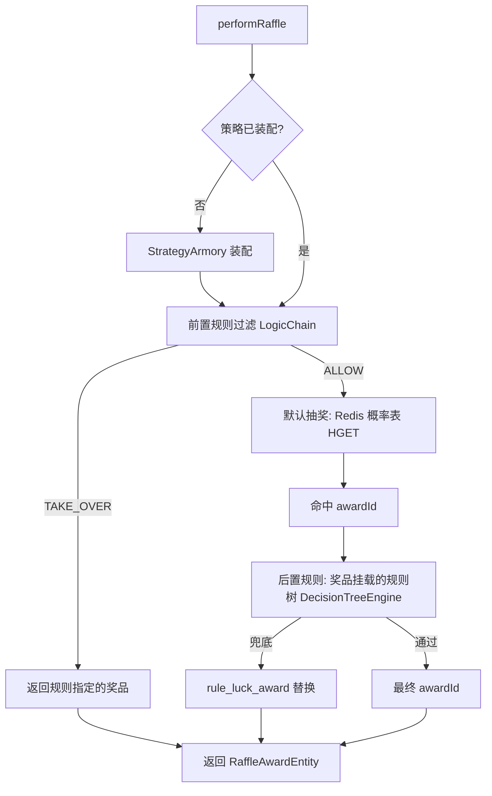
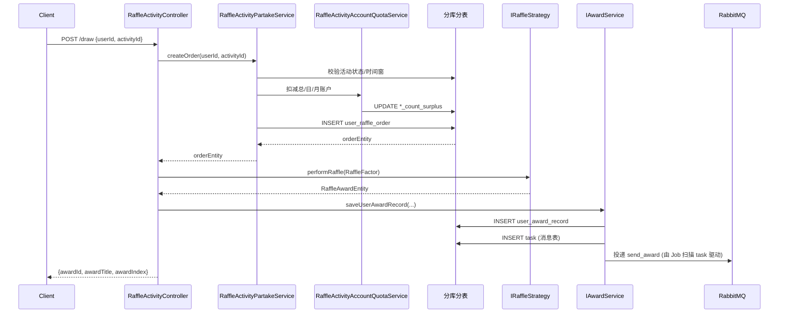

<style>
/* 全局字号与行高 */
body { font-size: 15px; line-height: 1.7; font-family: -apple-system, "PingFang SC", "Microsoft YaHei", "Segoe UI", sans-serif; }
h1 { font-size: 26px; }
h2 { font-size: 21px; }
h3 { font-size: 18px; }
h4 { font-size: 16px; }
p, li, td, th, code, pre, blockquote { font-size: 15px; }
code { font-size: 14px; padding: 1px 5px; }
pre { font-size: 13px; line-height: 1.6; padding: 12px; }
pre code { font-size: 13px; }
/* 表格放大 */
table { font-size: 14px; border-collapse: collapse; }
th, td { padding: 7px 12px; }
th { font-size: 15px; font-weight: 600; }
/* mermaid 图表区域 */
.mermaid, .mermaid svg { font-size: 15px !important; }
</style>

# 营销抽奖系统 — 项目设计文档

> 文档版本：v1.0  
> 适用代码版本：`com.charlie:marketing 1.0-SNAPSHOT`  
> 关联文档：[数据库设计文档](dev-ops/mysql/数据库设计文档.md)｜[规则树引擎](rule-tree-engine.md)｜[规则责任链](rule-chain.md)

---

## 1. 项目概述

### 1.1 项目背景

`marketing` 是一个面向 C 端用户的**营销抽奖系统**，模拟电商/在线服务中常见的"签到送抽奖 + 概率抽奖 + 异步发奖 + 行为返利"完整链路。系统需要在高并发场景下保证：

- **抽奖概率可控**：支持权重、黑名单、规则树等可编排规则
- **库存与额度精准**：避免超卖、避免重复扣减
- **异步发奖最终一致**：写流程与发奖流程解耦，MQ + 本地任务表保证不丢消息
- **横向扩展能力**：用户维度的流量可通过分库分表水平扩展
- **行为返利驱动**：签到/支付等行为触发返利入口，提升用户活跃

### 1.2 业务能力

| 能力 | 入口 API | 说明 |
|---|---|---|
| 活动装配 | `GET /api/v1/raffle/activity/armory` | 把活动下的 SKU 库存与抽奖策略概率表预热到 Redis |
| 发起抽奖 | `POST /api/v1/raffle/activity/draw` | 校验账户 → 创建抽奖单 → 命中奖品 → 写中奖记录 → 投递发奖 MQ |
| 签到返利 | `POST /api/v1/raffle/activity/calendar_sign_rebate` | 触发签到返利流程（sku 充值 + 积分入账） |
| 是否已签到 | `POST /api/v1/raffle/activity/is_calendar_sign_rebate` | 按当日 `out_business_no` 查询是否已返利 |
| 查询账户 | `POST /api/v1/raffle/activity/query_user_activity_account` | 查询用户在某活动下的总/日/月次数额度与剩余 |
| 策略装配 | `GET /api/v1/raffle/strategy_armory` | 把指定 strategy 的概率查找表预热到 Redis |
| 查询奖品列表 | `POST /api/v1/raffle/query_raffle_award_list` | 返回奖品 + 解锁条件（已抽次数 vs 规则锁定次数） |
| 随机抽奖 | `POST /api/v1/raffle/random_raffle` | 仅走策略层、不写订单/中奖记录（演示用） |

### 1.3 技术栈

| 维度 | 选型 |
|---|---|
| 语言/版本 | Java 8 |
| 构建 | Maven 3 多模块（parent POM + 6 子模块） |
| Web | Spring Boot 2.7.12、Spring MVC |
| 持久化 | MyBatis 2.1.4、MySQL 8.0.22、HikariCP |
| 分库分表 | 自研 `cn.bugstack.middleware:db-router-spring-boot-starter 1.0.2`（`@DBRouter` + `@DBRouterStrategy`） |
| 缓存 | Redis（Redisson 3.23.4） |
| 消息队列 | RabbitMQ（spring-boot-starter-amqp 3.2.0） |
| JSON | Fastjson 2.0.28 |
| 工具库 | Guava 32、commons-lang3 3.9、dom4j、xstream |
| JWT | jjwt 0.9.1、auth0 java-jwt 4.4.0 |
| 测试 | JUnit、easy-random-core 4.3 |

---

## 2. 工程结构

```
marketing/                          ← Parent POM
├── marketing-api/                 ← 接口契约层：API、DTO、Response
├── marketing-app/                 ← 应用启动层：Application、配置、定时任务、测试入口
├── marketing-domain/              ← 领域层：领域模型、领域服务、仓储接口
├── marketing-infrastructure/      ← 基础设施层：DAO、PO、Repository 实现、Redis、MQ
├── marketing-trigger/             ← 触发器层：HTTP Controller、Job、Listener
├── marketing-types/               ← 公共类型：Constants、ResponseCode、BaseEvent、AppException
└── docs/                          ← 设计文档与运维资料
    ├── rule-chain.md
    ├── rule-tree-engine.md
    └── dev-ops/                   ← docker-compose、MySQL 脚本等
```

### 2.1 模块依赖关系



依赖方向严格遵循：**trigger → api/domain**、**app → trigger/domain/infra**、**infra → domain**、**domain → api**。`marketing-types` 是最底层的公共类型（枚举、事件基类、异常），所有模块均可依赖。

---

## 3. 模块详解

### 3.1 `marketing-types` — 公共类型

最底层模块，定义所有业务都要复用的"契约型"基础类型。

| 类型 | 说明 |
|---|---|
| `BaseEvent<T>` | MQ 事件抽象基类，约定 `buildEventMessage` / `exchange` / `routingKey` / `queue` 四个方法；内嵌 `EventMessage<T>`（`id` / `timestamp` / `data`）作为统一消息体 |
| `Constants` | 全局常量（key 拼接、状态值等） |
| `ResponseCode` | 统一响应码枚举（SUCCESS、UN_ERROR、ILLEGAL_PARAMETER 等） |
| `AppException` | 业务异常，承载 `code` + `info`，由 Controller 统一捕获并转换为 `Response` |

### 3.2 `marketing-api` — 接口契约层

只定义"对外长什么样"，不包含任何实现。`trigger` 模块的 Controller 实现这里的接口，从而把"接口定义"和"接口实现"分离。

| 文件 | 职责 |
|---|---|
| `IRaffleActivityService` | 抽奖活动相关接口契约（armory / draw / 签到返利 / 账户查询） |
| `IRaffleStrategyService` | 策略相关接口契约（strategy_armory / queryRaffleAwardList / randomRaffle） |
| `dto/ActivityDrawRequestDTO`、`ActivityDrawResponseDTO` | 抽奖请求/响应 |
| `dto/UserActivityAccountRequestDTO`、`UserActivityAccountResponseDTO` | 账户查询请求/响应 |
| `dto/RaffleStrategyRequestDTO`、`RaffleStrategyResponseDTO` | 策略抽奖请求/响应 |
| `dto/RaffleAwardListRequestDTO`、`RaffleAwardListResponseDTO` | 奖品列表查询请求/响应 |
| `response/Response<T>` | 统一响应包装（`code` / `info` / `data`） |

### 3.3 `marketing-domain` — 领域层

DDD 风格的核心：领域模型（entity / aggregate / valobj）、领域服务、仓储接口都在这里；**不依赖任何基础设施实现**。下层依赖通过 `marketing-infrastructure` 适配注入。

#### 3.3.1 子领域划分

| 子领域 | 关键 Aggregate | 关键 Entity | 关键 Service |
|---|---|---|---|
| **activity（活动域）** | `CreateQuotaOrderAggregate`、`CreatePartakeOrderAggregate` | `ActivityEntity`、`ActivitySkuEntity`、`ActivityOrderEntity`、`ActivityAccountEntity` / `Day` / `Month`、`ActivityCountEntity`、`UserRaffleOrderEntity`、`SkuRechargeEntity`、`PartakeRaffleActivityEntity` | `IRaffleActivityPartakeService`、`IRaffleActivityAccountQuotaService`、`IRaffleActivitySkuStockService` |
| **strategy（策略域）** | — | `StrategyEntity`、`StrategyAwardEntity`、`AwardEntity`、`StrategyRuleEntity`、`RaffleAwardEntity`、`RaffleFactorEntity`、`RuleMatterEntity`、`RuleActionEntity` | `IRaffleStrategy`、`IRaffleAward`、`IRaffleRule`、`IRaffleStock` |
| **rule（规则子域，策略域内）** | — | — | 责任链 `ILogicChain` + 工厂 `DefaultChainFactory`（黑名单 / 权重 / 默认）<br/>规则树 `ILogicTreeNode` + 引擎 `DecisionTreeEngine`（rule_lock / rule_stock / rule_luck_award） |
| **award（发奖域）** | `UserAwardRecordAggregate` | `UserAwardRecordEntity` | `IAwardService`（保存中奖记录、构建发奖任务） |
| **rebate（返利域）** | `BehaviorRebateAggregate` | `BehaviorEntity`、`BehaviorRebateOrderEntity` | `IBehaviorRebateService`（签到返利、查询是否已返利） |
| **task（任务域）** | — | `TaskEntity` | `ITaskService`（查询待发送任务、推进状态） |

> 关于**规则责任链**与**规则树引擎**的详细设计，请分别参见 `docs/rule-chain.md` 与 `docs/rule-tree-engine.md`。

#### 3.3.2 关键领域服务

##### `IRaffleActivityPartakeService` — 参与活动

`createOrder(userId, activityId)`：
1. 校验活动状态（`state=open`）与时间窗（`begin_date_time ≤ now < end_date_time`）
2. 查询是否已存在 `user_raffle_order` 未使用订单，存在则**复用**（保证幂等）
3. 走"账户额度过滤 + 写订单"的事务，账户额度由 `IRaffleActivityAccountQuotaService` 同步扣减

实现：`partake/RaffleActivityPartakeService` 继承 `AbstractRaffleActivityPartake`（模板方法封装公共流程）

##### `IRaffleActivityAccountQuotaService` — 活动账户额度

`queryActivityAccountEntity(activityId, userId)` 返回用户在该活动下的总/日/月额度与剩余。

`queryRaffleActivityAccountDayPartakeCount(activityId, userId)` 返回用户当日参与次数（用于解锁规则树 `tree_lock_N`）。

`createSkuRechargeOrder(SkuRechargeEntity)`：返利触发的 SKU 充值下单（复用活动下单路径）。

实现：`quota/RaffleActivityAccountQuotaService` + `quota/rule/IActionChain` 责任链（`ActivityBaseActionChain` → `ActivitySkuStockActionChain`），对每次额度操作做基础校验与库存扣减。

##### `IRaffleStrategy` — 抽奖策略

`performRaffle(RaffleFactorEntity)` 流程：
1. 策略装配校验（缓存未装配则先装配）
2. 抽奖前规则过滤（`IRaffleRule` → `ILogicChain`）
3. 默认抽奖（Redis 概率表 `HGET`）
4. 抽奖后规则（奖品挂载的规则树 `DecisionTreeEngine`）

##### `IAwardService` — 发奖

`saveUserAwardRecord(UserAwardRecordEntity)`：与 `task` 表同事务落库（消息表模式，保证 MQ 至少一次投递）。

##### `IBehaviorRebateService` — 行为返利

`createOrder(BehaviorEntity)`：按 `behavior_type` 查 `daily_behavior_rebate` 配置，逐条生成返利流水 + 写 MQ 任务（sku 充值/积分入账）。

`queryOrderByOutBusinessNo(userId, outBusinessNo)`：按业务防重ID查返利流水，用于"今日是否已签到"判断。

#### 3.3.3 仓储接口（`repository` 包）

| 接口 | 职责 |
|---|---|
| `IActivityRepository` | 活动/账户/订单/库存 等查询与落库 |
| `IStrategyRepository` | 策略/奖品/规则/规则树 等查询 |
| `IAwardRepository` | 中奖记录、发奖任务 落库 |
| `IBehaviorRebateRepository` | 行为返利配置/流水 落库 |
| `ITaskRepository` | 任务表 落库与状态推进 |

### 3.4 `marketing-infrastructure` — 基础设施层

`domain` 层定义的仓储接口的全部实现都在这里。

| 子包 | 关键类 |
|---|---|
| `persistent.dao` | 18 个 DAO 接口（`IAwardDao` / `IRaffleActivityDao` / `IStrategyDao` / `ITaskDao` 等），与 `mybatis/mapper/*.xml` 一一对应 |
| `persistent.po` | 与 DAO 对应的 18 个 PO 实体（`Award` / `RaffleActivity` / `UserAwardRecord` 等） |
| `persistent.redis` | `IRedisService` + `RedissonService`（封装常用 KV / Hash / 计数器操作） |
| `persistent.repository` | 仓储实现：`ActivityRepository` / `AwardRepository` / `BehaviorRebateRepository` / `StrategyRepository` / `TaskRepository` |
| `mq` | `EventPublisher`（发 MQ）、`RabbitMqConfig`（拓扑声明）、`RabbitMqTopologyProperties`（`rabbitmq.topology` 配置绑定） |
| `adapter.port` / `adapter.repository` / `gateway` / `gateway.dto` | 端口适配包（保留扩展位，目前以 `package-info.java` 占位） |

### 3.5 `marketing-trigger` — 触发器层

外部交互入口（HTTP/Job/Listener）都在这里。

| 子包 | 关键类 | 职责 |
|---|---|---|
| `http` | `RaffleActivityController` | 活动装配、抽奖、签到返利、是否签到、查询账户 |
| `http` | `RaffleStrategyController` | 策略装配、查询奖品列表、随机抽奖 |
| `job` | `SendMessageTaskJob` | 定时扫描 `task.state='create'`，投递 MQ，成功后置 `completed` |
| `job` | `UpdateActivitySkuStockJob` | 定时把活动 SKU 库存从 DB 同步到 Redis（兜底） |
| `job` | `UpdateAwardStockJob` | 定时把奖品库存从 DB 同步到 Redis（兜底） |
| `listener` | `SendAwardCustomer` | 消费 `send_award` 队列，按 `award_key` 调用具体发奖逻辑，更新 `user_award_record.award_state='completed'` |
| `listener` | `RebateMessageCustomer` | 消费 `send_rebate` 队列，执行 sku 充值下单 / 积分入账 |
| `listener` | `ActivitySkuStockZeroCustomer` | 消费 `activity_sku_stock_zero` 队列，处理 SKU 售罄事件 |

### 3.6 `marketing-app` — 应用启动层

Spring Boot 启动入口与全局配置。

| 文件 | 职责 |
|---|---|
| `Application.java` | `@SpringBootApplication` 启动类 |
| `config/GuavaConfig.java` | Guava `RateLimiter` 等工具装配 |
| `config/RedisClientConfig.java` + `RedisClientConfigProperties.java` | Redisson 客户端配置 |
| `config/ThreadPoolConfig.java` + `ThreadPoolConfigProperties.java` | 全局业务线程池（用于异步发奖等） |
| `resources/application*.yml` | dev / test / prod 三套环境配置（数据源路由、Redis、RabbitMQ topology） |
| `src/test` | 11 个测试类：领域服务（`RaffleStrategyTest` / `BehaviorRebateServiceTest` 等）、DAO、Controller |

---

## 4. 核心业务域

### 4.1 奖品中心（`award`）

奖品字典统一在 `award` 表维护，`award_key` 对接具体发奖逻辑（`user_credit_random` / `openai_use_count` / `openai_model` / `user_credit_blacklist`）。具体字段参见 [数据库设计文档 §4.1](dev-ops/mysql/数据库设计文档.md#41-award--奖品表公共库-marketing)。

### 4.2 策略域（`strategy` + `strategy_award` + `strategy_rule`）

策略是"一组奖品 + 概率 + 规则模型"的整体：

- `strategy_award` 定义策略下的奖品池（库存、概率、关联规则模型）
- `strategy_rule` 定义策略级或奖品级的规则（黑名单、权重、锁定等）
- 同一策略可被多个活动复用（但 `raffle_activity.uq_strategy_id` 保证"活动-策略"一对一约束）

#### 4.2.1 抽奖流程（`IRaffleStrategy.performRaffle`）



### 4.3 活动域（`activity` + `strategy` + `sku` + `account`）

活动 = 策略 + 次数配置 + SKU + 账户体系：

- `raffle_activity` 活动基本信息
- `raffle_activity_count` 活动次数配置（总/日/月）
- `raffle_activity_sku` 活动商品（活动+次数配置+库存打包为 SKU）
- `raffle_activity_account` / `_day` / `_month` 用户账户（按 userId 路由分库）

#### 4.3.1 参与抽奖（`draw`）主链路



详细字段流转参见 [数据库设计文档 §6.5](dev-ops/mysql/数据库设计文档.md#65-场景五用户发起抽奖--写入抽奖单--中奖记录--mq-发奖)。

### 4.4 抽奖流水域（`user_raffle_order` + `user_award_record`）

| 表 | 职责 | 状态机 |
|---|---|---|
| `user_raffle_order` | 一次"发起抽奖"的请求 | `create` → `used` / `cancel` |
| `user_award_record` | 一次抽奖的中奖结果 | `create` → `completed`（MQ 消费成功后推进） |

- `user_raffle_order.order_id` 与 `user_award_record.order_id` 一一对应，靠 `uq_order_id` 唯一约束保证幂等
- 两个表都按 `userId` 分库分表（每库 4 张 `_000` ~ `_003`）

### 4.5 任务补偿域（`task`）

"消息表 + 定时扫描"模式：业务事务提交时同步写 `task` 记录（state=`create`），由 `SendMessageTaskJob` 扫描推进。

- 投递参数（`exchange` / `routing_key` / `queue`）冗余落库，不绑定单一 topic
- 与 `BaseEvent` 事件规范一一对齐
- 失败按重试策略置 `fail`（配合 `spring.rabbitmq.listener.simple.retry`）

### 4.6 规则树域（`rule_tree` + `rule_tree_node` + `rule_tree_node_line`）

详细设计见 [规则树引擎文档](rule-tree-engine.md)。简要：

- `rule_tree` 定义一棵决策树
- `rule_tree_node` 是节点（`rule_lock` / `rule_stock` / `rule_luck_award`）
- `rule_tree_node_line` 是节点间的流转条件（`EQUAL/ALLOW` / `EQUAL/TAKE_OVER`）
- 运行时由 `DecisionTreeEngine` 按连线遍历

### 4.7 行为返利域（`daily_behavior_rebate` + `user_behavior_rebate_order`）

详细流程见 [数据库设计文档 §6.6](dev-ops/mysql/数据库设计文档.md#66-场景六签到行为返利入账)。关键点：

- `daily_behavior_rebate` 按 `behavior_type` 配置返利规则（同行为可多份返利：sku 额度 + 积分）
- `user_behavior_rebate_order` 流水按 `userId` 分库分表
- 幂等键 `biz_id` 由 `out_business_no + 自身枚举` 拼接，保证同一业务防重ID下同类型返利仅入账一次
- 流水落库后投递 `send_rebate` MQ，由 `RebateMessageCustomer` 异步执行 sku 充值/积分入账

---

## 5. 横切关注点

### 5.1 分库分表

- **路由组件**：`cn.bugstack.middleware:db-router-spring-boot-starter 1.0.2`
- **路由键**：`userId`
- **分库数**：2（`marketing_01` / `marketing_02`）
- **分表数**：4 种流水表每库 4 张（`_000` ~ `_003`），账户表与 `task` 表每库 1 张
- **使用方式**：在 DAO 方法上标注 `@DBRouterStrategy(splitTable = true)`，参数上标注 `@DBRouter(key = "userId")`

### 5.2 缓存

- **客户端**：Redisson 3.23.4
- **典型用法**：
  - 策略装配：`HASH big_market_strategy_rate_table_key_{strategyId}`（奖品概率查找表），`STRING big_market_strategy_rate_range_key_{strategyId}`（概率总区间）
  - 权重子表：`HASH big_market_strategy_rate_table_key_{strategyId}_{weightKey}`（按权重档位装配）
  - 活动缓存：`STRING big_market_activity_key_{activityId}`、`STRING big_market_activity_count_key_{activityCountId}`
  - SKU 库存计数器：`STRING big_market_sku_stock_key_{sku}`（decr 原子扣减）

### 5.3 消息队列

#### 5.3.1 拓扑声明

通过 `application*.yml` 的 `rabbitmq.topology` 段配置，由 `RabbitMqConfig` 读取并构建 `Declarables`，启动时 `RabbitAdmin` 自动 declare。当前三套队列：

- `activity_sku_stock_zero`：SKU 售罄事件
- `send_award`：发奖事件
- `send_rebate`：返利事件

#### 5.3.2 生产者（`EventPublisher`）

- 配合 `spring.rabbitmq.publisher-confirm-type=correlated` + `publisher-returns=true` 开启发送方确认
- 业务模块写 `task` 表后，由 `SendMessageTaskJob` 扫描并通过 `EventPublisher` 投递
- 投递参数与 `BaseEvent` 事件规范一一对齐

#### 5.3.3 消费者

- `acknowledge-mode: auto`，方法正常返回即 ack，异常抛出走重试（`max-attempts: 3`）
- `prefetch: 10` 控制消费速率

### 5.4 异常处理

- 业务异常统一抛 `AppException(code, info)`
- Controller 通过 `catch (AppException e)` + `catch (Exception e)` 双层捕获，统一转为 `Response<T>` 返回
- 非业务异常返回 `ResponseCode.UN_ERROR`

### 5.5 日志

- 框架：logback（`logback-spring.xml`）
- 关键链路（draw / armory / 返利）均记录入参与出参日志
- 异常路径记录 `error` 级别 + 完整堆栈

---

## 6. 配置与部署

### 6.1 Maven Profile

`pom.xml` 提供 dev / test / prod 三个 profile，分别设置 JVM 参数与 `spring.profiles.active`：

| Profile | 内存 | 激活 |
|---|---|---|
| dev | 1G | 默认 |
| test | 1G | `-DprofileActive=test` |
| prod | 6G | `-DprofileActive=prod` |

### 6.2 数据源

`mini-db-router.jdbc.datasource` 配置三套（db00 公共库 + db01 / db02 分库），通过 `dbCount=2` + `tbCount=4` 启用分库分表路由。

### 6.3 容器化

- `marketing-app/Dockerfile`：基础镜像构建
- `marketing-app/build.sh`：构建脚本
- `docs/dev-ops/docker-compose-app.yml`：应用部署
- `docs/dev-ops/docker-compose-environment.yml`：本地环境（MySQL + Redis + RabbitMQ）
- `docs/dev-ops/docker-compose-environment-aliyun.yml`：阿里云环境

### 6.4 启动顺序

1. 启动 MySQL（`marketing` + `marketing_01` + `marketing_02`）
2. 启动 Redis（端口 16379）
3. 启动 RabbitMQ（端口 5672，admin/admin）
4. 启动应用（`java -jar marketing-app.jar`）
5. 调用 `/api/v1/raffle/activity/armory?activityId=100301` 预热活动
6. 调用 `/api/v1/raffle/strategy_armory?strategyId=100006` 预热策略
7. 调用 `/api/v1/raffle/activity/draw` 发起抽奖

---

## 7. 测试

| 测试类 | 覆盖范围 |
|---|---|
| `RaffleActivityControllerTest` / `RaffleStrategyControllerTest` | 触发器层 Controller |
| `RaffleActivityAccountQuotaServiceTest` / `RaffleActivityPartakeServiceTest` | 活动领域服务 |
| `AwardServiceTest` | 发奖领域服务 |
| `BehaviorRebateServiceTest` | 返利领域服务 |
| `RaffleStrategyTest` / `StrategyTest` | 策略主流程 |
| `LogicChainTest` / `LogicTreeTest` | 规则责任链 + 规则树 |
| `AwardDaoTest` / `RaffleActivityDaoTest` / `RaffleActivityOrderDaoTest` / `StrategyRepositoryTest` | DAO 与仓储层 |
| `ApiTest` | API 冒烟测试 |

---

## 8. 关键设计决策

| 决策点 | 方案 | 原因 |
|---|---|---|
| 架构 | DDD 六层（types / api / domain / trigger / infrastructure / app） | 接口与实现分离，领域层零外部依赖，便于测试与替换基础设施 |
| 概率存储 | `decimal(6,4)`，不强制总和为1 | 支持非完整概率（如策略 100006 合计 23%），运行时以最小刻度归一化 |
| 规则编排 | 责任链（黑名单/权重）+ 规则树（锁定/库存/兜底） | 两类规则：策略级过滤用责任链、奖品级决策用规则树，互不干扰 |
| `rule_models` 冗余 | 策略表和奖品表均存 `rule_models` | 减少 JOIN，抽奖时一次查出所有规则 |
| 订单+账户双表 | `raffle_activity_order`（获得）+ `raffle_activity_account`（消耗） | 职责分离：订单不可变（流水），账户可变（余额） |
| 日/月账户独立 | `raffle_activity_account` + `_day` + `_month` 三表 | 日/月按自然周期滚动写入新行，避免主表跨天/跨月条件更新，降低并发冲突 |
| 抽奖单与活动订单分离 | `raffle_activity_order`（购买资格） vs `user_raffle_order`（发起抽奖） | 一次购买可对应多次抽奖，便于统计转化 |
| 中奖记录与发奖分离 | `user_award_record` + `task` 表 + MQ | 写中奖记录与落 MQ 任务同事务，异步消费保证最终一致性，避免单条链路阻塞 |
| 活动-策略 1:1 | `raffle_activity.uq_strategy_id` | 一个策略在同一时间只能被一个活动使用，避免多活动复用导致抽奖资格/库存口径混乱 |
| 返利流水双唯一 | `uq_order_id` + `uq_biz_id`（由 `out_business_no + 自身枚举` 拼接） | `uq_order_id` 保证流水全局唯一，`uq_biz_id` 保证同一业务防重ID下同类型返利仅入账一次 |
| 业务防重 | `out_business_no` 外部防重ID | 外部系统透传，确保同一业务请求只创建一条订单/返利流水 |
| Redis 概率查找表 | Hash 结构，O(1) 查询 | 高并发抽奖场景，避免实时计算概率 |
| 分库分表路由 | 自研 `db-router-spring-boot-starter` + `@DBRouter` / `@DBRouterStrategy` | 不引入 Sharding-JDBC 等重型中间件，注解驱动、轻量可控 |
| 消息表 | `task` 表 + `SendMessageTaskJob` 定时扫描 | MQ 故障/重启不丢消息，幂等键 (`message_id`) 防重 |
| RabbitMQ 拓扑声明 | 配置驱动（`rabbitmq.topology` 三段） | 不写死 `@Bean Declarables`，新增队列/交换机只需改配置 |

---

## 9. 演进方向

| 方向 | 说明 |
|---|---|
| 行为返利触发入口 | 当前仅暴露签到返利 API；`BehaviorRebateService.createOrder` 已具备按 `behavior_type` 处理任意行为的能力，需补支付（`openai_pay`）等触发入口 |
| 库存热key | SKU 库存计数器走 Redis `decr`，高并发下需关注 Redis 热点与一致性兜底（`UpdateActivitySkuStockJob` 已实现定时同步） |
| 限流 | 接入 Guava `RateLimiter` 或 Sentinel，按 userId / activityId 维度限流 |
| 监控 | 接入 Micrometer + Prometheus + Grafana，关注抽奖 QPS、MQ 积压、库存命中率等核心指标 |
| 链路追踪 | 接入 SkyWalking / Zipkin，覆盖 Controller → Domain → Repository → MQ 全链路 |
| 灰度发布 | 策略/规则变更走灰度，按 userId 桶或白名单控制 |
| 数据归档 | 流水表（`user_award_record` / `user_raffle_order` / `user_behavior_rebate_order`）按时间分区或冷热分离 |

---

## 10. 文档索引

| 文档 | 路径 | 说明 |
|---|---|---|
| 数据库设计文档 | [docs/dev-ops/mysql/数据库设计文档.md](dev-ops/mysql/数据库设计文档.md) | 11 张公共表 + 40 张分库分表物理表的完整 DDL、索引、ER 图、数据流转 |
| 规则树引擎 | [docs/rule-tree-engine.md](rule-tree-engine.md) | `DecisionTreeEngine` 设计、节点/连线数据结构、典型规则树示例 |
| 规则责任链 | [docs/rule-chain.md](rule-chain.md) | `ILogicChain` 设计、BlackList / Weight / Default 责任链实现 |
| docker-compose | [docs/dev-ops/](dev-ops/) | 本地/阿里云环境编排文件、MySQL 脚本目录 |
| OpenAPI（API 文档） | Controller Javadoc | 详见 `RaffleActivityController` / `RaffleStrategyController` 的接口注释（含 curl 示例） |

---

*本文档与代码同步更新；如发现与代码不一致，以代码为准并提交 PR 更新文档。*
